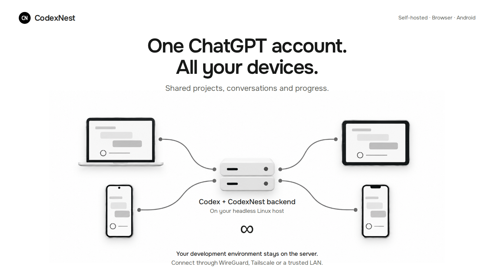
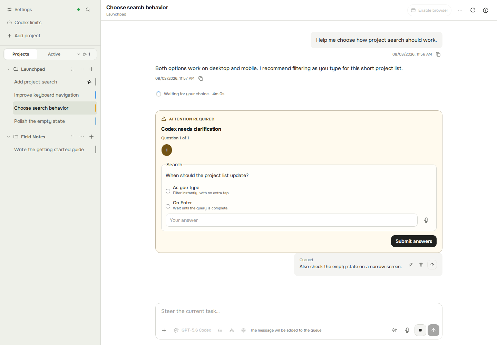
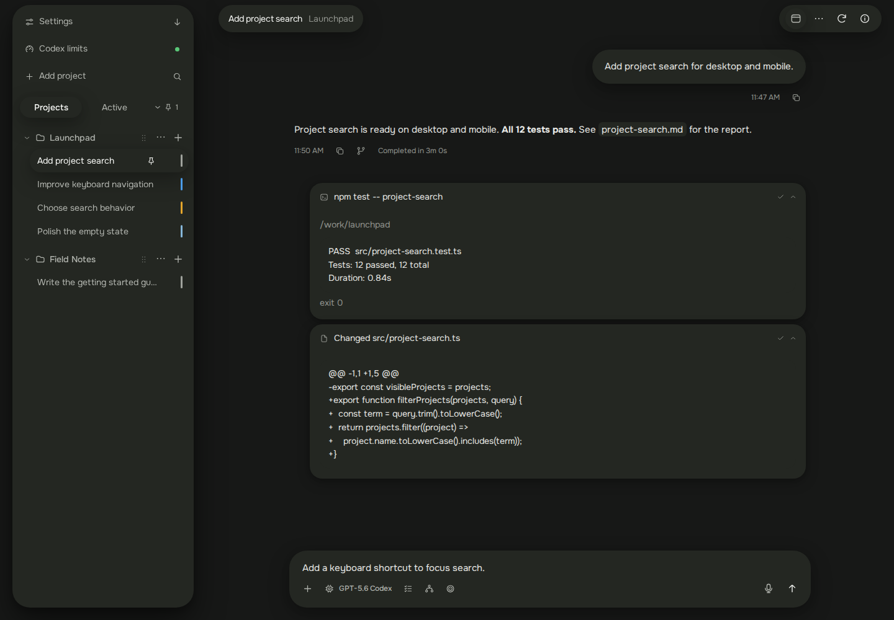
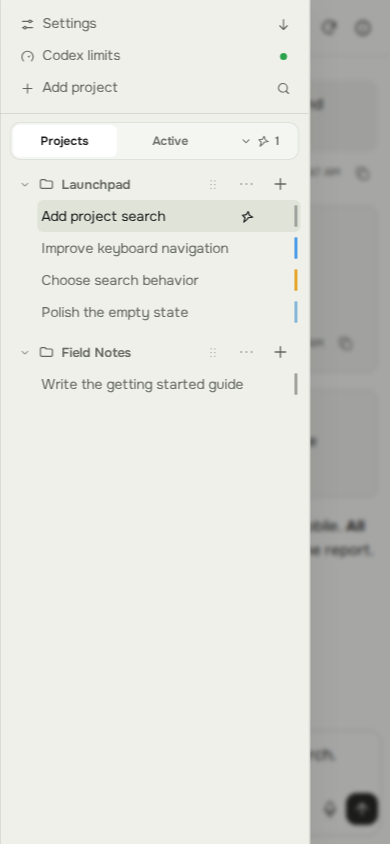
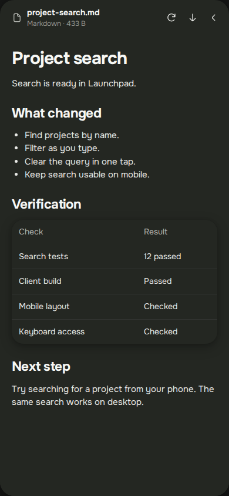

<h1 align="center">CodexNest</h1>

<p align="center">English · <a href="./README.ru.md">Русский</a></p>

<p align="center">
  <a href="./docs/assets/cover.png"></a>
</p>

<p align="center">
  <strong>Your Codex workspace. Desktop and mobile.</strong><br />
  Manage Codex CLI sessions on your own Linux machine, from your browser or Android phone.
</p>

<p align="center">
  <a href="https://github.com/petrovichest/codex-nest/actions/workflows/ci.yml"></a>
  <a href="https://github.com/petrovichest/codex-nest/releases/latest"></a>
  <a href="./LICENSE"></a>
</p>

<p align="center">
  <a href="#quick-start">Quick start</a> ·
  <a href="#screenshots">Screenshots</a> ·
  <a href="https://github.com/petrovichest/codex-nest/releases/latest/download/CodexNest-latest.apk">Android APK</a> ·
  <a href="./deploy/DEPLOYMENT.md">Documentation</a>
</p>

CodexNest is an unofficial, self-hosted project for a single owner. It is not
affiliated with or endorsed by OpenAI.

## Quick start

Use an Ubuntu or Debian machine (`amd64` or `arm64`) with Codex CLI installed and
signed in. Run the installer as a regular user:

> **Private access only.** Keep CodexNest on the host, a fully trusted LAN, or your
> private VPN. Do not expose port `4310` to the public internet.
> Read the [security boundary](#security-boundary) before connecting.

```bash
curl -fsSL https://github.com/petrovichest/codex-nest/releases/latest/download/install.sh | bash
```

The installer supplies its pinned Node.js runtime and managed user services; it
does not install or sign in to Codex CLI. Follow the
[first connection instructions](./deploy/DEPLOYMENT.md#6-проверка-и-первый-вход)
to open the browser client or connect the
[Android app](https://github.com/petrovichest/codex-nest/releases/latest/download/CodexNest-latest.apk).

## What you can do

- **Keep projects together.** Organize server-side folders and sessions; resume,
  fork or archive conversations as work evolves.
- **Guide work as it happens.** Follow streamed answers and plans, inspect
  commands and file changes, answer questions, queue follow-ups or interrupt a turn.
- **Run several sessions.** Follow concurrent work and use
  [CodexNest Team](#codexnest-team) for application-managed child tasks.
- **Take the workspace with you.** Use the browser or Android app, keep drafts
  and recent session data across temporary disconnects, and choose English or
  Russian with system, light or dark themes. On iOS, add the HTTPS site to your
  Home Screen as a web app.
- **Open the result.** Preview artifacts inside the conversation workspace and
  download the finished files.
- **Use voice and browser tools.** Dictate prompts, receive completion and
  attention notifications, and attach Chrome tabs through the
  [browser extension](#browser-extension).

## Screenshots

The current interface with a prepared **Launchpad** demo: adding project search,
reviewing progress and opening the result. All projects and conversations shown
here are demonstration data. Select an image to view it at full size.

### A workspace for your projects

Projects and sessions stay alongside the conversation. See the plan, follow
progress and send the next instruction from the same screen.

[](./docs/assets/desktop-session.png)

### Keep the next step in view

Answer a question while a follow-up waits in the queue. The light theme offers
the same controls and project navigation.

[](./docs/assets/desktop-queue.png)

### Inspect the work behind the answer

Expand the activity log to review commands, test output and file changes.

[](./docs/assets/desktop-activity.png)

### The same workspace on your phone

Open the session list to switch between projects and conversations. Read the
plan, continue the session, answer a clarification, or open the finished report.
These are mobile web views, also used inside the Android app.

<p align="center">
  <a href="./docs/assets/mobile-sessions.png"></a>
  <a href="./docs/assets/mobile-session.png"></a>
</p>

<p align="center"><sub>Switch between sessions · Continue the conversation</sub></p>

<p align="center">
  <a href="./docs/assets/mobile-question.png"></a>
  <a href="./docs/assets/mobile-report.png"></a>
</p>

<p align="center"><sub>Make a decision · Read the result</sub></p>

---

## Security boundary

CodexNest is a single-owner, local-first application. Run it only on the host,
a fully trusted private LAN, or the owner's private WireGuard/Tailscale network.
Never expose port `4310` through public port forwarding, UPnP, a public reverse
proxy or tunnel, or a public cloud firewall rule.

The bearer token grants owner-level control over CodexNest, and the server has
the same filesystem permissions as the Linux user running Codex CLI. Plain HTTP
does not protect the token, prompts, output, paths, or approval decisions; use
it only inside an encrypted private VPN or on a fully trusted LAN. Use private
HTTPS for shared or otherwise untrusted networks. See the
[deployment security guidance](./deploy/DEPLOYMENT.md) and the
[Android network caveat](./apps/client/android/README.md).

## Architecture and sources of truth

```text
Browser / Capacitor Android app
              |
       authenticated HTTP + WebSocket
              |
       CodexNest server (Fastify)
          |                 |
          |                 +-- CodexNest metadata (SQLite + rollback JSON)
          |
          +-- Codex app-server daemon over a local Unix socket (production)
              or JSONL over stdio (development)
```

The server is the only component that talks to Codex app-server. Production can
use the managed daemon so active turns survive a CodexNest restart; direct stdio
is the zero-setup development fallback. Codex remains the source of truth for
threads, turns, and conversation history. CodexNest stores only application-owned
state such as projects, token verification, read/pin/outcome metadata, queues,
preferences, and Team orchestration state.

The repository is an npm workspace:

- `apps/server` — authenticated API/WebSocket server and Codex bridge;
- `apps/client` — React/Vite UI and Capacitor Android project;
- `apps/extension` — the separately packaged Chrome browser-control extension;
- `packages/protocol` — the public client/server DTO contract; and
- `deploy` — installer, service, proxy, STT, update, and recovery artifacts.

The current implementation and tests are authoritative for product behavior.
Generated app-server types under `apps/server/src/codex/generated` are pinned by
`apps/server/src/codex/PROTOCOL_VERSION`. This README is the product entry point;
[deploy/DEPLOYMENT.md](./deploy/DEPLOYMENT.md) is the operational source of truth.

## CodexNest Team

CodexNest Team is the application's own managed orchestration mechanism, not
Codex native multi-agent or subagent mode. A root CodexNest session coordinates
managed child tasks through CodexNest tools and persisted `teamOrchestration`
state, remains responsible for integration and the final answer, and is the only
session allowed to delegate. Managed children cannot create more children.

Children are read-only and offline by default. A root may grant scoped network
or repository-relative write access; writable work is normally isolated in
detached worktrees until the root integrates it. Team parent and child sessions
disable native agent tools to preserve this boundary. Native subagents elsewhere
in the Codex projection are separate and are not the implementation of Team.

## Browser extension

The Chrome extension exposes browser-control tools and complete network-exchange
storage to CodexNest.

The toolbar icon opens a compact popup. Choose **Open side panel** there to keep
the same controls open in Chrome Side Panel while working
with web pages. The panel follows the active tab and stays open until you close
it with the browser's native control; the extension never opens it automatically.

Download `codexnest-browser-<version>.zip` from the same GitHub release as the
CodexNest server. Unpack it, open `chrome://extensions`, enable Developer mode,
choose **Load unpacked**, and select the unpacked directory. The checked-in
manifest key keeps the extension ID stable across releases.

Open the popup and enter the CodexNest HTTP(S) address and owner token. For the
current tab, choose an available writable root session. CodexNest keeps one
Chrome tab group per attached session; the popup and side panel can manage
several sessions and open their chats in CodexNest.

The extension uses `chrome.debugger` and intentionally gives the attached Codex
session control over all ordinary Chrome tabs, including navigation, clicks,
typing, JavaScript, screenshots, console/network metadata, and uploads. Install
it only in a trusted Chrome profile. The owner token is stored in
`chrome.storage.local`; plain HTTP exposes it on an untrusted network.

### Network capture

For every retained request, CodexNest stores the complete provider event data,
all request and response fields and headers, and both bodies without redaction.
Binary bodies are exposed as base64 with their SHA-256 digest. The latest 1,000
complete exchanges per attached tab are retained. A body may be up to 100 MiB,
the capture store for one binding may use up to 1 GiB, and body reads are
chunked to at most 512 KiB. An exchange that cannot be captured completely or
exceeds a limit is dropped as a whole and included in the reported drop count.

Detaching preserves the tabs, removes their CodexNest group, and disconnects the
browser adapter. The server retains ownership of the binding so only the same
extension instance can attach it again. Losing the extension profile storage
has no takeover or recovery flow.

## Notifications

Android notifications are self-hosted. A foreground service keeps an
authenticated WebSocket open to the owner's CodexNest server, reconnects after
network loss or reboot, and emits local notifications. Android therefore shows
a permanent low-priority connection notification while background delivery is
active. Firebase, Google Play Services, third-party push providers, and extra
notification credentials are not required.

Browser notifications use the same WebSocket. The tab must remain open or
minimized, and browser security rules may require HTTPS before notification
permission is available.

## Speech-to-text

Voice recordings can be transcribed by an OpenAI audio model or by a local
service. Both supported local backends expose the same
`CODEXNEST_STT_LOCAL_URL` contract:

- the `whisper.cpp` HTTP server; or
- the shipped [`deploy/local-stt-server.py`](./deploy/local-stt-server.py)
  adapter backed by `faster-whisper`.

Only one local backend should listen on the configured endpoint. Provider,
language, timeout, and optional Codex-based cleanup of local transcripts can be
managed in the UI or server environment. Installation and service examples for
both backends are in the [deployment guide](./deploy/DEPLOYMENT.md#speech-to-text).

## Development and testing

Requirements: Node.js 24 LTS, npm 10 or newer, and a signed-in Codex CLI. Android
builds additionally require JDK 21 and the Android SDK.

For UI changes, start with the [design kit](./docs/design-kit.md): shared tokens,
component patterns, approved exceptions, and the new-feature checklist.
CI runs formatting, lint, unit tests, the build, dependency audit, and installer
script checks. The build checks types for the protocol, client, and extension;
the server has a separate type check. Browser tests, Codex compatibility checks,
and the installer platform matrix remain available locally. Android CI builds
only the signed release APK.

Pull requests run `verify`. Pushes to `codex/mvp` publish a rolling release after
`verify`; `v*` tags publish versioned releases. Release jobs reuse the client build
and extension ZIP from `verify` instead of rebuilding them. Other branch pushes
do not start CI.

```bash
npm install
npm run protocol:generate
npm run dev
```

Vite serves the browser UI at `http://localhost:5173`; the API listens at
`http://127.0.0.1:4310` by default. Generate the single-owner token before using
protected endpoints:

```bash
npm run auth:generate -w @codexnest/server
```

Normal verification uses local fixtures and does not contact OpenAI:

```bash
npm run format:check
npm run lint
npm run typecheck
npm test
npm run build
```

The real app-server integration suite is opt-in. It contacts the configured model provider,
creates and deletes temporary sessions, and verifies both the protocol smoke path and a
context-aware turn after unchanged native compaction is injected into a clean thread:

```bash
RUN_CODEX_INTEGRATION=1 npm run test:integration -w @codexnest/server
```

To additionally exercise the full large-session acceptance path, set the separate gate and source
path. The test first makes an isolated snapshot, verifies that snapshot's size, mtime, and inode
remain unchanged, and deletes only the snapshot and newly created test threads:

```bash
RUN_CODEX_INTEGRATION=1 \
RUN_CODEX_COMPACTION_ACCEPTANCE=1 \
CODEXNEST_COMPACTION_SOURCE_PATH=/absolute/path/to/rollout.jsonl \
npm run test:integration -w @codexnest/server
```

Build the load-unpacked directory and deterministic Chrome ZIP with:

```bash
npm run package:build -w @codexnest/extension
```

The persistent-Chromium extension E2E test is:

```bash
npm exec -w @codexnest/extension -- playwright install chromium
NODE_ENV=test npm run test:e2e -w @codexnest/extension
```

## Installation and operations

Start with the [quick start](#quick-start) above for the latest successful rolling
build. For configuration and ongoing operation:

- [Deployment, configuration, updates, backup, and recovery](./deploy/DEPLOYMENT.md)
- [Android build, signing, networking, and notifications](./apps/client/android/README.md)
- [Contributing](./CONTRIBUTING.md)
- [Regenerating the README screenshots and covers](./docs/media/README.md)

## License

CodexNest is licensed under the [Apache License 2.0](./LICENSE). Bundled font
licenses remain with the font assets under `apps/client/src/assets/fonts`.
