# Дизайн-кит CodexNest

Правила UI/UX для новых фич и проверки изменений в CodexNest. Охват: веб-клиент,
PWA, Android-приложение и браузерное расширение. Основа — существующий интерфейс,
его стили, компоненты и тесты.

**Решение от 17 сентября 2026:** новый композер принят как визуальный эталон
для дальнейшей переработки всего интерфейса. [Утверждённое направление](#утверждённое-направление)
зафиксировано ниже; перенос на остальные экраны пока не начат. Текущая задача
ограничена документацией, без изменений интерфейса, токенов и компонентов.

Документ предназначен разработчикам и тем, кто проектирует и проверяет интерфейс.
Он хранится вместе с кодом и не требует инструкций для агентов или отдельной
библиотеки компонентов.

## Короткая памятка для новой фичи

| Что добавляем       | Что брать за основу                                                                                    |
| ------------------- | ------------------------------------------------------------------------------------------------------ |
| Кнопку              | Базовый `button`; `.primary` для главного действия, `.danger` для опасного; `ActionLabel` при ожидании |
| Поле                | Нативный `input`, `textarea` или `select`, видимую связанную подпись; описание и ошибку рядом          |
| Настройку           | `SettingsGroup` и `SettingsRow`, существующую сетку и контролы                                         |
| Карточку            | Ближайший блок того же назначения; отдельная подложка нужна только самостоятельному содержимому        |
| Диалог              | Общий `Dialog`; высоту по содержимому с ограничением viewport; проверить загрузку и длинный текст      |
| Иконку или логотип  | `Icons.tsx` для действий; официальный CN для брендинга, без перерисовки                                |
| Цвет, текст, отступ | Общие токены по роли и Onest; форму сверять с [утверждённым направлением](#утверждённое-направление)   |

Перед завершением: обе темы, русский и английский, узкий экран, клавиатура,
применимые состояния и отсутствие потери ввода или скачков размеров.
Не копируйте локальное исключение в новую фичу как общий стандарт. Мягкое
оформление композера отдельно утверждено как направление всего продукта; его
точные размеры остаются привязаны к назначению и компоновке поля ввода.
Подробности — в [каталоге](#каталог-элементов), [реестре исключений](#известные-особенности-и-расхождения)
и [проверках](#проверка-новой-фичи).

## Как пользоваться

Перед созданием фичи найдите подходящее место в [UX-паттернах](#ux-паттерны), затем
выберите элемент из [каталога](#каталог-элементов) и проверьте его состояния.
Перед завершением работы пройдите [проверку новой фичи](#проверка-новой-фичи).

- **Правила** задают подход к новым изменениям: переиспользовать элементы,
  сохранять иерархию, поддерживать состояния и адаптивность.
- **Утверждённое направление** задаёт визуальную цель будущего редизайна. Его
  фиксация не запускает переделку экранов; реализация выполняется по отдельной задаче.
- **Значения и примеры** описывают текущую реализацию. Числа в таблицах нужны для
  сверки; в коде используйте соответствующие переменные и классы.
- **Особенности и расхождения** перечислены отдельно. Наличие локального стиля
  в коде само по себе не делает его общим правилом.

Если для новой фичи не хватает существующего паттерна, сначала опишите, какую
задачу он решает, его состояния и поведение на мобильном экране. Новый общий
паттерн и его описание меняются вместе в рамках одной фичи. Не создавайте новый
токен, компонент или зависимость, если задачу решает существующий элемент.

### Источники

| Что сверять                                           | Источник                                                 |
| ----------------------------------------------------- | -------------------------------------------------------- |
| Общие цвета, шрифты, интервалы, радиусы, движение     | [Единые токены][tokens]                                  |
| Базовые кнопки, поля, фокус, типографика              | [Примитивы клиента][primitives]                          |
| Компоновка, состояния, адаптивные переопределения     | [Стили экранов][styles]                                  |
| Порядок подключения CSS                               | [Точка входа клиента][main]                              |
| Логика взаимодействия                                 | Компоненты и тесты, указанные в соответствующих разделах |
| Расширение: оформление и собственные имена переменных | [Стили расширения][extension-styles]                     |

Текущий порядок CSS клиента: `tokens.css` → `primitives.css` → `styles.css`.
Расширение напрямую импортирует тот же `tokens.css`, но сохраняет собственные
стили компонентов. Значения общей палитры и шрифт не копируются между приложениями.
При проверке конкретного элемента учитывайте его селекторы, состояние и
медиазапросы. Значение базового примитива не всегда равно итоговому размеру.
Обнаруженное расхождение с документом нужно объяснить и согласовать с общим
паттерном, а не автоматически переносить в следующие фичи.

## Визуальный характер

CodexNest — рабочее пространство для проектов, сессий и результатов работы.
Главное на экране — разговор и действия пользователя. Характер интерфейса:
компактный, спокойный, с умеренной плотностью служебной информации.

- Основу составляют нейтральные поверхности; у боковой панели лёгкий зелёный
  оттенок. Основное действие контрастное и почти монохромное.
- Цвет помогает различать выполнение, очередь, внимание и ошибку. Не назначайте
  отдельный яркий цвет каждой новой фиче.
- Иерархию создают отступы, положение, размер текста и различия тона поверхностей.
  Мягкие тени отделяют плавающие блоки; обычным строкам настроек тень не нужна.
  Видимые границы оставляйте там, где они нужны для чтения или взаимодействия.
- Используйте карточку для самостоятельного блока с собственным состоянием,
  например плана или вопроса. Обычный ответ ассистента остаётся частью потока
  текста; каждое предложение не нуждается в отдельной подложке.
- Сохраняйте свободное место вокруг содержимого. Не заполняйте его декоративными
  панелями, крупными заголовками, градиентами или дополнительными метриками.

### Утверждённое направление

**Мягкие плавающие поверхности (floating bubble).** Отправная точка — реализованный
композер из коммитов `b3f8076` и `cacb25a`, одобренный пользователем 17 сентября 2026.
Общее впечатление: выразительный объём, мягкие контуры, спокойные цвета и собранные
группы действий. Это направление для всего продукта: чата, навигации, настроек,
диалогов, карточек и поверхностей расширения. Для рабочей области чата выбран и
реализован свободный поток сообщений с акцентными карточками, описанный ниже.
Макеты навигации, настроек и остальных экранов ещё не выбраны; порядок и сроки
их переработки не определены.

#### Форма и состояния

- Самостоятельная поверхность воспринимается как плавающий мягкий блок: большие
  скругления, близкий к фону тон, рассеянная тень, без жёсткой видимой рамки.
  Объём создают форма, подложка и тень; Onest и существующий набор иконок сохраняются.
- Внутри одной панели действия имеют единый стиль, согласованные размеры и интервалы.
  Иконки используют круглую область взаимодействия, короткие текстовые контролы —
  капсулу подходящей ширины. Крупные радиусы композера не копируются на каждый элемент.
- В покое у неактивных кнопок нет видимого круга, постоянной заливки или обводки.
  Это касается и отправки в композере. Область нажатия сохраняет полный размер.
- Включённый режим обозначается мягким заполненным кругом под иконкой. Точки под
  режимами и постоянные контурные рамки для такого выделения не используются.
  Это решение о режимах, а не отмена смысловых маркеров статуса в других местах.
- Hover и нажатие проявляют мягкую подложку без изменения размеров и положения.
  Клавиатурный фокус остаётся хорошо заметным; отсутствие рамки в покое не отменяет
  `focus-visible`, доступное имя, `aria-pressed` и другие признаки состояния.
- Запись голоса сохраняет красный акцент и внутреннюю пульсацию, которая не задевает
  соседние кнопки. Недоступность, ошибка и ожидание остаются различимыми.
- Вокруг самостоятельного блока есть воздух, внутри связанные действия собраны
  компактно. Тени и отдельные подложки не добавляются каждому сообщению или строке.

#### Эталон композера

Снимки реального компонента на ширине `320px`: запись, таймер `125` секунд,
выполняющаяся задача, остановка задачи и отмена записи в одной строке.

<p>
  <a href="../apps/client/e2e/visual/__screenshots__/chromium/recording-light-running-320.png">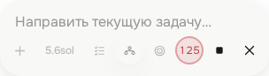</a>
  <a href="../apps/client/e2e/visual/__screenshots__/chromium/recording-dark-running-320.png">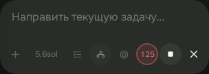</a>
</p>

Значения ниже описывают уже реализованный эталон в [styles.css][styles]. Переменные
`--composer-*` пока локальны; общие токены остальных экранов ещё не переработаны.

| Свойство                                     | Светлая тема                                                    | Тёмная тема                                                 |
| -------------------------------------------- | --------------------------------------------------------------- | ----------------------------------------------------------- |
| Поверхность `--composer-surface`             | `#f8f9f6`                                                       | `#292c28`                                                   |
| Мягкое выделение `--composer-control-active` | `#eceee8`                                                       | `#363a33`                                                   |
| Тень `--composer-shadow`                     | `0 12px 32px rgb(39 50 26 / 9%), 0 3px 12px rgb(39 50 26 / 4%)` | `0 12px 34px rgb(0 0 0 / 27%), 0 3px 14px rgb(0 0 0 / 10%)` |
| Радиус поверхности                           | `30px` на desktop, `24px` до `820px`                            | Такой же                                                    |
| Граница поверхности                          | `1px solid transparent`, без видимого контура                   | Такая же                                                    |
| Форма контролов                              | `999px` для капсулы, `50%` для круглого таймера                 | Такая же                                                    |

Мобильная геометрия композера, до `820px` включительно:

| Параметр                             | `320–359px`                        | `360–820px`  |
| ------------------------------------ | ---------------------------------- | ------------ |
| Внешние горизонтальные поля          | `8px`                              | `12px`       |
| Горизонтальные поля строки кнопок    | `5px`                              | `12px`       |
| Поля строки кнопок сверху / снизу    | `6px / 12px`                       | `6px / 12px` |
| Размер кнопки с иконкой              | `32 × 32px`                        | `32 × 32px`  |
| Ширина выбора модели в обычном чате  | `54px`, короткое имя видно целиком | Такая же     |
| Минимальный интервал соседних кнопок | `2px`                              | `2px`        |
| Отступ композера снизу               | `12px` + safe area                 | Такой же     |

Все режимы и действия композера должны полностью помещаться **в одну строку**,
включая запись и остановку работающей задачи. Перенос на второй ряд, горизонтальная
прокрутка, обрезание обязательных кнопок и уменьшение их ниже `32px` не подходят.
Таймер внутри кнопки показывает целые секунды: `60`, `125`, `600`, без деления на
минуты (`10:00`) и без сдвига соседей. У панели с дополнительным выбором проекта
сохраняется компактный вариант выбора модели с иконкой.

При открытой экранной клавиатуре нижний отступ убирается существующим правилом
`.composer.keyboard-open`. На desktop сохранены ширина до `880px`, внешние
горизонтальные поля `24px`, отступ снизу `20px` + safe area и зазор правых действий
`4px`; справа кнопки `34px`, настройки и добавление файлов — `32px`.

#### Связанные решения взаимодействия

- Статус «Codex работает» и время находятся рядом слева. Журнал открывается
  нажатием на компактную подпись статуса; пустая часть строки не кликабельна.
- Кнопка микрофона со стрелкой удалена. Обычный микрофон запускает запись по
  нажатию; после остановки и распознавания результат отправляется автоматически.
  Постоянная автоотправка не означает постоянное прослушивание микрофона.
- Новая запись отправляется как `send`, а при текущем ходе агента — как `steer`.
  Старое сохранённое предпочтение `codexnest.voiceInputMode` больше не управляет
  новыми записями; уже существующие задания распознавания сохраняют свою семантику.
- При недоступности отправки черновик остаётся редактируемым. Отключаются отправка
  и запуск новой записи, а не всё поле. Ошибки и отмена не должны терять ввод.
- Первая правка мобильных отступов касалась поля ввода и пространства рядом с
  ним. Лента переработана отдельно; готовый композер сохранён.

При будущей работе над экраном берите отсюда форму, тон, объём и поведение состояний,
сохраняя его назначение и доступность. Компоновка остальных экранов определяется
отдельно; правила чата не распространяются автоматически на боковую колонку,
настройки или расширение.

#### Область чата: свободная лента и акцентные карточки

Обычные пояснения и итоги агента показываются прямо на фоне чата, без общей
подложки и тени вокруг ответа. Мягкие карточки выделяют вопросы, подтверждения,
планы, чек-листы и отдельные блоки для копирования. Пояснения до и после такого
блока остаются на фоне чата. Обычный Markdown-заголовок или выделение текста
не превращает всё сообщение в карточку.

Порядок сообщений сохраняется, включая уточнения пользователя во время работы.
Вопросы и подтверждения относятся к своему ходу; запросы без загруженного хода
показываются отдельной карточкой. Оформление также охватывает шапку, очередь,
действия над сообщениями, сведения о задаче, просмотр вложений, переименование
и создание ветки. Боковая колонка и композер сохраняют прежние стили и геометрию.

<p>
  <a href="assets/chat-soft-light.png">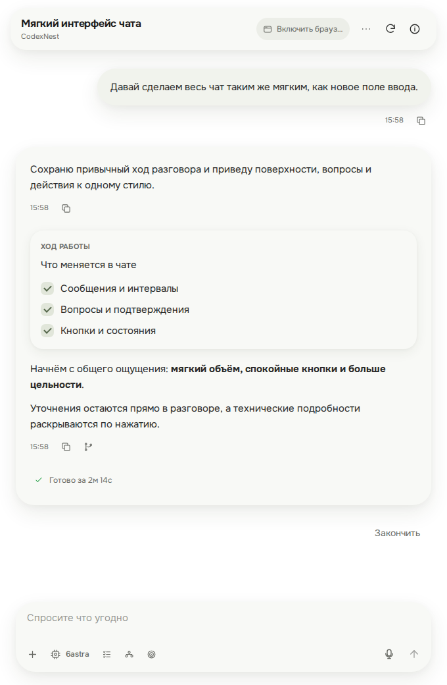</a>
  <a href="assets/chat-soft-dark.png">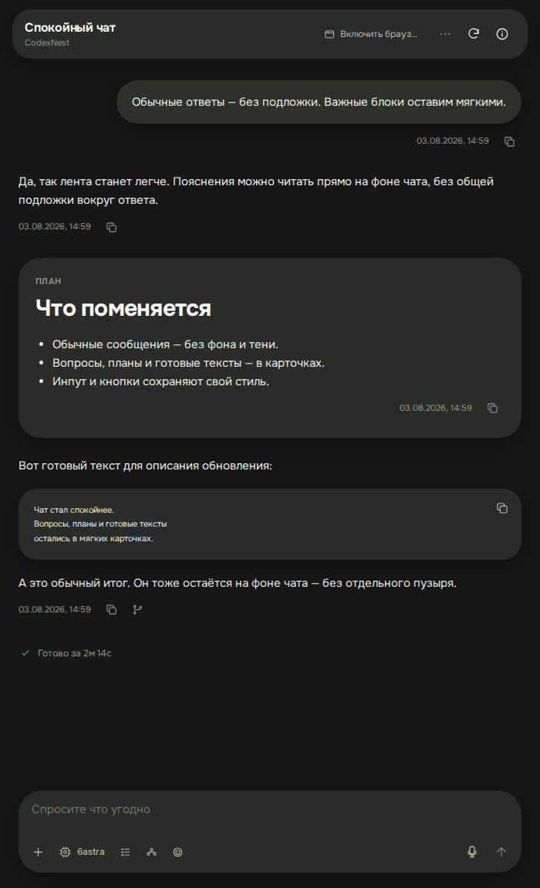</a>
</p>

<p>
  <a href="assets/chat-soft-mobile-light.png">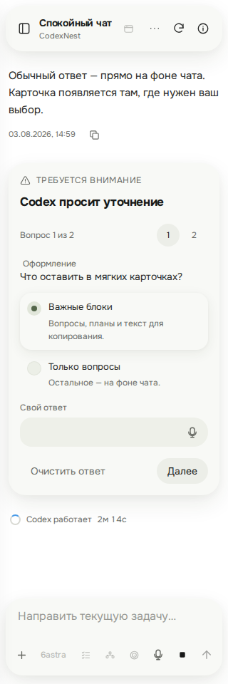</a>
  <a href="assets/chat-soft-mobile-dark.png">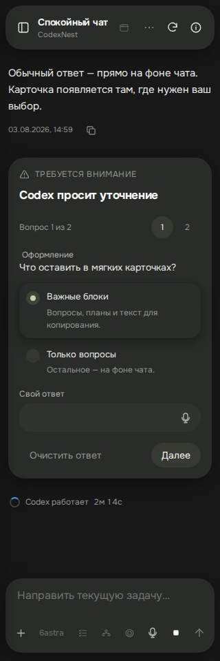</a>
</p>

- Основная поверхность и тень совпадают с эталоном композера. Вложенные карточки
  остаются в том же тоне и отделяются более лёгкой тенью. Достаточно двух уровней
  объёма; каждой строке отдельная карточка не нужна.
- Подписи, вкладки и текстовые кнопки имеют вес **400**, в том числе «Свой ответ»,
  «Далее» и действия подтверждения. Заголовки сохраняют иерархию; Markdown внутри
  сообщения сохраняет авторские выделения.
- Чекбокс — `20 × 20px`, радиус `7px`, приглушённая заливка и галочка.
  Радиокнопка остаётся круглой; выбранная строка выделяется мягкой тенью.
  Сохраняются нативная семантика, клавиатурный фокус и системный вид в forced colors.
- Кнопки с иконками в ленте имеют круглую область `32 × 32px`, в покое фон прозрачен.
  Слоты действий очереди имеют тот же размер, чтобы кнопки не выходили за границы.
- Поля акцентных карточек — `22px` на desktop и `16px` на mobile. Обычные сообщения
  выровнены по полям ленты; промежуток между сообщениями — `24px`.
  Компактный триггер журнала сохраняет отдельный таймер и не растягивается на всю строку.
- Общая декоративная поверхность ответа скрыта. Компоненты сообщений, вопросов
  и журнала сохраняют свои места в CSS Grid и не перегруппировываются в новые
  React-обёртки при уточнении пользователя: сохраняются черновик, выделение, фокус
  и раскрытие. Отдельный блок для копирования имеет радиус `24px` и собственную
  кнопку копирования; пользовательские сообщения сохраняют прежние пузыри.

#### Редактор аннотаций и изображения

Редактор комментария к выделенному тексту использует вариант **B**: текст слева,
кнопки удаления и сохранения столбиком справа. Поверхность `--chat-surface`, тень
`--chat-shadow`, радиус `24px`, внутренние отступы `12px`. Ширина до `360px`,
по краям доступной области остаётся минимум `16px`. Текст — Onest `16px/24px`,
вес `400`; отдельной подложки и контурной рамки у поля нет.

- Кнопки `36 × 36px`, иконки `18px`, промежуток `4px`. В покое фон прозрачен;
  удаление получает красный акцент при наведении или нажатии. Порядок Tab совпадает
  с визуальным порядком: поле, удаление, сохранение.
- Поле растёт по тексту от двух строк до `176px`, затем прокручивается внутри.
  Ручного растягивания нет. При открытой клавиатуре доступная высота ограничивает
  поле; редактор располагается под выделением или над ним по своим реальным размерам.
- Фокус поля обозначается мягким свечением общей поверхности. Кнопки сохраняют
  видимый клавиатурный фокус, в forced colors у редактора появляется системный контур.
- Сохранение, удаление и закрытие по нажатию снаружи сохраняют прежнее поведение.

У готовых изображений в сообщениях **нет общей рамки 4:3**. Превью и кликабельная
область повторяют реальные пропорции картинки, без добавленных полей и обрезки.
Небольшие изображения не увеличиваются. Markdown-превью ограничено шириной `720px`
и шириной сообщения; высота — меньшим из `480px` и `65dvh`. При ограничении высоты
ширина также уменьшается. Вложения сохраняют свою сетку, элементы выровнены по верху.

Пока размеры неизвестны, загрузка и ошибка показываются компактным статусом
минимальной высоты `64px`; готовая картинка получает собственную высоту.
Поздняя загрузка сохраняет позицию чтения, а при следовании за концом чата
прокрутка остаётся внизу. Просмотр полного изображения по нажатию не меняется.
Эти правила не изменяют миниатюры вложений в композере.

#### Компактная шапка чата

Высота шапки — `44px`, радиус — `22px`, верхний отступ — `8px` плюс безопасная
область экрана. На компьютере шапка центрирована по видимому пузырю инпута:
ширина — `min(832px, 100% − 48px)`. Название задачи и проект используют
Onest, `14px`, вес `400`, интервал `20px` и стоят в одну строку с промежутком
`10px`. Название выделяется основным цветом, проект — приглушённым.
На телефоне сохраняются две строки с интервалом `18px` и тем же размером текста.
Длинные названия сокращаются многоточием, оставляя место всем кнопкам.

Мобильные края совпадают с инпутом: `12px`, а до `359px` включительно — `8px`.
При ненулевых боковых безопасных областях отступ шапки равен максимуму из
обычного отступа и `8px + safe area`. Инпут сохраняет текущую геометрию.

Браузер представлен одной иконкой стандартного `icon-button`, одинакового размера
с обновлением и сведениями. Выключенное состояние прозрачно, включённое получает
мягкую заливку. Название действия доступно в подсказке и `aria-label`; загрузка
и блокировка переключения во время задачи сохраняются.

На всех ширинах шапка располагается поверх ленты. Её фон непрозрачен, тень и цвет
совпадают с другими мягкими поверхностями. Область прокрутки начинается сверху
рабочей области (на телефоне — под системным безопасным отступом), **выше нижнего
края шапки**: карточки не обрезаются прямой линией под панелью и видны вокруг обоих
её закруглений. Это правило действует и на границе `820/821px`, и при открытых сведениях.
Скругление всего viewport, сплошная прямоугольная подложка, размытие и автоматическое
скрытие шапки не используются. Область системных часов сохраняет фон страницы.

Начальный отступ ленты оставляет `28px` под шапкой на компьютере и `22px` на телефоне
и прокручивается вместе с историей. `scroll-padding-top` сохраняет `8px` между панелью
и целью перехода или фокуса. На телефоне меню ответвлений открывается на `8px` ниже
панели; сведения, навигация и диалоги сохраняют свои верхние слои. Настройки и экран
подготовки ответвления используют свою прежнюю компоновку.

<p>
  <a href="assets/chat-header-desktop-light.png">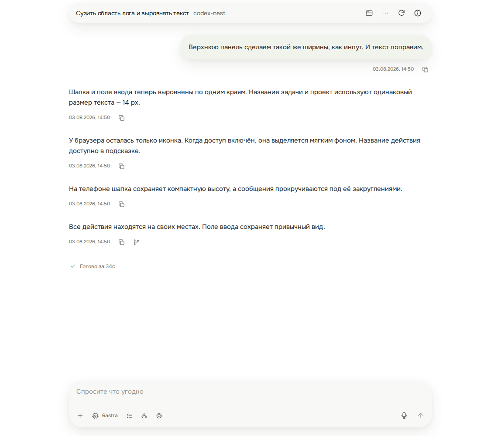</a>
  <a href="assets/chat-header-desktop-dark.png">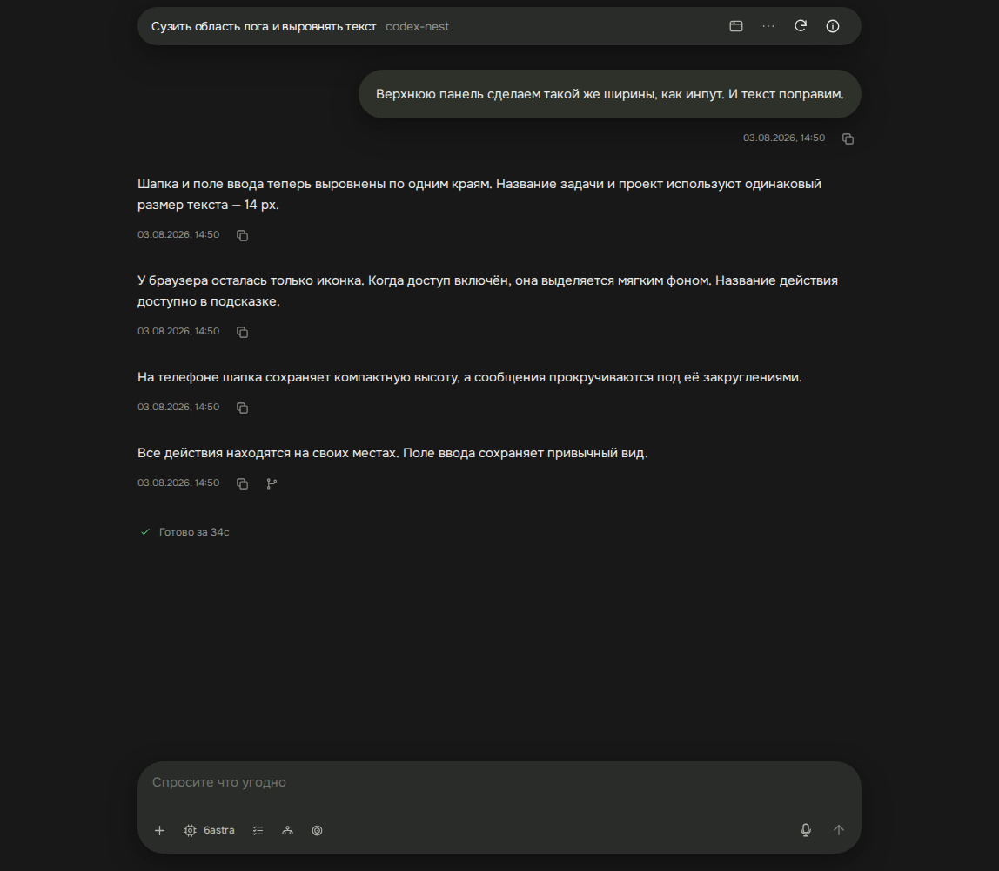</a>
</p>

<p>
  <a href="assets/chat-header-mobile-light.png">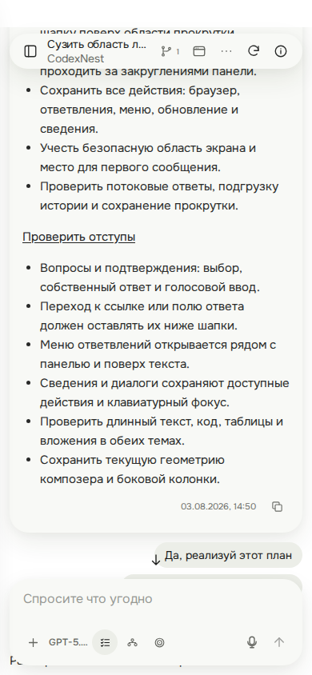</a>
  <a href="assets/chat-header-mobile-dark.png">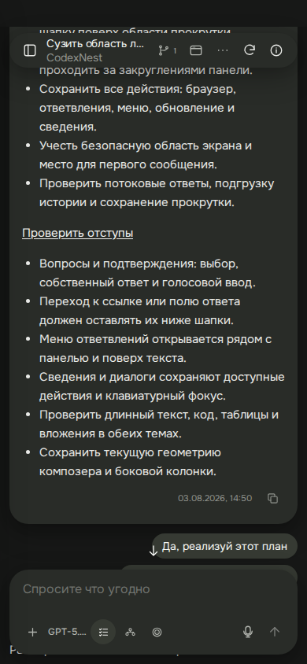</a>
</p>

#### Состояния кнопок чата

Все обычные кнопки и раскрывающие элементы в шапке, ленте, очереди, вопросах,
сведениях, вложениях и диалогах используют одну систему состояний. Размеры
и положение не меняются при наведении и нажатии. Подписи имеют вес `400`.

<p>
  <a href="assets/chat-button-states.png">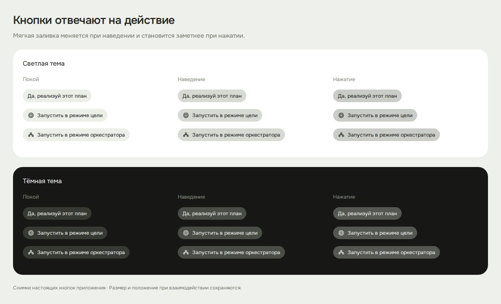</a>
</p>

| Роль                               | Покой                          | Наведение              | Нажатие                                     |
| ---------------------------------- | ------------------------------ | ---------------------- | ------------------------------------------- |
| Обычное действие                   | Прозрачный фон                 | `--chat-active`        | `--chat-control-hover`                      |
| Главное действие, включённый режим | `--chat-active`                | `--chat-control-hover` | `--chat-control-pressed`                    |
| Опасное действие                   | Прозрачный фон и красный текст | `--danger-soft`        | `--danger-soft` с примесью `--danger` в 10% |

`--chat-control-hover` и `--chat-control-pressed` — смесь `--chat-active` с
`--text-strong` в долях `10%` и `16%` соответственно. В светлой теме кнопка темнеет,
в тёмной — светлеет. Постоянная заливка главного действия не заменяет отклик:
все три кнопки запуска плана, «Далее», отправка ответов и сохранение имеют
различимые состояния. Выбранные вкладки и шаги вопроса сохраняют своё выделение.

Переход цвета занимает `120ms`; при reduced motion он отключён. Hover применяется
только при `(hover: hover)`, на телефоне остаётся отклик на нажатие без залипания
подсветки. Недоступные действия сохраняют своё исходное оформление и не реагируют
на указатель. Видимый клавиатурный фокус и признаки загрузки сохраняются.

Выключенный браузер не имеет постоянной заливки; включённый выделяется по
`aria-pressed="true"`. Кнопка перехода вниз в покое показывает только стрелку,
сохраняя полную область нажатия. Скачивание в списке артефактов — круглая кнопка
`32 × 32px` без разделителя. Кнопки поверх изображений сохраняют контрастную
полупрозрачную подложку без рамки; запись голоса — красное выделение.

В `chat.css` роли задают локальные `--chat-button-rest`, `--chat-button-hover`
и `--chat-button-pressed`, а общий селектор управляет состояниями. Не добавляйте
компонентные hover-правила, возвращающие прежнюю рамку или совпадающий с покоем фон.
Эти правила не распространяются на готовый композер, боковую колонку и настройки.

Локальные токены [chat.css](../apps/client/src/styles/chat.css) ограничены чатом
и его диалогами. Они не меняют общие примитивы остальных экранов:

| Токен                    | Значение | Назначение                                                       |
| ------------------------ | -------- | ---------------------------------------------------------------- |
| `--chat-radius-control`  | `16px`   | Поля, варианты ответа, пункты меню                               |
| `--chat-radius-card`     | `20px`   | Вложенные карточки, журнал, вложения                             |
| `--chat-radius-compact`  | `24px`   | Мобильные поверхности и шапка подготовки ответвления             |
| `--chat-header-height`   | `44px`   | Шапка чата; её радиус равен половине высоты                      |
| `--chat-radius-surface`  | `28px`   | Акцентные карточки, пользовательские сообщения и desktop-диалоги |
| `--chat-radius-checkbox` | `7px`    | Только маркеры выбора                                            |

Проверки охватывают потоковые обновления, уточнение посреди ответа, загрузку
истории, вопросы, очередь, доступность и обе темы. Отдельное сравнение защищает
стили и геометрию готового композера и боковой колонки.

### Примеры из проекта

Общие снимки ниже показывают ранее зафиксированную компоновку. Эталон нового
оформления — композер и свободная лента выше. Исторические снимки помогают найти
элементы и состояния, но не задают актуальное оформление чата.

Тёмная сессия: боковая панель, сообщение пользователя справа, план и прогресс
на спокойных подложках, ответ в потоке, композер внизу.

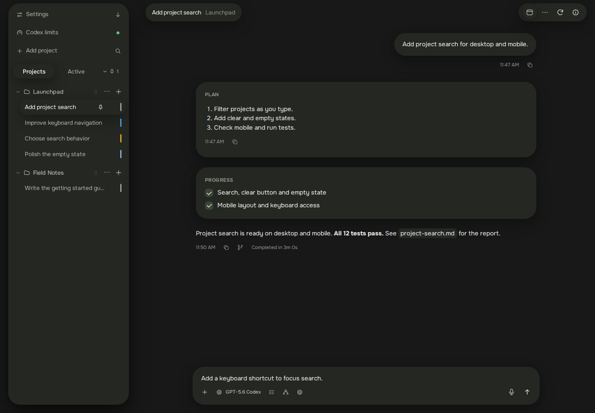

Мобильная сессия сохраняет ту же иерархию. Слева — светлая тема и композер;
справа — тёмная тема, вопрос и очередь.

<p>
  <a href="assets/mobile-session.png">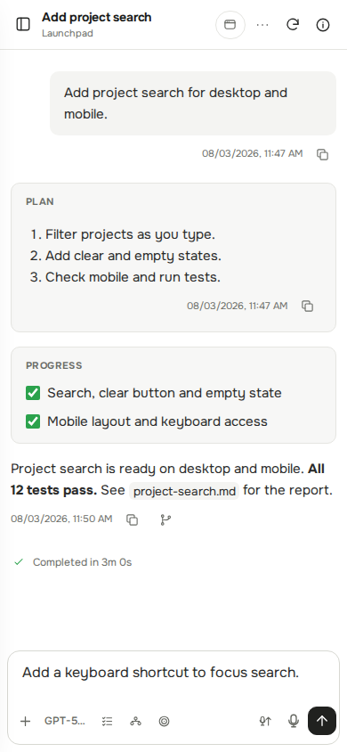</a>
  <a href="assets/mobile-question.png">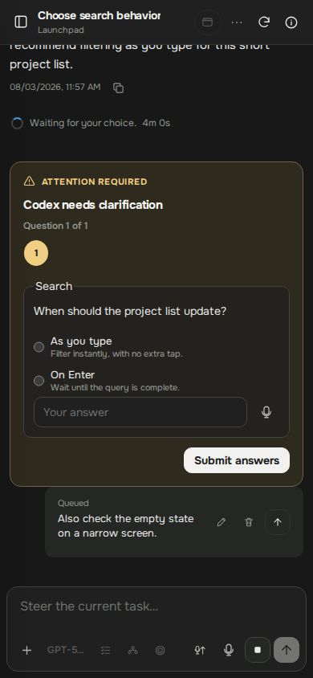</a>
</p>

| Паттерн             | Визуальный пример                                   | На что смотреть                                                     |
| ------------------- | --------------------------------------------------- | ------------------------------------------------------------------- |
| Настройки           | [Светлый desktop][settings-image]                   | Разделы и строки, подпись слева, контрол справа, тонкие разделители |
| Список сессий       | [Мобильная навигация](assets/mobile-sessions.png)   | Группы проектов, выбранная строка, маркеры статусов                 |
| Очередь             | [Светлый desktop](assets/desktop-queue.png)         | Сообщение остаётся узнаваемым до и после доставки                   |
| Журнал действий     | [Раскрытая активность](assets/desktop-activity.png) | Технические подробности раскрываются внутри сессии                  |
| Диалог на телефоне  | [Создание ветки во время загрузки][sheet-image]     | Нижняя панель, доступные действия, стабильное положение заголовка   |
| Просмотр результата | [Мобильный Markdown](assets/mobile-report.png)      | Тема приложения, читаемый документ, собственная область прокрутки   |

Изображения — примеры состояния интерфейса, а не источник текстов или продуктовых
требований. Подписи и содержимое демонстрационной сессии не нужно копировать в фичи.

## Основы UI

### Цвета и поверхности клиента

Все переменные в следующей таблице определены в [tokens.css][tokens]. Светлая
тема задаётся в `:root`, тёмная — в `:root[data-resolved-theme="dark"]`.
Системный режим разрешается существующей логикой [App.tsx][app]; новой фиче
не нужен собственный механизм определения темы.

| Токен                  | Светлая   | Тёмная    | Назначение                                         |
| ---------------------- | --------- | --------- | -------------------------------------------------- |
| --color-canvas         | `#ffffff` | `#171817` | Основной фон рабочего пространства                 |
| --color-surface        | `#ffffff` | `#1f201f` | Контролы, заголовок, диалоги                       |
| --color-recessed       | `#f4f4f2` | `#252725` | Приглушённая подложка, сообщение пользователя, код |
| --color-sidebar        | `#eef0e9` | `#20231f` | Боковая навигация                                  |
| --color-raised         | `#ffffff` | `#282a28` | Всплывающие меню                                   |
| --color-ink            | `#292a29` | `#e9eae7` | Основной текст                                     |
| --color-ink-strong     | `#181918` | `#f7f8f5` | Заголовки и важные подписи                         |
| --color-muted          | `#6a6c67` | `#92958f` | Описания и метаданные                              |
| --color-muted-strong   | `#646660` | `#b1b4ae` | Второстепенные контролы и подписи                  |
| --color-lapis          | `#20211f` | `#f1f2ef` | Главное действие и видимый фокус                   |
| --color-lapis-contrast | `#ffffff` | `#181918` | Текст на основном действии                         |
| --color-line           | `#e5e5e1` | `#323431` | Ненавязчивые разделители                           |
| --color-line-strong    | `#d7d8d2` | `#41443f` | Границы контролов                                  |
| --color-hover          | `#e2e5dc` | `#2a2e28` | Наведение в навигации                              |
| --color-active         | `#dfe3d8` | `#30352e` | Выбранная строка навигации                         |
| --color-danger         | `#c53b43` | `#ef6a70` | Ошибки и опасные действия                          |
| --color-danger-soft    | `#fff0f0` | `#351f21` | Подложка ошибки                                    |
| --color-warning        | `#fff8e8` | `#352e1e` | Подложка предупреждения                            |
| --color-warning-text   | `#725315` | `#f1cf82` | Текст предупреждения                               |
| --color-success        | `#2ba24c` | `#5ac878` | Успешный результат                                 |

`--color-lapis` — историческое имя нейтрального акцента, оно не означает синий
цвет. `--color-warning` — фон, поэтому его нельзя использовать как цвет текста
предупреждения. Цвет состояния не заменяет понятную подпись или доступное имя.
Читаемость проверяется на фактическом фоне, включая прозрачность и наложения.

В существующем коде используются совместимые псевдонимы: `--text`, `--muted`,
`--surface`, `--surface-muted`, `--line`, `--accent`, `--danger`, `--shadow` и другие.
Их соответствия заданы в [tokens.css][tokens]. При правке существующего блока
сохраняйте принятую в нём запись; для нового общего стиля выбирайте смысловой
токен `--color-*`. Не дублируйте значения HEX в компоненте и не переименовывайте
псевдонимы ради новой фичи.

### Статусы клиента

Источник цветов — [tokens.css][tokens]; отображение статуса сессии определяют
[thread-status.ts][thread-status] и селекторы `.status-*` в [styles.css][styles].

| Токен                | Светлая   | Тёмная    | Значение                        |
| -------------------- | --------- | --------- | ------------------------------- |
| --status-idle        | `#a0a39d` | `#a0a39d` | Нейтральное состояние           |
| --status-running     | `#4b9ce8` | `#4b9ce8` | Выполнение                      |
| --status-queued      | `#86b7d9` | `#86b7d9` | Очередь                         |
| --status-attention   | `#e5a62b` | `#e5a62b` | Требуется внимание              |
| --status-complete    | `#2ba24c` | `#5ac878` | Завершение, требующее прочтения |
| --status-failed      | `#c53b43` | `#ef6a70` | Ошибка                          |
| --status-interrupted | `#9974db` | `#9974db` | Прерывание                      |

Не вычисляйте маркер только по `thread.state`: учитываются очередь,
прочитанность и факт просмотра. Например, прочитанная ошибка получает нейтральный
маркер, а очередь у прочитанной завершённой сессии — маркер очереди. Используйте
`threadStatusClasses` и `hasAlwaysVisibleThreadStatus` в соответствующих местах.
В навигации маркер — вертикальная полоса `3 × 22px`; базовая точка — `7 × 7px`.
Не распространяйте постоянную пульсацию на все статусы.

### Отступы, размеры и форма

Источник токенов — [tokens.css][tokens]. Размеры указаны в CSS-пикселях.

| Токен                  | Значение | Применение                                       |
| ---------------------- | -------- | ------------------------------------------------ |
| --space-0-5            | `2px`    | Микроинтервал между связанными элементами        |
| --space-1              | `4px`    | Тесная связь подписи и пояснения                 |
| --space-1-5            | `6px`    | Компактный промежуток внутри контрола            |
| --space-2              | `8px`    | Иконка и текст, небольшие группы                 |
| --space-2-5            | `10px`   | Компактный внутренний отступ                     |
| --space-3              | `12px`   | Внутренние отступы, мобильный край ленты         |
| --space-4              | `16px`   | Блоки внутри одного сообщения или диалога        |
| --space-5              | `20px`   | Поля диалога и промежутки между блоками          |
| --space-6              | `24px`   | Поля ленты и разделы на мобильном экране         |
| --space-8              | `32px`   | Разделение ходов разговора и секций desktop      |
| --radius-sm            | `6px`    | Строки навигации, небольшой встроенный элемент   |
| --radius-md            | `10px`   | Обычные кнопки, поля, карточки, меню, сообщения  |
| --radius-lg            | `14px`   | Диалоги и крупные накладываемые панели           |
| --control-height       | `34px`   | Базовая минимальная высота контрола              |
| --control-touch-height | `32px`   | Текущий компактный мобильный размер              |
| --sidebar-width        | `292px`  | Закреплённая боковая панель desktop              |
| --header-height        | `60px`   | Заголовок desktop; на мобильном переопределяется |

Для новых интервалов сначала выбирайте ближайший токен по назначению. Тонкая
граница обычно `1px`; круглая форма и капсула уместны для круглых действий,
маркеров и коротких статусов. Прямые значения для оптического выравнивания и
специальной геометрии допустимы в существующем паттерне, но не образуют новую шкалу.

Радиус выбирается по роли: `6px` для компактных встроенных действий и пунктов,
`10px` для обычных контролов, карточек и меню, `14px` для диалогов и
других существующих накладываемых панелей. Это шкала текущих общих примитивов;
утверждённый композер использует `30/24px` и круглые контролы, а чат — локальную
шкалу `--chat-radius-*`, как описано [выше](#утверждённое-направление). В чате
используйте эти локальные токены, в остальных существующих экранах —
`var(--radius-sm)`, `var(--radius-md)` или `var(--radius-lg)`, без произвольных
промежуточных значений. У диалогов чата все углы скруглены; у остальных мобильных
sheet сохраняется прежняя геометрия. Круги, капсулы, локальную шкалу чата и
перечисленные оптические исключения проверяет
[тест радиусов][style-tests]; новое исключение требует объяснения там и здесь.

При унификации существующего экрана заменяйте число токеном с тем же значением:
не меняйте плотность, порядок и положение элементов попутно. Новый размер вне
шкалы сначала нужно обосновать; случайное число не становится общим стандартом.

Следующая геометрия определяется в [styles.css][styles]. Ширины поверхностей и
сетка настроек заданы локально; отступы используют `--space-*`, а базовая
икон-кнопка — `--control-height`. Таблица показывает итоговые значения,
а не рекомендует копировать числа вместо токенов:

| Элемент / селектор                         | Текущее значение                                                 |
| ------------------------------------------ | ---------------------------------------------------------------- |
| Лента `.timeline`                          | Ширина `min(880px, 100%)`, поля `32px 24px` на desktop           |
| Композер `.composer`                       | Ширина `min(100%, 880px)`, горизонтальные поля `24px` на desktop |
| Настройки `.settings-stack`                | Ширина `min(880px, 100%)`                                        |
| Строка `.settings-row`                     | Минимум `62px`, контрол в колонке `220–300px` на desktop         |
| Диалог `.dialog-surface`                   | Ширина `min(580px, 100%)`, внутренний отступ `20px`              |
| Небольшой диалог `.dialog-surface.compact` | Ширина `min(450px, 100%)`                                        |
| Кнопка `.icon-button`                      | `34 × 34px` до локальных переопределений                         |

Минимальная высота не гарантирует итоговую: содержимое и внутренние отступы
могут увеличить контрол. `32px` — существующий контракт компактности отдельных
мобильных действий, а не универсальное утверждение об удобстве всех целей касания.
Не уменьшайте этот размер ради размещения дополнительной кнопки. Проверяйте
доступность и расстояния между действиями на реальном узком экране.

### Типографика и иконки

Клиент и расширение поставляют локальный variable-шрифт **Onest**, диапазон начертаний
`400–700`, с `font-display: swap`. Семейство задаёт `--font-ui` в [токенах][tokens].
**`--font-mono` сейчас равен `--font-ui`**: пути, код и технические подписи тоже
используют Onest. Не подключайте отдельный моноширинный или заголовочный шрифт
в рамках новой фичи.

Размеры задаются общими токенами `--text-*` в [tokens.css][tokens]:

| Токен          | Размер | Назначение                                   |
| -------------- | ------ | -------------------------------------------- |
| --text-micro   | `9px`  | Существующие микроподписи, не основной текст |
| --text-tiny    | `10px` | Компактные бейджи и служебные подписи        |
| --text-caption | `11px` | Метаданные и подписи метрик                  |
| --text-small   | `12px` | Описания и значения метрик                   |
| --text-label   | `13px` | Подпись строки настройки                     |
| --text-ui      | `14px` | Основной UI                                  |
| --text-message | `15px` | Сообщение и desktop-ввод                     |
| --text-input   | `16px` | Мобильный ввод и заголовок экрана            |
| --text-section | `17px` | Заголовок раздела                            |
| --text-dialog  | `19px` | Заголовок диалога                            |

Общие начертания: `--weight-regular` (`400`), `--weight-medium` (`500`),
`--weight-semibold` (`600`), `--weight-action` (`650`), `--weight-bold` (`700`).
Интерлиньяж: `--leading-tight` (`1.25`), `--leading-copy` (`1.5`),
`--leading-message` (`1.6`). Существующие оптические значения между ступенями
не округляются при механической замене: это может изменить переносы и высоту.
Микроразмеры не используйте для инструкций, ошибок и значимых метрик.

Роли в [примитивах][primitives] и [стилях экранов][styles]:

| Роль / селектор                                 | Размер и параметры                                      |
| ----------------------------------------------- | ------------------------------------------------------- |
| Базовый UI, `body`                              | `14px`, обычное начертание                              |
| Сообщение, `.message`                           | `15px / 1.6`                                            |
| Ввод, `.composer-box textarea`                  | `15px`; на мобильном `16px`, межстрочный интервал `1.5` |
| Заголовок экрана, `.workspace-title h1`         | `16px`, вес `650`; на мобильном `14px`                  |
| Заголовок раздела, `.settings-group-heading h2` | `17px / 1.25`                                           |
| Заголовок диалога, `.dialog-heading h2`         | `19px`                                                  |
| Подпись строки настроек                         | `13px / 1.35`, вес `650`                                |
| Описание строки настроек                        | `12px / 1.45`, приглушённый цвет                        |
| Подзаголовок экрана, `.workspace-title p`       | `11px / 1.3`, вес `400`                                 |

Короткие заголовки и имена сессий могут сокращаться многоточием. Инструкции,
ошибки и основной текст должны переноситься и оставаться доступными целиком.
Для flex/grid-детей с длинным содержимым сохраняйте `min-width: 0`. Выбранная
сессия выделяется фоном и цветом текста: её жирность не меняется при выборе.

[Icons.tsx][icons] задаёт единый язык иконок: `viewBox="0 0 24 24"`, обычный размер
`18 × 18px`, `strokeWidth="1.8"`, круглые окончания и соединения, `currentColor`.
В отдельных контролах размер переопределён — ориентируйтесь на соседние иконки
того же ряда. Сначала используйте существующую иконку. Если нужна новая, добавляйте
её в этот набор с теми же параметрами; не вводите другую библиотеку или emoji
вместо пиктограммы. Иконки по умолчанию скрыты от скринридера: доступное название
получает кнопка, например `aria-label={t("Закрыть")}`.

### Логотип и значки приложения

Официальный знак CN для веба и расширения —
[favicon.svg](../apps/client/public/favicon.svg). Сохраняйте геометрию, пропорции,
цвета и внутренние поля исходника; не собирайте буквы текстом или CSS-фигурами.
В заголовке расширения знак имеет размер `24 × 24px`. Рядом с видимой подписью
CodexNest изображение получает пустой `alt`, чтобы название не озвучивалось дважды;
самостоятельная ссылка или кнопка с логотипом должна иметь доступное имя.

Для панели инструментов Chrome используются PNG `16/32px`, для списка расширений
также `48/128px`. Они указаны в [манифесте расширения][extension-manifest] и
механически получены из того же `favicon.svg`, а не нарисованы отдельно.
После согласованного изменения исходника обновите их командой
`npm run icons:generate -w @codexnest/extension` с установленным Chromium для
Playwright. PNG хранятся в репозитории: обычная сборка не требует браузера.
[Браузерный тест][extension-appearance] сверяет размеры и рисунок готовых файлов
с исходным SVG. В обеих темах используется один знак, без отдельного цветного акцента.

У устанавливаемого PWA есть существующий квадратный вариант
[pwa-icon.svg](../apps/client/src/assets/pwa-icon.svg) с тем же знаком на фоне
`#171817`; его ресурсы и правила установки проверяет
[pwa.test.ts](../apps/client/src/pwa.test.ts). Не заменяйте им круглый знак в
заголовке и не меняйте оформление платформенных значков попутно с новой фичей.

### Движение, фокус и перекрытия

| Токен из [tokens.css][tokens] | Значение                                                       | Назначение                         |
| ----------------------------- | -------------------------------------------------------------- | ---------------------------------- |
| --motion-fast                 | `120ms`                                                        | Смена цвета, границы, прозрачности |
| --motion-standard             | `180ms`                                                        | Появление поверхности              |
| --motion-ease                 | `cubic-bezier(0.2, 0, 0, 1)`                                   | Базовая кривая перехода            |
| --elevation-overlay, светлая  | `0 10px 32px rgb(28 30 27 / 9%), 0 1px 3px rgb(28 30 27 / 7%)` | Тень наложенной поверхности        |
| --elevation-overlay, тёмная   | `0 14px 42px rgb(0 0 0 / 30%), 0 1px 3px rgb(0 0 0 / 24%)`     | Та же роль в тёмной теме           |

Анимация объясняет изменение состояния. Не добавляйте декоративное движение
вокруг обычного результата. Поддержка `prefers-reduced-motion` уже предусмотрена
в [примитивах][primitives] и специальных стилях; новые эффекты должны её учитывать.

Базовый `:focus-visible` — обводка `2px` цветом `--color-lapis` с отступом `2px`.
Сохраняйте заметный фокус на кнопках, полях, ссылках и раскрываемых элементах.
У композера есть собственное оформление `:focus-within`; это не образец для
глобального удаления outline.

Нативные checkbox и radio используют нейтральный `accent-color: var(--color-lapis)`.
Семантическое исключение — зелёные маркеры выполнения в `.plan-checklist`.
Не заменяйте нативные контролы декоративными элементами только ради цвета.

У клиента несколько уровней наложения: заголовки и композер, навигация,
инспектор/просмотрщик, затем диалоги. Используйте существующую поверхность и её
backdrop. Не решайте конфликт произвольным `z-index: 9999`.
[Dialog][dialog] создаёт портал и учитывает глубину вложения через `100 + depth`.

## Каталог элементов

Сейчас это сочетание HTML-примитивов с классами и специализированных React-компонентов.
Общего React-компонента `Button`, `Input` или универсального `Card` в клиенте нет.
Каталог описывает существующие реализации; при будущей переработке экрана их
внешний вид сверяется с [утверждённым направлением](#утверждённое-направление),
а поведение и доступность сохраняются.

| Элемент                    | Что использовать                                                                              | Правило                                                                       |
| -------------------------- | --------------------------------------------------------------------------------------------- | ----------------------------------------------------------------------------- |
| Обычная кнопка             | `button`, [primitives.css][primitives]                                                        | Второстепенное действие; `type="button"`, если это не отправка формы          |
| Основное действие          | `button.primary`                                                                              | Одно главное действие в одной группе решений                                  |
| Опасное действие           | `button.danger`                                                                               | Назвать последствие; подтверждение соразмерно действию                        |
| Кнопка с иконкой           | `.icon-button` и [Icons][icons]                                                               | Для компактной панели; доступное имя обязательно                              |
| Поле и выбор               | `input`, `textarea`, `select`                                                                 | Видимая связанная подпись, отдельное пояснение и ошибка                       |
| Переключатель режима       | `.setting-control` в [SettingsPicker][settings-picker]                                        | `aria-pressed` отражает выбор; недоступность не выглядит выбранным состоянием |
| Переключатель в настройках | `.skill-switch` в [SkillsSettingsCard][skills-settings]                                       | Сохранить настоящий checkbox и связанное имя                                  |
| Действие с ожиданием       | [ActionLabel][action-label] внутри кнопки                                                     | Резервирует место для обеих подписей, доступна только текущая                 |
| Диалог                     | [Dialog][dialog]                                                                              | Название, начальный фокус, Tab, закрытие, возврат фокуса                      |
| Меню действий              | Существующие `details/summary` в [App][app] и [ThreadPage][thread-page]                       | Действия рядом с объектом, доступность без hover, закрытие снаружи            |
| Группа и строка настроек   | [SettingsGroup / SettingsRow][settings-presentation]                                          | Общая сетка, подпись, пояснение, область контрола                             |
| Заголовок рабочего экрана  | [WorkspaceHeader][workspace-header]                                                           | Общий заголовок, мобильная навигация, действия и сведения                     |
| Вопрос в сессии            | [AttentionPanel][attention] / [AsyncQuestionCard][async-question]                             | Выбор и отправка — отдельные шаги; состояние ответа видно                     |
| Сведения и результат       | [SessionInspector][inspector], [ArtifactViewer][artifact-viewer], [ImageViewer][image-viewer] | Использовать существующие панели просмотра                                    |
| Пустое состояние           | `.center-state`, `.center-state.compact`                                                      | Объяснить отсутствие данных и доступный следующий шаг                         |
| Обратная связь             | `.settings-notice`, `.dialog-notice`, контекстная ошибка                                      | Сообщение рядом с действием; подходящая семантическая роль                    |

### Состояния элемента

Для каждого нового элемента проверьте применимые состояния. Если состояние
невозможно по смыслу, его не нужно искусственно добавлять.

| Состояние          | Ожидаемое поведение                                                                    |
| ------------------ | -------------------------------------------------------------------------------------- |
| Обычное            | Роль и название действия понятны до взаимодействия                                     |
| Hover              | Мягкая смена поверхности/границы; без движения соседних элементов                      |
| Клавиатурный фокус | Заметная обводка; все действия доступны с клавиатуры                                   |
| Выбрано / раскрыто | Согласованы фон, `aria-pressed`, `aria-selected`, `aria-expanded` по роли элемента     |
| Недоступно         | Реальный `disabled` или подходящая семантика; причина видна, если она неочевидна       |
| Выполняется        | Блокируется повторное действие, подпись объясняет процесс, размеры стабильны           |
| Первичная загрузка | Понятно, что данные ещё не получены; доступные части интерфейса работают               |
| Обновление         | Сохраняются введённые данные, выбор, фокус и прочитанный участок                       |
| Пусто              | Отличается от загрузки и ошибки; предложен уместный следующий шаг                      |
| Ошибка             | Понятны сбой и возможность исправления/повтора, ввод не теряется                       |
| Успех              | Подтверждён фактический результат, снята блокировка, контекст сохранён                 |
| Нет связи          | Показано состояние подключения и судьба действия: сохранено, ожидает или не отправлено |

Не используйте `disabled` только для изменения цвета. Базовая непрозрачность
недоступной кнопки клиента — `0.4`; локальные контролы могут иметь переопределения.
Отсутствие данных во время запроса нельзя показывать как «Ничего не найдено».

### Пример: действие без скачка ширины

Фрагмент внутри React-компонента клиента. `t` получен из `useI18n`, `saving` и
`save` — состояние и обработчик этого компонента. Импортируйте [ActionLabel][action-label]
из существующего модуля. Обработчик отвечает за результат и сообщение об ошибке.

```tsx
<button type="button" className="primary" disabled={saving} onClick={save}>
  <ActionLabel idle={t("Сохранить")} busy={t("Сохраняем…")} pending={saving} />
</button>
```

Компонент оставляет обе подписи в расчёте ширины и показывает одну. Не заменяйте
его условием, которое меняет ширину кнопки при каждом запросе. Если фиче нужен
спиннер, его место также не должно сдвигать подпись и соседние действия.

### Пример: строка настроек

Фрагмент использует [SettingsGroup / SettingsRow][settings-presentation] и
[SlidersIcon][icons]. `theme` и `onThemeChange` приходят от владельца настроек,
как в [SettingsPage][settings-page]. Это пример размещения, не отдельная форма
хранения темы. `id` должен быть уникален на странице.

```tsx
<SettingsGroup title={t("Интерфейс")} icon={<SlidersIcon />}>
  <SettingsRow
    label={t("Тема")}
    labelFor="settings-theme"
    description={t("Светлая, тёмная или системная цветовая схема.")}
  >
    <select
      id="settings-theme"
      value={theme}
      onChange={(event) => onThemeChange(event.target.value)}
    >
      <option value="system">{t("Системная тема")}</option>
      <option value="light">{t("Светлая тема")}</option>
      <option value="dark">{t("Тёмная тема")}</option>
    </select>
  </SettingsRow>
</SettingsGroup>
```

`SettingsRow` связывает подпись через `labelFor`. Его `description` отображается
визуально; для программной связи описания/ошибки с полем задавайте явный `id` и
`aria-describedby` в конкретной форме. Не полагайтесь на placeholder как на label.

### Пример: небольшой информационный диалог

Фрагмент монтируется условно, когда диалог открыт. `titleId` создаётся через
React `useId()`, `title` и `content` — локализованный заголовок и содержимое,
`closeButtonRef` — `useRef<HTMLButtonElement>(null)`, `onClose` закрывает диалог.
Используются существующие [Dialog][dialog] и [XIcon][icons].

```tsx
<Dialog
  className="compact"
  titleId={titleId}
  closeOnBackdrop
  closeOnEscape
  initialFocusRef={closeButtonRef}
  onClose={onClose}
>
  <div className="dialog-header">
    <div className="dialog-heading">
      <h2 id={titleId}>{title}</h2>
    </div>
    <button
      ref={closeButtonRef}
      type="button"
      className="icon-button"
      aria-label={t("Закрыть")}
      onClick={onClose}
    >
      <XIcon />
    </button>
  </div>
  <div>{content}</div>
</Dialog>
```

У `Dialog` задаётся либо `titleId`, либо `ariaLabel`. Для формы с несохранёнными
данными политика закрытия должна учитывать потерю ввода: не копируйте поведение
информационного окна автоматически. Сам компонент не подтверждает потерю данных.
Начальный фокус формы обычно получает нужное поле, подтверждения — безопасное
действие. При нестандартном открытии задайте `returnFocusRef`; обычный открыватель
компонент запоминает сам.

### Диалог создания ветки

В [ForkDialog][fork-dialog] метрики находятся под описанием варианта в двух
колонках. Подписи «Объём»/«Время» — `--text-caption` (`11px`), значения —
`--text-small` (`12px`). Текст переносится по словам, а не посреди единицы измерения.
Заголовок и нижние действия сохраняют положение при загрузке и ошибке расчёта.
Высота определяется содержимым. Между прокручиваемым телом и действиями остаётся
`16px`; внутри тела предусмотрены вертикальные отступы `12px`, чтобы тени карточек
не обрезались.
Не резервируйте пустоту фиксированной высотой окна или растягиванием его тела.
Подписи метрик видны и при загрузке; на ширине до `640px` под значение отводится
минимум две строки, чтобы переносы не сдвигали кнопки. На desktop высота ограничена
viewport и safe area, у мобильного sheet — дополнительно `88dvh`.
Если содержимое не помещается, прокручивается только тело, а заголовок и действия
остаются видны.
Недоступность оценки не должна скрывать разрешённое создание ветки.

## UX-паттерны

### Где размещать новую возможность

| Задача пользователя              | Место в интерфейсе              | Правило                                                                     |
| -------------------------------- | ------------------------------- | --------------------------------------------------------------------------- |
| Найти проект, переключить сессию | Боковая навигация               | Сохранять группировку, порядок и выбранную строку                           |
| Выполнить действие над сессией   | Заголовок сессии или её меню    | Частое действие видно; дополнительные действия собраны рядом с объектом     |
| Настроить следующую отправку     | Композер и SettingsPicker       | Не перегружать строку инструментов; сохранять доступ к отправке и остановке |
| Изменить постоянное предпочтение | Соответствующий раздел настроек | Использовать существующие группы и строки; объяснить область действия       |
| Посмотреть детали выполнения     | Раскрываемый журнал активности  | Краткое состояние видно сразу, подробности доступны по запросу              |
| Посмотреть файлы и результат     | Инспектор и просмотрщик         | Сохранять контекст сессии и возможность вернуться к чтению                  |
| Ответить на вопрос               | Блок вопроса в сессии           | Видны варианты, свободный ответ, отправка и состояние доставки              |

Не переносите управление сессией в глобальные настройки только ради свободного
места. Поясняйте область настройки, если она влияет на устройство, все подключения
или только следующие задачи; пример уже есть в разделе «Интерфейс».

### Раскрытие, меню, диалог или отдельный экран

- **Раскрытие на месте** — подробности того же объекта: журнал действий, команда,
  пояснение. Свернутый заголовок должен сохранять полезный смысл.
- **Меню / popover** — небольшой набор действий или короткий выбор рядом с
  инициатором. Сохраняйте доступ без наведения, закрытие снаружи и клавиатурой
  по существующему паттерну; проверьте поведение конкретного меню.
- **Диалог** — ограниченная задача с собственным вводом или подтверждением.
  Используйте общий компонент, явный заголовок и понятный выход.
- **Экран / панель** — длительная работа, большая форма, просмотр документа.
  Переиспользуйте компоновку настроек, инспектора или просмотрщика.

Само наличие `details/summary` не реализует все правила сложного меню. Для новых
действий повторяйте соответствующую логику закрытия и фокуса, а не только HTML.
Не открывайте вложенный диалог, если действие можно завершить в текущем.

### Разговор, очередь и фоновая работа

Источники: [ThreadPage][thread-page], [Composer][composer],
[AsyncQuestionCard][async-question] и [проверки стабильности][layout-tests].

- Сообщение пользователя имеет собственную подложку и выравнивается вправо.
  Ответ ассистента читается в потоке. План, прогресс, вопрос и журнал остаются
  различимыми типами содержимого.
- Сообщение в очереди сохраняет типографику и геометрию при переходе в историю.
  Не меняйте ему размер шрифта или ширину только из-за доставки.
- Различайте запись на устройстве, принятие сервером и доставку. Успех одного
  этапа не означает завершение следующего; подпись должна отражать известный факт.
- При временной недоступности сохраняйте черновик и выбранные ответы. Выбор
  варианта ответа не равен отправке: нужна явная кнопка; основной черновик
  композера при этом не заменяется.
- Отправка сообщения из основного композера пропускает текущую форму уточнений:
  сообщение передаётся как новое указание, без назначения ответом на первый вопрос.
  Форма скрывается после сохранения текста в очередь отправки, а для голосового
  сообщения — с начала загрузки записи. При ошибке или отмене актуальная форма
  возвращается с прежними ответами и текущим вопросом. Диктовка в черновик или
  внутри формы не пропускает вопросы; пропуск привязан к конкретному блоку.
- Форма уточнений отделяется от голосового сообщения и очереди интервалом
  `--space-4` (`16px`); между ходами сохраняется `--space-8` (`32px`). Скрытая форма
  не оставляет собственного отступа. Переключатели вопросов круглые: `34 × 34px`
  на desktop и `32 × 32px` до `820px` включительно, без сжатия. Счётчик и навигация
  располагаются в одной строке с переносом; свободный ответ имеет видимую подпись.
- Фоновые обновления не забирают фокус и не прокручивают читателя к концу, если
  он читает выше. Пользовательская навигация остаётся отзывчивой во время работы.
- Резервируйте место для изображений, загрузки и изменяемых подписей. Отправка,
  остановка, запись голоса и появление очереди не должны перемещать соседние
  контролы под указателем.
- Между правыми действиями композера сохраняйте зазор: `--space-1` (`4px`) на
  desktop и `--space-0-5` (`2px`) до `820px` включительно. Мобильные кнопки остаются
  не меньше `32 × 32px`; при записи и появлении остановки задачи они помещаются
  в одну строку, в том числе на `320px`. Нулевой зазор здесь не является нормой
  компактности. Пульсация записи рисуется внутри кнопки и не закрывает соседние
  действия; при уменьшенном движении остаётся статическая внутренняя обводка.

### Ошибки, обратная связь и подтверждения

Показывайте ошибку рядом с причиной: поле, карточка, композер, просмотрщик.
Проблему общего соединения показывает общий статус. Сохраняйте достаточно
контекста для повтора; не заменяйте всю страницу сообщением из-за локальной ошибки.

Текст сообщает, что не удалось сделать и что доступно дальше. Например:
«Не удалось загрузить фрагмент» с повтором или «В записи не обнаружена речь.
Проверьте микрофон и запишите ещё раз». Не обещайте восстановление или сохранение,
если приложение не располагает подтверждением.

Для ошибки, требующей внимания, подходит `role="alert"`; для ненавязчивого
результата или состояния — `role="status"`. Не озвучивайте каждое фоновое событие.
В [SettingsGroup][settings-presentation] уже есть `aria-busy` и `inert` для загрузки
тела группы; наружный заголовок остаётся. Это не повод размонтировать всю секцию.

Подтверждение требуется там, где пользователь может потерять значимые данные
или прервать работу; его текст называет объект и последствие. Для обычного
безопасного переключения лишний диалог не нужен. Используйте поведение действия
в его текущем контексте: например, завершение сессии в боковом списке имеет
подтверждение повторным нажатием и собственную подпись. Не распространяйте этот
способ на все опасные операции.

## Адаптивность и доступность

### Существующие перестройки клиента

Источник — медиазапросы [styles.css][styles]. Это действующие пороги отдельных
паттернов, не предложение ввести новую общую сетку breakpoint-токенов.

| Ширина viewport          | Что меняется                                                                                                               |
| ------------------------ | -------------------------------------------------------------------------------------------------------------------------- |
| Более `1279px`           | Боковая навигация закреплена; инспектор и просмотрщик могут соседствовать с лентой                                         |
| До `1279px` включительно | Инспектор и просмотрщик переходят в накладываемые панели                                                                   |
| До `820px` включительно  | Навигация становится drawer шириной `min(310px, 88vw)`; настройки выстраиваются в одну колонку; просмотрщик занимает экран |
| До `760px` включительно  | Отдельное правило ширины сообщений с изображениями                                                                         |
| До `600px` включительно  | Поиск по диалогам разворачивается на весь экран                                                                            |
| До `520px` включительно  | Диалог ветки становится нижней панелью; дополнительно уплотняются отдельные элементы                                       |

На мобильном шапка чата высотой `44px` плавает над лентой с отступом
`8px + --app-safe-area-top`. Базовый заголовок других экранов сохраняет
`56px + --app-safe-area-top`. Горизонтальные поля ленты — `12px`, композера —
`8px`. Ввод в композере имеет размер `16px`.
Инспектор появляется снизу; не все диалоги автоматически становятся нижними
панелями — это поведение выбирается существующим паттерном.

Безопасные отступы берите из `--app-safe-area-top/right/bottom/left` в
[токенах][tokens]. Используйте текущую компоновку с `100dvh`, прокруткой содержимого
и учётом экранной клавиатуры. Не добавляйте второй фиксированный нижний toolbar,
который перекроет композер или системный отступ.

### Проверки взаимодействия

- Новое действие доступно мышью, клавиатурой и касанием; hover не является
  единственным способом обнаружить или выполнить его.
- Навигация работает с панелью слева и справа. Используйте
  [useDrawerNavigation][drawer] для существующего drawer; новые жесты не должны
  перехватывать ввод, действия и прокрутку таблиц.
- На узком экране названия и ошибки переносятся без перекрытия кнопок. Локальная
  горизонтальная прокрутка допустима у таблицы или списка вкладок, но не у всей
  страницы и не как способ разместить обязательные действия композера.
- Заголовки имеют смысловую иерархию; поля — связанные подписи; группы вариантов —
  `fieldset/legend`, если это соответствует форме. Иконка и цвет не заменяют текст.
- Диалог имеет доступное имя, управляет фокусом, удерживает Tab внутри и возвращает
  фокус после закрытия. Проверяются Escape и клик по фону согласно политике окна.
- Режим уменьшенного движения сохраняет понятность состояния без анимации.
  Автоматический аудит дополняется ручной проверкой клавиатуры и читаемости.

## Тексты интерфейса

Используйте простые глаголы и названия знакомых пользователю объектов: «Создать
ветку», «Подключить вкладку», «Проверить снова». Одинаковое действие называется
одинаково в кнопке, подтверждении и результате. Короткое «Сохранить» уместно
в однозначной форме; среди нескольких операций уточните, что сохраняется.

- Заголовки и кнопки — в обычном регистре, без рекламных формулировок и лишних
  восклицаний. Существующие маленькие рубрики плана/прогресса не задают регистр
  всем заголовкам приложения.
- Label называет поле, описание объясняет смысл, placeholder даёт пример.
  Не поручайте одному тексту все три роли.
- Пустое состояние предлагает следующий шаг: подключить проект, включить Browser
  в сессии или изменить запрос. Оно не обвиняет пользователя.
- Не раскрывайте внутренние имена RPC и хранения там, где достаточно описать
  действие. Технические детали уместны в предназначенном для них журнале.
- В клиенте новые строки проходят через `useI18n().t` и русско-английский словарь
  [i18n.tsx][i18n]. В расширении используется отдельный объект `copy` в
  [popup.ts][extension-popup]. Не создавайте третий механизм перевода.
- Проверяйте обе локали, длинные названия и динамические подписи. Для ожидания
  используйте [ActionLabel][action-label]; формат дат и чисел должен учитывать
  текущий язык, как в соседнем интерфейсе.

## Браузерное расширение

Расширение использует общий [tokens.css][tokens]: обе палитры, Onest, шкалу
радиусов, отступов и типографики. [popup.css][extension-styles] импортирует его
напрямую; Vite включает файл шрифта и его OFL-лицензию в сборку и ZIP.
Загрузка шрифта не требует сети или установленного Onest на компьютере.
На `body` явно задан `--font-ui`, чтобы встроенные стили Chrome не подставляли
системный шрифт. Глобальные примитивы и компоновка клиента не импортируются:
popup и side panel сохраняют свои HTML-контролы и структуру.

В заголовке обеих поверхностей используется официальный знак CN из
[favicon.svg](../apps/client/public/favicon.svg), размер `24 × 24px`.
Расширение подключает исходный SVG напрямую; отдельный CSS-знак или копия
геометрии логотипа не допускается. Подпись CodexNest рядом с изображением
озвучивается один раз: у самого изображения пустой `alt`.
Значки в панели Chrome и списке расширений используют PNG из того же исходника,
см. [правила брендинга](#логотип-и-значки-приложения).

### Общие токены и локальная геометрия

`--canvas`, `--recessed`, `--ink` — местные псевдонимы общих цветов.
`--accent-soft` ссылается на `--color-recessed`; `--accent`, `--muted`,
`--line`, `--success` и остальные совместимые имена приходят из общих токенов.
Основная кнопка использует `--color-lapis` / `--color-lapis-contrast`.
Новой независимой палитры и отдельного фиолетового акцента нет.

| Параметр                     | Текущее поведение                                                                             |
| ---------------------------- | --------------------------------------------------------------------------------------------- |
| Popup                        | Ширина `360px`                                                                                |
| Side panel                   | Ширина контейнера, минимальная высота `100vh`                                                 |
| Верхняя панель               | `--extension-header-height: 52px`, поля `--extension-inset: 17px`                             |
| Основные кнопки              | Минимум `--extension-button-height: 35px`, радиус `--radius-md`, текст `12px`, вес `650`      |
| Поля `.field input/select`   | `--extension-field-height: 37px`, радиус `--radius-md`, текст `--extension-text-body: 12.5px` |
| Компактные действия          | Радиус `--radius-sm`, как у встроенных действий клиента                                       |
| Существующие дробные размеры | `--extension-text-caption: 10.5px`, `--extension-text-empty: 11.5px`                          |
| Disabled                     | Непрозрачность `0.52` у кнопок и select                                                       |
| Focus-visible                | `2px solid var(--color-lapis)`, отступ `2px`                                                  |

Локальные размеры сохраняют существующую плотность расширения; это не новые
общие ступени для приложения. Цвет соединения дублируется текстом, точкой и
левой полосой `3px`: нейтральный до настройки, `--status-running` при подключении,
`--success` после подключения, `--status-attention` при переподключении,
`--danger` при ошибке.

### Выбор темы

По умолчанию действует системная тема. Внизу popup и side panel, до и после
настройки подключения, доступен выбор «Системная / Светлая / Тёмная».
[popup.ts][extension-popup] хранит режим в `localStorage` расширения под ключом
`codexnest.theme`; неизвестное значение означает `system`. Системный режим
реагирует на `prefers-color-scheme`, а ручной выбор имеет приоритет и сохраняется
при повторном открытии. Событие `storage` синхронизирует открытые поверхности.

Хранилище расширения отдельно от веб-клиента: одинаковый ключ не означает
синхронизацию с темой приложения. Переключение меняет только атрибуты темы и
значение theme-select, не пересоздаёт форму, не сбрасывает выбранную сессию,
фокус или введённые поля и не запрашивает фоновое состояние через RPC.
Это проверяют модульные тесты и [браузерные тесты оформления][extension-appearance].

Основной сценарий: подключение → выбор существующей сессии с включённым Browser →
подключение текущей вкладки → управление подключением. Пустой список объясняет,
где включить Browser. Не добавляйте сюда самостоятельное создание сессии как
побочный способ решить пустое состояние.

Фоновое обновление каталога сохраняет выбранную сессию и не закрывает select
во время взаимодействия. Занятая сессия обозначается текстом и недоступностью,
а side panel следует за активной вкладкой. Это закреплено
[тестами расширения][extension-e2e]. Учитывайте обе поверхности и обе локали.

## Известные особенности и расхождения

Это перечень границ текущей системы, а не список автоматически разрешённых
стилей для новых элементов. Изменение этих особенностей требует отдельного
обоснования, а не попутного округления всех размеров.

Новое исключение фиксируется здесь вместе с селектором или поверхностью,
причиной, границами применения и способом проверки. Для радиусов также обновляется
явный список в тесте; для остальных значений нужны проверка затронутого сценария
и визуальное ревью. Если исключение повторяется в новой поверхности, сначала
решите, достаточно ли общего токена: повторение само по себе не узаконивает новую шкалу.

| Наблюдение                                                                                                                  | Где                                                 | Как поступать в новой фиче                                                               |
| --------------------------------------------------------------------------------------------------------------------------- | --------------------------------------------------- | ---------------------------------------------------------------------------------------- |
| `--font-mono` совпадает с UI-шрифтом                                                                                        | [tokens.css][tokens]                                | Сохранить текущую типографику, несмотря на название токена                               |
| Оптические радиусы: маркер сессии и край артефакта `2px`, фокус ссылки родителя `3px`                                       | [Тест радиусов][style-tests]                        | Это не поверхности и не дополнительные ступени шкалы; не переносить на кнопки и меню     |
| Компактный touch-токен `32px`, отдельные проектные действия имеют `26px`, кнопки `.fork-operation-actions` — минимум `24px` | [tokens.css][tokens], [styles.css][styles]          | Не брать самые маленькие значения как стандарт; отдельно проверить область касания       |
| Не все переходы используют motion-токены: drawer задаёт `180ms ease` напрямую                                               | [styles.css][styles]                                | Новую общую анимацию строить на токенах; не менять старые жесты попутно                  |
| У расширения сохранены высоты контролов `35/37px`, поля `17px` и дробные размеры текста                                     | [popup.css][extension-styles]                       | Переиспользовать локальные токены, не менять плотность без отдельной задачи              |
| Унаследованные оптические начертания между ступенями общей шкалы и локальные размеры текста                                 | [styles.css][styles], [popup.css][extension-styles] | Не округлять попутно: изменятся переносы; не копировать в новые элементы без обоснования |
| В CI проверяется Chromium, не WebKit и не реальные устройства                                                               | [CI][ci], [настройки Playwright][playwright-config] | Изменения жестов, клавиатуры и safe area дополнительно проверять на целевых устройствах  |

## Примеры соблюдения правил

| Соответствует дизайн-коду                                         | Нарушает правило                                                          |
| ----------------------------------------------------------------- | ------------------------------------------------------------------------- |
| Цвет текста и подложки берётся из токенов своей поверхности       | В новой карточке зашиты белый фон и чёрный текст для обеих тем            |
| Новая настройка использует SettingsGroup и SettingsRow            | Аналогичная настройка получает собственную сетку, тень и крупную карточку |
| Используется Dialog с названием и возвратом фокуса                | Нарисован похожий `div` поверх экрана без управления клавиатурой          |
| ActionLabel резервирует ширину обычной и занятой подписи          | «Сохранить» заменяется на длинную подпись, сдвигая соседнюю кнопку        |
| Новое действие учитывает существующую строку композера на `320px` | Ради дополнительной иконки уменьшаются цели касания и размер текста       |
| Ошибка сохраняет введённый текст и предлагает повтор              | Неудачная отправка очищает поле и сообщает только «Ошибка»                |
| Статус сессии вычисляется существующим helper                     | Любая завершённая сессия всегда окрашивается зелёным без учёта прочтения  |
| Фоновое событие сохраняет положение читателя                      | Каждое обновление прокручивает историю вниз                               |
| Иконка взята из Icons и у кнопки есть доступное имя               | Добавлен похожий символ из другого набора или безымянная кнопка           |

## Проверка новой фичи

### Короткий порядок проверки

1. **Место и паттерн:** задача размещена в подходящем разделе, выбран существующий
   элемент; новый общий паттерн, если он нужен, описан вместе с реализацией.
2. **Визуальная сверка:** соблюдены токены, типографика, плотность и иерархия;
   просмотрены обе темы клиента и соответствующие поверхности расширения.
3. **Состояния:** проверены обычное, выбранное, недоступное, ожидание, пустота,
   ошибка и успех там, где применимо. Нет потери ввода или скачков геометрии.
4. **Размер и ввод:** проверены desktop, узкий экран, длинное содержимое,
   экранная клавиатура, касание и полностью клавиатурное прохождение сценария.
5. **Язык и обратная связь:** русский и английский помещаются, действия имеют
   понятные названия, ошибки и состояния доступны вспомогательным технологиям.
6. **Регрессии:** выполнены подходящие существующие проверки; изменения снимков
   просмотрены, а изменения общего правила отражены в этом документе.

Для клиентской визуальной сверки используйте имеющиеся fixture-размеры
`1440 × 1000` и `390 × 844`. При изменении композера дополнительно проверяйте
ширины `320`, `360`, `390`, `412px` с уменьшенной высотой viewport. При изменении
адаптивного правила проверьте обе стороны именно затронутого порога, например
`820` и `821px`; при изменении drawer — оба положения боковой панели.

### Существующие проверки

Команды ниже запускаются из корня репозитория с установленными зависимостями.
Для Playwright нужны браузеры, указанные в его конфигурации. Это команды для
проверки будущих UI-изменений, не заявление, что каждый сценарий покрыт автоматикой.
Если локальное окружение задаёт `NODE_ENV=production`, запускайте тесты с явным
`NODE_ENV=test`: production-сборка React не содержит необходимых модульным тестам
функций. Менять код компонента ради такого сбоя не нужно.

[CI][ci] запускает полный Chromium-набор клиента в отдельном задании
`client-visual`, без обновления эталонных снимков. При сбое сохраняются снимки
разницы и трассы на 7 дней. Rolling-релиз зависит от успешного завершения этого
задания и существующего `extension-e2e`; модульный тест радиусов входит в `verify`.
Настройка обязательных проверок для слияния PR в GitHub — отдельная настройка
репозитория: наличие задания само по себе не включает защиту ветки.

Локальный эквивалент визуального шага CI:

```bash
npm run build -w @codexnest/protocol
npm exec -w @codexnest/client -- playwright install chromium
NODE_ENV=test npm run test:visual -w @codexnest/client -- --project=chromium --update-snapshots=none
```

| Что изменено                                                 | Проверка                                                                         |
| ------------------------------------------------------------ | -------------------------------------------------------------------------------- |
| Основные экраны, темы, диалоги                               | `npm run test:visual -w @codexnest/client -- redesign.visual.spec.ts`            |
| Композер, очередь, загрузка, фоновое обновление              | `npm run test:visual -w @codexnest/client -- layout-stability.spec.ts`           |
| Радиусы клиента и расширения                                 | `npm run test -w @codexnest/client -- src/styles.test.ts`                        |
| Метрики ветки, темы и нейтральные контролы                   | `npm run test:visual -w @codexnest/client -- design-contract.spec.ts`            |
| Поведение общего диалога                                     | `npm run test -w @codexnest/client -- src/components/Dialog.test.tsx`            |
| Асинхронные вопросы                                          | `npm run test -w @codexnest/client -- src/components/AsyncQuestionCard.test.tsx` |
| Отображение и выбор в расширении                             | `npm run test -w @codexnest/extension -- src/popup.test.ts`                      |
| Popup, side panel, обновление каталога и подключение вкладки | `npm run test:e2e -w @codexnest/extension`                                       |
| Только этот документ                                         | `npm exec -- prettier --check docs/design-kit.md` и проверка ссылок/значений     |

[Визуальный набор клиента][visual-tests] включает снимки, проверки геометрии,
типографики и отдельные аудиты axe. [Набор стабильности][layout-tests] проверяет
размеры при доставке, загрузке, записи голоса, длинных английских подписях и
сохранение позиции чтения. Сценарии `recording paint bounds` отдельно включают
обычную анимацию, проверяют её фазы, включая максимум, зазоры и размеры кнопок
на ширинах `320/360/390/412/820/821px` в обеих темах, без задачи и с выполняющейся
задачей, а затем режим уменьшенного движения. Прямоугольник элемента не учитывает
внешнюю тень: одной проверки геометрии без проверки анимации недостаточно.
[Dialog.test.tsx][dialog-tests] проверяет начальный
фокус, Tab, Escape, фон, возврат фокуса и вложенность.

Клиентский [Playwright][playwright-config] настроен на Chromium и WebKit,
уменьшенное движение и стабильные fixture-данные; часть специализированных
проверок выполняется только в Chromium. Добавляйте проверку нового поведения,
если существующие сценарии его не покрывают. Не обновляйте эталонные снимки
автоматически только ради прохождения теста — сначала объясните визуальную разницу.

Изменение одной документации не требует запуска сборки, полного UI-набора или
пересоздания скриншотов. Достаточно сверить источники, примеры, ссылки и формат.
Правила помогают обнаруживать отклонения при разработке и ревью. Документ сам
по себе не блокирует изменения; тест радиусов дополнительно запрещает новые
произвольные скругления во всех CSS-файлах внутри `apps/client/src` и
`apps/extension/src`, включая новые файлы. Это не проверка inline-стилей,
семантического выбора радиуса или всех интервалов и размеров текста:
эти решения дополнительно проверяются по токенам, сценарию и снимкам.

[tokens]: ../apps/client/src/styles/tokens.css
[primitives]: ../apps/client/src/styles/primitives.css
[styles]: ../apps/client/src/styles.css
[main]: ../apps/client/src/main.tsx
[app]: ../apps/client/src/App.tsx
[icons]: ../apps/client/src/components/Icons.tsx
[dialog]: ../apps/client/src/components/Dialog.tsx
[fork-dialog]: ../apps/client/src/components/ForkDialog.tsx
[style-tests]: ../apps/client/src/styles.test.ts
[settings-presentation]: ../apps/client/src/components/SettingsPresentation.tsx
[settings-picker]: ../apps/client/src/components/SettingsPicker.tsx
[settings-page]: ../apps/client/src/components/SettingsPage.tsx
[skills-settings]: ../apps/client/src/components/SkillsSettingsCard.tsx
[action-label]: ../apps/client/src/components/ActionLabel.tsx
[workspace-header]: ../apps/client/src/components/WorkspaceHeader.tsx
[thread-status]: ../apps/client/src/thread-status.ts
[thread-page]: ../apps/client/src/components/ThreadPage.tsx
[composer]: ../apps/client/src/components/Composer.tsx
[attention]: ../apps/client/src/components/AttentionPanel.tsx
[async-question]: ../apps/client/src/components/AsyncQuestionCard.tsx
[inspector]: ../apps/client/src/components/SessionInspector.tsx
[artifact-viewer]: ../apps/client/src/components/ArtifactViewer.tsx
[image-viewer]: ../apps/client/src/components/ImageViewer.tsx
[drawer]: ../apps/client/src/useDrawerNavigation.ts
[i18n]: ../apps/client/src/i18n.tsx
[extension-styles]: ../apps/extension/src/popup.css
[extension-popup]: ../apps/extension/src/popup.ts
[extension-manifest]: ../apps/extension/public/chrome/manifest.json
[extension-e2e]: ../apps/extension/e2e/popup.spec.ts
[extension-appearance]: ../apps/extension/e2e/appearance.spec.ts
[visual-tests]: ../apps/client/e2e/visual/redesign.visual.spec.ts
[layout-tests]: ../apps/client/e2e/visual/layout-stability.spec.ts
[dialog-tests]: ../apps/client/src/components/Dialog.test.tsx
[playwright-config]: ../apps/client/playwright.config.ts
[ci]: ../.github/workflows/ci.yml
[settings-image]: ../apps/client/e2e/visual/__screenshots__/chromium/03-desktop-light-settings.png
[sheet-image]: ../apps/client/e2e/visual/__screenshots__/chromium/17-mobile-light-fork-sheet-loading.png
