# Дизайн-кит CodexNest

Правила UI/UX для новых фич и проверки изменений в CodexNest. Охват: веб-клиент,
PWA, Android-приложение и браузерное расширение. Основа — существующий интерфейс,
его стили, компоненты и тесты.

**Решение от 18 сентября 2026:** левая панель в варианте «Парящая» — визуальный
эталон всего интерфейса. Единый тон нейтральных поверхностей, объём через тени,
прозрачные действия и постоянно приподнятый выбор задают
[утверждённое направление](#утверждённое-направление). Оно распространяется на чат,
настройки, диалоги и расширение.

Общие поверхности и состояния применены в клиенте и расширении. Настройки
используют вертикальные разделы C, выбор проекта — компактный диалог P2,
поиск — диалог S1. [Согласованные превью](#согласованные-превью) сохраняют историю
решений; [состояние перехода](#состояние-перехода-на-новый-дизайн) указывает реализацию.

Документ предназначен разработчикам и тем, кто проектирует и проверяет интерфейс.
Он хранится вместе с кодом и не требует инструкций для агентов или отдельной
библиотеки компонентов.

## Короткая памятка для новой фичи

| Что добавляем       | Что брать за основу                                                                                          |
| ------------------- | ------------------------------------------------------------------------------------------------------------ |
| Кнопку              | `button`; обычное и главное действие прозрачны в покое; объём при hover/focus; `ActionLabel` при ожидании    |
| Поле                | Нативный `input`, `textarea` или `select` на парящей поверхности; связанную подпись, описание и ошибку рядом |
| Настройку           | `SettingsGroup` и `SettingsRow`; общую парящую подложку группы, существующую сетку и порядок контролов       |
| Карточку            | Ближайший блок того же назначения; отдельная подложка нужна только самостоятельному содержимому              |
| Диалог              | Общий `Dialog`; высоту по содержимому с ограничением viewport; проверить загрузку и длинный текст            |
| Иконку или логотип  | `Icons.tsx` для действий; официальный CN для брендинга, без перерисовки                                      |
| Цвет, текст, отступ | Общие токены по роли и Onest; форму сверять с [утверждённым направлением](#утверждённое-направление)         |

Перед завершением: обе темы, русский и английский, узкий экран, клавиатура,
применимые состояния и отсутствие потери ввода или скачков размеров.
Не копируйте локальное исключение в новую фичу как общий стандарт. Форму, тон
и состояния сверяйте с левой панелью и правилами ниже; размеры выбирайте по роли
элемента, сохраняя плотность и расположение действий.
Подробности — в [каталоге](#каталог-элементов), [реестре исключений](#известные-особенности-и-расхождения)
и [проверках](#проверка-новой-фичи).

## Как пользоваться

Перед созданием фичи найдите подходящее место в [UX-паттернах](#ux-паттерны), затем
выберите элемент из [каталога](#каталог-элементов) и проверьте его состояния.
Перед завершением работы пройдите [проверку новой фичи](#проверка-новой-фичи).

- **Правила** задают подход к новым изменениям: переиспользовать элементы,
  сохранять иерархию, поддерживать состояния и адаптивность.
- **Утверждённое направление** задаёт единый стандарт реализованных поверхностей
  и новых экранов.
- **Визуальные правила и превью** описывают принятый стандарт. Пометка «текущая
  реализация» относится к существующим компонентам, геометрии и поведению.
  При несовпадении CSS со стандартом проверяйте состояние перехода и исключения.
  В коде используйте соответствующие переменные и классы.
- **Особенности и расхождения** перечислены отдельно. Наличие локального стиля
  в коде само по себе не делает его общим правилом.

Если для новой фичи не хватает существующего паттерна, сначала опишите, какую
задачу он решает, его состояния и поведение на мобильном экране. Новый общий
паттерн и его описание меняются вместе в рамках одной фичи. Не создавайте новый
токен, компонент или зависимость, если задачу решает существующий элемент.

### Источники

| Что сверять                                           | Источник                                                 |
| ----------------------------------------------------- | -------------------------------------------------------- |
| Общие цвета, шрифты, интервалы, радиусы, движение     | [Единые токены][tokens]                                  |
| Базовые кнопки, поля, фокус, типографика              | [Примитивы клиента][primitives]                          |
| Компоновка, состояния, адаптивные переопределения     | [Стили экранов][styles]                                  |
| Поверхности, геометрия и состояния чата               | [Стили чата][chat-styles]                                |
| Порядок подключения CSS                               | [Точка входа клиента][main]                              |
| Логика взаимодействия                                 | Компоненты и тесты, указанные в соответствующих разделах |
| Расширение: оформление и собственные имена переменных | [Стили расширения][extension-styles]                     |

Текущий порядок CSS в `main.tsx`: `tokens.css` → `primitives.css` → `styles.css` →
`styles/chat.css`. Компоненты также подключают свои стили, например
[стили вставленного текста][pasted-text-styles].
Клиент через `primitives.css` и расширение напрямую импортируют общий
[controls.css](../apps/client/src/styles/controls.css): состояния кнопок и геометрию
стрелки нативного select. Расширение также импортирует `tokens.css`, сохраняя свои
стили компонентов. Клиентская шкала типографики переопределяется в `primitives.css`
и не меняет размеры текста расширения. Значения общей палитры и шрифт не копируются
между приложениями.
При проверке конкретного элемента учитывайте его селекторы, состояние и
медиазапросы. Значение базового примитива не всегда равно итоговому размеру.
Обнаруженное расхождение с документом нужно объяснить и согласовать с общим
паттерном, а не автоматически переносить в следующие фичи.

## Визуальный характер

CodexNest — рабочее пространство для проектов, сессий и результатов работы.
Главное на экране — разговор и действия пользователя. Характер интерфейса:
компактный, спокойный, с выразительным объёмом и мягкими контурами.

- Все нейтральные парящие поверхности имеют точный тон подложки левой панели.
  Высоту и вложенность передают тени, форму — скругления и внутренние поля.
- Иерархию создают положение, отступы и типографика. Главное действие понятно по
  подписи и месту; оно не получает постоянную заливку или тень только из-за роли.
- Цвет помогает различать выполнение, очередь, внимание и ошибку. Не назначайте
  отдельный яркий цвет каждой новой фиче.
- Общая подложка объединяет самостоятельную панель или группу настроек. Внутри
  дополнительная поверхность нужна самостоятельному содержимому, полю или
  выбранному/наведённому контролу. Каждой строке отдельная карточка не нужна.
- Лента чата остаётся свободной: обычный ответ агента — текст на фоне страницы,
  вопросы, планы и другие самостоятельные блоки — парящие карточки.
- Сохраняйте свободное место, Onest, существующие иконки, плотность и расположение
  действий. Декоративные панели, градиенты и новые метрики не добавляются.

### Утверждённое направление

**Мягкие парящие поверхности (floating bubble).** Эталон формы и поведения —
левая панель «Парящая». Её подложка задаёт общий тон, выбранная сессия — объём
выбранных элементов и кнопок при наведении или клавиатурном фокусе. Принцип
распространяется на весь интерфейс, включая основные действия и поля.

| Нейтральная поверхность | Светлая тема | Тёмная тема |
| ----------------------- | ------------ | ----------- |
| Единый тон левой панели | `#f8f9f6`    | `#242722`   |

Это один и тот же цвет для панели, шапки, композера, пользовательского сообщения,
карточки, диалога, меню, поля и поднятого контрола. Не осветляйте вложенные
поверхности и не выделяйте сообщения другим нейтральным оттенком. Фон страницы,
цвета текста, смысловые акценты и краткое состояние продавливания сохраняют свои роли.

Общий токен поверхности — `--color-floating` в [tokens.css][tokens]. Он задаёт
точный тон прежнего `--sidebar-panel`; его используют все нейтральные поверхности.
`--color-surface`, `--color-recessed`, `--color-sidebar` и `--color-raised`
ссылаются на него. Локальные имена
вроде `--composer-surface` и `--chat-user` остаются совместимыми псевдонимами.

#### Уровни объёма

Тени берутся из существующей системы; новый оттенок для обозначения высоты не нужен.

| Роль                                                        | Светлая тема                                                     | Тёмная тема                                                 | Источник                                    |
| ----------------------------------------------------------- | ---------------------------------------------------------------- | ----------------------------------------------------------- | ------------------------------------------- |
| Общая подложка навигации                                    | `0 24px 52px rgb(39 50 26 / 19%), 0 5px 14px rgb(39 50 26 / 8%)` | `0 24px 52px rgb(0 0 0 / 48%), 0 5px 14px rgb(0 0 0 / 26%)` | `--sidebar-panel-shadow`                    |
| Парящая поверхность, поле, выбранный или наведённый контрол | `0 12px 32px rgb(39 50 26 / 9%), 0 3px 12px rgb(39 50 26 / 4%)`  | `0 12px 34px rgb(0 0 0 / 27%), 0 3px 14px rgb(0 0 0 / 10%)` | `--sidebar-surface-shadow`, `--chat-shadow` |
| Компактная вложенная карточка                               | `0 5px 18px rgb(39 50 26 / 7%), 0 1px 5px rgb(39 50 26 / 4%)`    | `0 6px 20px rgb(0 0 0 / 26%), 0 1px 6px rgb(0 0 0 / 16%)`   | `--chat-inner-shadow`                       |
| Краткое нажатие                                             | `inset 0 2px 4px rgb(39 50 26 / 13%)`                            | `inset 0 2px 5px rgb(0 0 0 / 32%)`                          | `--sidebar-pressed-shadow`                  |

Сильная тень общей навигации не переносится на каждую карточку. Кнопки, ссылки
и переключатели сохраняют видимый клавиатурный контур. Для полей используется
согласованная подсветка композера, описанная ниже; в forced colors — системный контур.
При pressed допустим существующий `--sidebar-control-active` (`#eceee8` / `#363a33`):
это краткий отклик с внутренней тенью, а не отдельный тон парящей поверхности.

#### Боковая навигация: парящая панель и единый объём

Утверждено 18 сентября 2026. Вариант C «Парящая»: одна непрозрачная поверхность
объединяет верхние действия, переключатель разделов, список и архив. Отдельных
подложек под верхними группами нет. Ширина панели `292px`, порядок кнопок,
режимы «Проекты / Активные», закреплённые сессии и плотность списка сохраняются.

- Внешнее поле сверху на компьютере — `8px`, вровень с верхней панелью сессии;
  боковые и нижнее поля — `20px`; нижний край совпадает с подложкой композера.
  Занятое навигацией место — `332px`.
  Чат, всплывающие панели и сведения о задаче учитывают эту ширину. Правое
  расположение зеркально левому.
- Радиус общей подложки — существующий `--chat-radius-surface: 28px`, доступный
  из общих токенов. Нового радиуса не вводится: у верхней капсулы высотой `38px`
  фактический радиус `19px`, и вместе с полем `8px` это согласуется с внешними `28px`.
- Обе верхние группы имеют одинаковую ширину и внутренние поля `8px`.
  Верхние кнопки имеют высоту `38px`, переключатели — `34px`; меню сессии
  сохраняет области касания `44px` на touch.
  При ширине самой панели до `260px` переключатель сохраняет текст `14px`:
  боковые поля вкладок уменьшаются до `2px`, колонка закреплённых — до `48px`.
  Вкладки остаются равной ширины, счётчик не сдвигает соседние кнопки.
- Выбранная сессия, выбранный раздел, активная ссылка настроек и закреплённая
  кнопка используют одну поверхность и тень. У обычных кнопок этот объём появляется
  при наведении и `focus-visible`; в покое они прозрачны. Геометрия не меняется.
- Краткое нажатие сохраняет прежнее продавливание с внутренней тенью. После
  отпускания возвращается выбранное, наведённое или обычное состояние.
  Постоянный выбор не перекрывает `:active`; правила не требуют `!important`.
- В дереве подложка сессии расширена влево на `8px`: поле перед названием `12px`,
  положение текста сохраняется. В активном списке поле перед названием тоже `12px`.
  Радиус строки — `18px`; подложки у каждой строки в покое нет.
- Индикатор `3 × 20px` находится в `10px` от правого края; между ним и меню —
  минимум `6px`. Пульсация помещается внутри строки, текст учитывает раскрытые действия.
- Наведение на любую часть строки, включая меню, запускает прокрутку длинного
  названия со скоростью `45px/с`. После ухода указателя название возвращается
  к началу; короткие названия не прокручиваются. Reduced motion отключает движение.
- На мобильных боковые внешние поля — `8px` плюс safe area. Сверху и снизу —
  только safe area, вровень с заголовком сессии и подложкой композера.
  Safe area учитывается один раз снаружи поверхности.
  Ширина — `min(310px, 88vw)`, ограниченная доступным пространством.
  Закрытый drawer и его тень полностью скрыты; свайп учитывает внешний отступ,
  порог открытия и закрытия остаётся `30%` ширины панели.
- Смысловые цвета завершения, подтверждения, ошибок, обновления и соединения,
  disabled, клавиатурный контур и отсутствие залипающего hover на touch сохраняются.

В текущем CSS состояния навигации задают `--sidebar-button-rest-shadow` и общий
селектор hover/focus/disabled/active. `--sidebar-surface` использует
`--color-floating` в обеих темах; уровни теней определены в общих токенах.

#### Кнопки: покой, выбор, наведение и нажатие

Эти правила едины для навигации, композера, чата, настроек, диалогов и расширения.
Геометрия и положение соседей при смене состояния не меняются.

| Роль                                        | Покой                                        | Наведение / `focus-visible`                  | Нажатие                                                            |
| ------------------------------------------- | -------------------------------------------- | -------------------------------------------- | ------------------------------------------------------------------ |
| Обычное и главное действие                  | Прозрачный фон, без тени и видимой рамки     | Единый тон и тень выбранной сессии           | Существующее продавливание                                         |
| Выбранная вкладка, сессия, включённый режим | Единый тон и тень выбранной сессии постоянно | Тот же объём; при фокусе видимый контур      | Продавливание имеет приоритет; после отпускания возвращается выбор |
| Опасное действие                            | Прозрачный фон, смысловой красный акцент     | Объём и различимый опасный характер действия | Существующий смысловой отклик и продавливание                      |

`.primary` обозначает роль главного действия и не требует постоянной заливки.
Это относится к «Сохранить», «Выполнить план», «Далее», отправке ответов и сообщения.
Постоянный объём обозначает выбор или включённый режим, включая браузер и режимы
композера. Точки под режимами и постоянные контурные рамки для выбора не используются.

Иконки получают круглую область взаимодействия, текстовые кнопки — капсулу.
Область нажатия сохраняет полный размер даже при прозрачном фоне. Hover работает
только при `(hover: hover)`; на touch остаётся отклик без залипания подсветки.
Существующая анимация нажатия сохраняется; после отпускания возвращается выбранное,
наведённое или обычное состояние. Постоянный выбор не перекрывает `:active`.

Недоступные действия не реагируют на указатель; признаки ожидания, `disabled`,
доступное имя, клавиатурный контур и ARIA-состояния сохраняются. Reduced motion
отключает декоративные переходы. Семантические исключения остаются явными: запись
голоса красная с внутренней пульсацией, опасное действие узнаваемо, кнопки поверх
фотографий имеют контрастную подложку. Правило единого тона относится к нейтральным
парящим поверхностям.

#### Поля и группы настроек

Поля постоянно приподняты: единый тон, рассеянная тень, без жёсткой рамки в покое.
При фокусе применяется тот же эффект, что у ввода в чате: обычная тень поверхности
плюс `0 0 20px color-mix(in srgb, var(--color-lapis) 8%, transparent)`.
Общий токен — `--field-focus-shadow`; жёсткой обводки в обычных темах нет.
Клик, автофокус и переход клавишей Tab дают одинаковую подсветку, потеря фокуса
возвращает обычную тень. Переход использует `--motion-fast` и `--motion-ease`,
reduced motion отключает анимацию. В forced colors применяется `2px solid Highlight`.
Однострочные поля и закрытые select имеют форму капсулы; многострочные используют
существующие мягкие радиусы по назначению. Композер сохраняет свою геометрию.
Если textarea входит в общую поверхность композера или редактора, объём принадлежит
этой поверхности: вторая подложка вокруг самого текста не нужна.
То же правило действует для редакторов очереди, аннотаций, вставленного текста
и свободного ответа: подсветка принадлежит одной внешней поверхности.

Примеры берутся из приложения, без добавления новых форм:

| Пример                                  | Реальный компонент                                               | Что сохраняется                                                       |
| --------------------------------------- | ---------------------------------------------------------------- | --------------------------------------------------------------------- |
| Основной ввод сообщения                 | [Composer][composer]                                             | Рост по тексту, черновик, вставки, действия и мобильная клавиатура    |
| Поиск по переписке                      | [ThreadSearchDialog][thread-search]                              | Запрос, отправка, результаты и клавиатурный фокус                     |
| «Свой ответ»                            | [AsyncQuestionCard][async-question], [AttentionPanel][attention] | Выбор варианта, свободный ответ и его отправка                        |
| URL распознавания речи и выбор настроек | [SettingsPage][settings-page]                                    | Нативная семантика, подписи, пояснения, ошибки и состояния сохранения |

`SettingsGroup` получает общую парящую подложку с радиусом `28px`, полями `24px`
и промежутком между группами `20px`, как на согласованном превью. Внутри сохраняются
сетка, порядок и подписи `SettingsRow`; отдельные строки не получают своих карточек
и декоративных разделителей. Поля и выбранные элементы сохраняют объём внутри
группы, используя тот же тон. На мобильном сохраняется существующее построение
в одну колонку, без горизонтального переполнения.

На экранах от `1280px` разделы C находятся в вертикальной панели шириной `180px`;
промежуток до содержимого — `24px`. Заголовок каждой группы расположен над её
полями. Ниже `1280px` разделы переходят в горизонтальную прокручиваемую строку,
поля — в одну колонку. Стрелки клавиатуры соответствуют направлению вкладок;
`Home` и `End` ведут к крайним разделам. Изменение ширины не пересоздаёт форму.

До `820px` включительно шапка и карточки выровнены по краям с отступом `16px`
плюс боковые системные области. Шапка имеет минимальную высоту `60px` и поля
`8px × 16px`; увеличенный шрифт увеличивает её высоту. Верхняя системная область
учитывается во внешнем отступе шапки, без повторного отступа внутри.
Между шапкой и вкладками — `16px`, между вкладками и первой карточкой — `20px`.
Эти зазоры сохраняются при прокрутке. Нижняя системная область находится за пределами
прокрутки; после последней карточки остаётся `24px`. Внутри карточки последнее поле
также отстоит от нижнего края на `24px`, без дополнительного отступа последней строки.

Список скиллов начинается через `16px` после поиска, без рамок и обрезания теней.
Переключатель сохраняет нативную семантику: нейтральная подложка, компактная тень
в выключенном состоянии, обычная поднятая поверхность во включённом; положение
и цвет бегунка обозначают состояние. Наведение и клавиатурный фокус поднимают
переключатель, нажатие даёт inset-тень. Во время сохранения эффекты отключены.

Закрытый нативный select сохраняет системное меню и клавиатурное управление.
Его стрелка повторяет `ChevronDownIcon`: область `18 × 18px`, позиция справа
`12px` по центру высоты. Видимый штрих отстоит от края примерно на `16px`.
У обычного поля отступ текста слева `16px`, справа резерв `44px`; стрелка не
прилипает к скруглённому краю. Скрытый select внутри существующего контрола
не получает видимой второй стрелки. В forced colors возвращается системный вид.

#### Выбор проекта P2 и поиск S1

Выбор папки на desktop имеет размер до `560 × 500px`, радиус `28px` и поля `20px`.
Заголовок, путь, создание папки и нижние действия остаются на месте; прокручивается
список. Строка папки — минимум `36px`, на touch — `44px`, без постоянной подложки
и разделителя. При наведении и клавиатурном фокусе появляется общий объём.
Длинные имена сокращаются внутри строки, путь прокручивается отдельно.

Поиск на desktop ограничен шириной `740px`, высота зависит от содержимого и не
превышает `820px` или доступную высоту окна. Пустой поиск остаётся компактным.
Форма не прокручивается вместе с результатами. На мобильном оба диалога сохраняют
полноэкранное поведение и safe area. Фокус, Escape, возврат к кнопке открытия,
загрузка, ошибки и существующие действия используют общий `Dialog`.

#### Композер: геометрия и поведение

Композер — основное поле ввода приложения. Реализован согласованный компактный
вариант: пустое поле и одна строка занимают около `93px` на desktop и `85px` до `820px`
включительно. Ширина, положение и набор действий сохранены. Текст — Onest `15px/22.5px`
в обеих компоновках; радиус — существующие `28px` на desktop и `24px` на mobile.

Высота определяется содержимым. Textarea имеет `rows=1`, без прежнего минимума
`52px`; растёт по тексту до `190px`, затем прокручивается внутри. Очистка сжимает
поле обратно. Длинный placeholder остаётся одной строкой с сокращением, но вводимый
текст переносится полностью. Нативный `field-sizing: content` не запускает JS-замеры;
запасной механизм объединяет измерения через animation frame и реагирует на изменение
ширины, игнорируя уведомления только об изменении высоты.

Поверхность инпута, выбранных/наведённых кнопок и связанных меню имеет единый тон
`--color-floating`. Покой обычных действий прозрачен, выбор постоянно приподнят,
нажатие использует внутреннюю тень. Видимый фокус, reduced motion, disabled и красная
запись с пульсацией сохраняются. Меню модели, цели и навыков сохраняют свои сценарии
и расположение. Локальные `--composer-*` определены в [styles.css][styles].

| Внутренние поля                | Desktop         | До `820px`                             |
| ------------------------------ | --------------- | -------------------------------------- |
| Текст: сверху / сбоку / снизу  | `16 / 20 / 0px` | `12 / 16 / 0px`                        |
| Кнопки: сверху / сбоку / снизу | `4 / 12 / 12px` | `4 / 8 / 12px`; сбоку `5px` до `359px` |

Снимки реализованного композера:

<p>
  <a href="assets/composer-compact-desktop-light.png">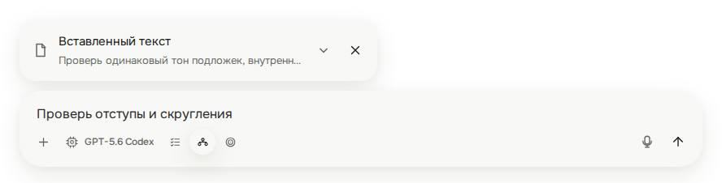</a>
  <a href="assets/composer-compact-desktop-dark.png">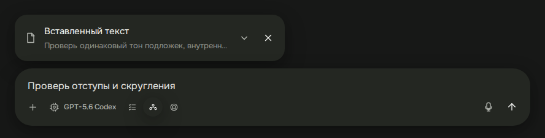</a>
</p>

<p>
  <a href="assets/composer-compact-mobile-light.png">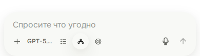</a>
  <a href="assets/composer-compact-mobile-dark.png">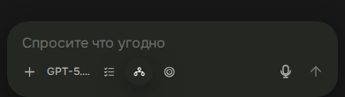</a>
</p>

| Свойство        | Принятое правило                                               |
| --------------- | -------------------------------------------------------------- |
| Поверхность     | Единый тон левой панели в обеих темах                          |
| Тень            | Уровень парящей поверхности, совпадающий с `--composer-shadow` |
| Радиус          | `28px` на desktop, `24px` до `820px` включительно              |
| Граница         | `1px solid transparent`, без видимого контура в покое          |
| Форма контролов | `999px` для капсулы, `50%` для круглого таймера                |

Мобильная геометрия композера, до `820px` включительно:

| Параметр                             | `320–359px`                        | `360–820px`  |
| ------------------------------------ | ---------------------------------- | ------------ |
| Внешние горизонтальные поля          | `8px` + боковые safe area          | Такие же     |
| Горизонтальные поля строки кнопок    | `5px`                              | `8px`        |
| Поля строки кнопок сверху / снизу    | `4px / 12px`                       | `4px / 12px` |
| Размер кнопки с иконкой              | `32 × 32px`                        | `32 × 32px`  |
| Ширина выбора модели в обычном чате  | `54px`, короткое имя видно целиком | Такая же     |
| Минимальный интервал соседних кнопок | `2px`                              | `2px`        |
| Отступ композера снизу               | Нижняя safe area                   | Такой же     |

Все режимы и действия композера должны полностью помещаться **в одну строку**,
включая запись и остановку работающей задачи. Перенос на второй ряд, горизонтальная
прокрутка, обрезание обязательных кнопок и уменьшение их ниже `32px` не подходят.
Таймер внутри кнопки показывает целые секунды: `60`, `125`, `600`, без деления на
минуты (`10:00`) и без сдвига соседей. У панели с дополнительным выбором проекта
сохраняется компактный вариант выбора модели с иконкой.

При открытой экранной клавиатуре нижний отступ убирается существующим правилом
`.composer.keyboard-open`. На desktop контейнер обычного чата имеет ширину до
`880px`, горизонтальные поля композера `20px` и ленты `28px`: видимый инпут
достигает `840px`, сообщения — `824px`. Композер выступает на `8px` с каждой стороны.
Отступ снизу — `20px` + safe area, зазор правых действий —
`4px`; справа кнопки `34px`, настройки и добавление файлов — `32px`.

#### Связанные решения взаимодействия

- Статус «Codex работает» и время находятся рядом слева. Журнал открывается
  нажатием на компактную подпись статуса; пустая часть строки не кликабельна.
- Кнопка микрофона со стрелкой удалена. Обычный микрофон запускает запись по
  нажатию; после остановки и распознавания результат отправляется автоматически.
  Постоянная автоотправка не означает постоянное прослушивание микрофона.
- Новая запись отправляется как `send`, а при текущем ходе агента — как `steer`.
  Старое сохранённое предпочтение `codexnest.voiceInputMode` больше не управляет
  новыми записями; уже существующие задания распознавания сохраняют свою семантику.
- Таймер в кнопке микрофона основного инпута и ответов на вопросы показывает
  целые секунды без двоеточия: `5`, `65`, `125`; при распознавании — `≈8` или `+3`.
  Кнопка сохраняет круглую форму и фиксированный размер.
- Статус голосового сообщения в ленте — компактная капсула справа, шириной по
  содержимому: иконка, подпись и время с промежутками `8px`. Внутренние отступы
  `8px × 12px`, высота около `36px`, радиус `--chat-radius-card`, тень
  `--chat-inner-shadow`. Время в капсуле сохраняет формат `≈0:15`.
- При недоступности отправки черновик остаётся редактируемым. Отключаются отправка
  и запуск новой записи, а не всё поле. Ошибки и отмена не должны терять ввод.
  Общие визуальные правила применяются ко всем поверхностям. Перечисленные здесь
  сценарии записи, отправки и работы с черновиком относятся к соответствующим
  компонентам и не меняются при обновлении оформления.

#### Область чата: свободная лента и акцентные карточки

Обычные пояснения и итоги агента показываются прямо на фоне чата, без общей
подложки и тени вокруг ответа. Мягкие карточки выделяют вопросы, подтверждения,
планы, чек-листы и отдельные блоки для копирования. Пояснения до и после такого
блока остаются на фоне чата. Обычный Markdown-заголовок или выделение текста
не превращает всё сообщение в карточку.

Порядок сообщений сохраняется, включая уточнения пользователя во время работы.
В режиме Plan каждый план показывается один раз на своём месте в истории.
Кнопки запуска находятся непосредственно под последней версией. Новые сообщения
и уточнения появляются ниже уже полученного плана, в том числе до подтверждения
отправки сервером. Выход из Plan не меняет порядок сообщений.
После уточнений предыдущий план помечается как требующий обновления. Запуск
доступен после завершения актуального плана, при отсутствии ожидающих вопросов,
сообщений в очереди и неотправленных аннотаций к нему.
Вопросы и подтверждения относятся к своему ходу; запросы без загруженного хода
показываются отдельной карточкой. Оформление также охватывает шапку, очередь,
действия над сообщениями, сведения о задаче, просмотр вложений, переименование
и создание ветки. Геометрия композера и расположение действий сохраняются;
цвет и состояния всех этих элементов подчиняются общему стандарту.

- Поверхности шапки, композера, пользовательских сообщений и карточек имеют
  единый тон левой панели. Вложенные карточки отделяются более лёгкой тенью;
  каждой строке отдельная карточка не нужна.
- Подписи, вкладки и текстовые кнопки имеют вес **400**, в том числе «Свой ответ»,
  «Далее» и действия подтверждения. Заголовки сохраняют иерархию; Markdown внутри
  сообщения сохраняет авторские выделения.
- Чекбокс — `20 × 20px`, радиус `7px`, приглушённая заливка и галочка.
  Радиокнопка остаётся круглой; выбранная строка выделяется мягкой тенью.
  Сохраняются нативная семантика, клавиатурный фокус и системный вид в forced colors.
- Кнопки с иконками в ленте имеют круглую область `32 × 32px`, в покое фон прозрачен.
  Слоты действий очереди имеют тот же размер, чтобы кнопки не выходили за границы.
- Поля акцентных карточек — `22px` на desktop и `16px` на mobile. Обычные сообщения
  выровнены по полям ленты; промежуток между сообщениями — `24px`.
  Компактный триггер журнала сохраняет отдельный таймер и не растягивается на всю строку.
- Общая декоративная поверхность ответа скрыта. Компоненты сообщений, вопросов
  и журнала сохраняют свои места в CSS Grid и не перегруппировываются в новые
  React-обёртки при уточнении пользователя: сохраняются черновик, выделение, фокус
  и раскрытие. Отдельный блок для копирования имеет радиус `24px` и собственную
  кнопку копирования; пользовательские сообщения сохраняют прежние пузыри.

#### Статус выполнения и завершения

После успешного завершения статус располагается в футере последнего видимого
текстового ответа агента или плана: время → копирование → ответвление →
«Готово за…». Вся строка выровнена влево, в том числе внутри карточки плана;
сообщения пользователя остаются справа. Статус использует размер и приглушённый
цвет времени, без зелёной галочки и разделителя. Между группой действий и статусом
`12px`. Если подходящего ответа нет, статус остаётся в конце хода без галочки.

Нажатие на статус раскрывает технические детали ниже ответа. В покое фон
прозрачен; наведение и клавиатурный фокус поднимают контрол с
`--color-floating` и `--chat-shadow`, нажатие использует внутреннюю тень,
а фокус дополнительно обозначается контуром. Журнал загружается только при раскрытии. Без доступного журнала статус
остаётся обычным текстом. На узком экране, при длинной дате или увеличенном
шрифте футер переносится без обрезания статуса и сохраняет левое выравнивание.

Выполнение, ожидание ответа, ошибка и прерывание сохраняют отдельную строку
с иконкой: минимальная высота `32px`, внутренние поля слева и справа `12px`,
промежуток между иконкой и текстом `8px`. Таймер текущей работы остаётся рядом
с промежутком `8px`; длинная подпись сокращается, не выталкивая время за экран.

#### Формы вопросов агента

Обычные и асинхронные вопросы используют одну поверхность `--color-floating`
в обеих темах. Карточка и поле свободного ответа получают `--chat-shadow`;
поле с микрофоном образует одну поверхность с общим контуром фокуса при вводе.
Компоновка, типографика и сценарии ответа сохраняются.

- Строки вариантов прозрачны. Выбранная строка получает `--color-floating`
  и мягкую тень `--chat-inner-shadow`; вес текста остаётся `400`.
  Вся доступная строка реагирует на наведение и клавиатурный фокус подъёмом
  до `--chat-shadow`; фокус дополнительно обводит строку. При нажатии появляется
  внутренняя тень. После ухода указателя возвращается обычное или выбранное состояние.
  Отключённые варианты не реагируют на наведение и нажатие; на touch hover не залипает.
- Текущий шаг постоянно поднят с `--chat-shadow`; остальные шаги прозрачны.
  Номер отвеченного шага — `--text-strong`, неотвеченного — `--muted`.
  Контейнер не обрезает тени; при нехватке ширины шаги переносятся.
- Все действия, включая основное, прозрачны в покое. Наведение и клавиатурный
  фокус дают `--color-floating` и `--chat-shadow`, нажатие — внутреннюю тень.
  На touch наведение не залипает; disabled не получает интерактивного объёма.
- Радиокнопки сохраняют круглый вид и нативную семантику; ошибки и запись
  сохраняют смысловые цвета. Оформление подтверждений других типов не меняется.

#### Таблицы в чате

Markdown-таблица показывается на общей мягкой поверхности `--chat-surface`
со скруглением `--chat-radius-card` (`20px`) и тенью `--chat-inner-shadow`.
Шапка использует `--chat-inset`, цвет `--muted-strong` и обычный вес `400`.
Текст — Onest `14px`, межстрочный интервал `1.55`. Внешней рамки и вертикальной
сетки нет; строки тела разделены линиями `1px` цвета `--line`.

- Поля ячеек — `12px 16px`; до `820px` включительно — `10px 12px`.
- Таблица занимает доступную ширину, столбцы распределяются по содержимому.
  Обязательной мобильной ширины `640px` нет: короткие таблицы помещаются в экран,
  длинные пути и широкие таблицы прокручиваются внутри карточки.
- Сохраняются ссылки, код, авторские выделения и выравнивание столбцов из Markdown.
  Строки сами по себе не являются кнопками и не получают декоративного hover.
- Область таблицы доступна по Tab и имеет локализованное имя «Таблица» / «Table».
  Горизонтальная прокрутка работает с клавиатуры и не открывает боковую колонку.
  Дописывание ответа сохраняет фокус и положение прокрутки таблицы.

Геометрию, прокрутку, статусы и обе темы проверяет `table-status.spec.ts`.

#### Редактор сообщения в очереди

Редактируемая карточка совпадает по ширине с основным полем ввода: выступает на `8px`
с каждой стороны относительно колонки сообщений на ПК и телефоне. После сохранения
или отмены сообщение возвращается к обычной ширине. Используются поверхность
`--chat-user`, тень `--chat-shadow` и скругление `28px` (`24px` до `820px`).

- Поля карточки — `16px 20px`, на телефоне — `16px`. Текст — Onest `15px/22.5px`, вес
  `400`; отдельной подложки и рамки у текстового поля нет.
- Поле растёт и уменьшается по содержимому от одной строки до `240px`, затем
  прокручивается внутри. Ручного растягивания нет; изменение доступной ширины
  пересчитывает высоту, включая браузеры без поддержки `field-sizing: content`.
- Через `12px` после поля справа расположены «Отмена» и «Сохранить»: высота `36px`,
  горизонтальные поля `18px`, промежуток `8px`, текст `14px`. Обе кнопки прозрачны
  в покое и получают общий объём при наведении или клавиатурном фокусе.
- Фокус поля подсвечивает карточку по образцу редактора аннотаций. Кнопки сохраняют
  видимый клавиатурный фокус; в forced colors у карточки появляется системный контур.
- Статус и действия очереди остаются под карточкой. Основной ввод, вложения,
  сохранение, отмена и обработка ошибок сохраняют существующее поведение.

#### Вставленный текст в сообщениях

Каждое действие «Вставить» учитывается отдельно. До 50 Unicode-символов без переносов
остаются в строке; более длинный или многострочный текст становится отдельной карточкой.
Правило одинаково в основном композере, редакторе очереди и истории. Поля цели и ответов
на специальные вопросы сохраняют обычную вставку.

Карточки расположены над пользовательским текстом и изначально свёрнуты. Заголовок
«Вставленный текст», `FileIcon`, первая строка и шеврон обозначают раскрываемое вложение.
Внутри — Markdown/GFM с ограничением высоты 240px и собственной прокруткой. В черновике
можно изменить исходник или удалить карточку; в истории — раскрыть и скопировать.
Подложка карточки **совпадает** с подложкой пользовательского сообщения и единым
тоном левой панели через `--color-floating` (`#f8f9f6` / `#242722`). Тон сохраняется
в черновике, очереди и истории. Внешний радиус карточки — `20px`, внутренней кнопки —
`16px`, между контурами — `4px`. Короткие inline-вставки сохраняют смысловую подсветку;
это не отдельная парящая поверхность.

В покое карточка использует `--chat-inner-shadow`. Наведение или клавиатурный
фокус кнопки раскрытия поднимают **всю карточку** через `--sidebar-surface-shadow`,
нажатие использует `--sidebar-control-active` и `--sidebar-pressed-shadow`.
Кнопка внутри остаётся прозрачной, без собственной тени. Клавиатурный контур
также проходит по внешнему краю карточки. Редактор подсвечивает общую поверхность
через `--field-focus-shadow`; копирование, удаление и редактирование имеют независимые
состояния. Нажатие на раскрытый текст не нажимает карточку. Reduced motion отключает
переходы, forced colors сохраняет внешний системный контур фокуса.

Короткие фрагменты используют `.paste-inline`: слабую заливку и тонкое подчёркивание,
без отдельной карточки и без изменения метрик текста. Нативный `textarea` сохраняет
каретку, выделение и мобильную клавиатуру; подсветка находится в синхронном слое под ним.
Редактирование не меняет тип вставки. Напечатанные внутри неё символы не получают метку;
отмена/повтор восстанавливают текст, карточки и происхождение вместе.

Компоненты: `PasteBlocks`, `PasteTextarea`, `PastedMarkdown`; стили —
`apps/client/src/styles/pasted-text.css`. Проверка сценариев и обеих тем:
`npm run test:visual -w @codexnest/client -- pasted-text.spec.ts`.

#### Вспомогательные поверхности композера

Меню цели и подсказки скиллов используют радиус `24px`, поля `16px`,
`--color-floating` и `--sidebar-surface-shadow`, без рамок. Строки подсказок имеют
радиус `16px`; внутренние поля оставляют место для теней выбранной строки.

Файлы и миниатюры вложений сохраняют размеры, получают радиус `20px` и
`--chat-inner-shadow` без рамки. Лента вложений имеет поля `16px`, чтобы не обрезать
тени и кнопки удаления. Миниатюра поднимается при наведении и фокусе, нажимается
через inset-тень. Контрастная кнопка удаления поверх изображения сохраняется.

Статус создания ветки, подсказка добавления первого проекта и ошибка скачивания
используют радиус `20px`, поля `12px × 16px` и компактную тень. Уведомление о сжатом
источнике сохраняет форму капсулы, получает общую непрозрачную подложку и компактную
тень. Ошибки сохраняют красный смысловой акцент.

В расширении кнопки с иконкой имеют размер `35 × 35px`, круглую форму и прозрачную
рамку. Уведомление об ошибке использует радиус `16px` и поля `12px`.

#### Редактор аннотаций и изображения

Редактор комментария к выделенному тексту использует вариант **B**: текст слева,
кнопки удаления и сохранения столбиком справа. Поверхность `--chat-surface`, тень
`--chat-shadow`, радиус `24px`, внутренние отступы `12px`. Ширина до `360px`,
по краям доступной области остаётся минимум `16px`. Текст — Onest `15px/22.5px`,
вес `400`; отдельной подложки и контурной рамки у поля нет.

- Кнопки `36 × 36px`, иконки `18px`, промежуток `4px`. В покое фон прозрачен;
  удаление получает красный акцент при наведении или нажатии. Порядок Tab совпадает
  с визуальным порядком: поле, удаление, сохранение.
- Поле растёт по тексту от двух строк до `176px`, затем прокручивается внутри.
  Ручного растягивания нет. При открытой клавиатуре доступная высота ограничивает
  поле; редактор располагается под выделением или над ним по своим реальным размерам.
- Фокус поля обозначается мягким свечением общей поверхности. Кнопки сохраняют
  видимый клавиатурный фокус, в forced colors у редактора появляется системный контур.
- Сохранение, удаление и закрытие по нажатию снаружи сохраняют прежнее поведение.

#### Галерея изображений агента

В основной переписке видны только изображения, явно приложенные агентом к сообщению.
Это правило действует для промежуточных пояснений, планов и итоговых ответов.
Просмотры файлов и результаты генерации остаются в технических деталях работы:
галерея загружается после раскрытия соответствующего инструмента. Старые переписки
следуют тому же правилу; фраза «показал изображения» сама по себе ничего не прикладывает.

Явно отправленные изображения собираются **под текстом своего сообщения**.
Markdown-картинки заменяются ссылками с иконкой изображения и исходной подписью;
поддерживаемые ссылки на файлы изображений и вложения входят в ту же подборку.
Порядок — первое появление в тексте, затем вложения. Один адрес даёт одну миниатюру,
даже если в тексте несколько ссылок на него. Документы и обычные веб-страницы
не превращаются в картинки. Исходный Markdown для копирования сохраняется.

- Галерея выровнена слева, без общей подложки. Отступ от текста `12px`, промежутки
  `8px`; при нехватке ширины изображения переносятся на следующий ряд, включая телефон.
- Максимальная высота миниатюры `200px`, до `820px` включительно — `160px`.
  Ширина не больше `320px` и ширины сообщения. Скругление — `--chat-radius-card`
  (`20px`). Один снимок подчиняется тем же правилам, что и подборка.
- **Без рамки 4:3, обрезки и пустых полей:** кликабельная область повторяет реальные
  пропорции содержимого. Панорама уменьшается по ширине, маленькая картинка не увеличивается.
- Миниатюра слегка затемняется при наведении и нажатии; клавиатурный фокус остаётся
  видимым. Ссылки используют текущий цвет ссылок, Onest и обычный вес текста.
- Ссылка и миниатюра открывают один просмотрщик с выбранным изображением. Внутри
  доступны перелистывание, счётчик и скачивание. Отдельной кнопки скачивания рядом
  с текстовой ссылкой на изображение нет. Escape, Android Back и кнопка закрытия
  возвращают в чат; фокус возвращается к элементу, открывшему просмотр.
- Загрузка и ошибка принадлежат конкретной миниатюре: компактное состояние от `64px`
  и повторная попытка. Ошибка одного файла не блокирует остальные. Загрузка изображения
  не пересоздаёт текстовые ссылки; дописывание ответа сохраняет уже загруженные превью.
  Позиция чтения и следование за концом чата сохраняются.

Тип ссылочного изображения определяется по поддерживаемому расширению без дополнительных
сетевых проверок. Локальные файлы используют существующий загрузчик и его ограничения.
Ссылки на изображения вне рабочей папки также проходят через загрузчик; сервер
разрешает их только при наличии соответствующего изображения в истории инструментов
этой сессии. Просмотр инструментом регистрирует такой файл, но не отправляет его в чат.
Оформление сообщений пользователя и миниатюры в композере не меняются: их встроенные
изображения сохраняют прежние ограничения `720px` по ширине и `min(480px, 65dvh)` по высоте.

У вложений пользователя строки сетки определяют высоту по полному содержимому
(`grid-auto-rows: max-content`). Это сохраняет высоту подложки при пересчёте колонок
в WebKit. После загрузки и изменения окна изображение остаётся внутри сообщения
с нижним внутренним отступом; обрезка подложки не используется. Маленькие изображения
не увеличиваются, кнопка превью сохраняет размеры изображения.

Галерею на desktop и mobile, обе темы и взаимодействия проверяет `chat-media.spec.ts`.
Разделение явной отправки и технического просмотра проверяет `tool-images.spec.ts`.

#### Панель сведений о сессии

Утверждён вариант C «Смысловые разделы». В «Обзоре» все сведения открыты:
«Проект» объединяет название, рабочую папку и изменения Git; «Выполнение» —
статус, модель, усилие и приём сообщений; «Активность» — даты создания и обновления.
Иконки принадлежат заголовкам разделов. Группы разделяются отступами `24px`,
без карточек отдельных строк и декоративных линий. Основной текст использует
ролевые токены `14px`, даты — `--text-caption` (`12px`).

Подложка панели — `--color-floating`, радиус — `28px`; высоту передаёт существующая
тень парящей поверхности. Вкладки не имеют общей серой подложки: выбранная вкладка
постоянно приподнята; кнопки используют общие hover/focus/pressed-состояния.
Ширина на desktop остаётся `352px`; на узких экранах сохраняются наложение
и нижняя панель. Прокручивается содержимое, заголовок и вкладки неподвижны.

Путь показан текстом без отдельной подложки и переносится при нехватке места.
Справа всегда доступна круглая кнопка «Копировать путь»: `36px`, на touch `44px`.
Копируется отображаемая рабочая папка сессии, включая worktree; до создания
сессии — папка выбранного проекта. Успех обозначается галочкой на две секунды
и доступным уведомлением; ошибка показана рядом и допускает повторную попытку.
Панель новой сессии и вкладка артефактов используют те же поверхности и контролы.

#### Компактная шапка чата

Высота шапки — `44px`, фактический радиус капсулы — `22px`. Верхний отступ на
компьютере — `8px`, на телефоне — только `--app-safe-area-top`, без дополнительных
`8px`. Верхний край совпадает с подложкой навигации. На компьютере (от `821px`)
шапка состоит из **двух капсул**: название с проектом слева и все действия в общем
блоке справа. Капсулы находятся в `20px` от краёв области чата, включая состояние
с открытыми сведениями. Общая обёртка прозрачна и не перехватывает взаимодействия
с лентой между капсулами. Цвет и тень принадлежат самим капсулам.

Капсула названия занимает ширину содержимого: короткое название оставляет её
компактной, длинное расширяет до блока действий. Минимальный зазор — `16px`.
Фиксированного ограничения ширины названия нет; многоточие появляется только
при исчерпании доступного места. Длинное имя проекта также сокращается. Блок
действий не сжимается и остаётся справа. Высота обеих капсул следует
`--chat-header-height`, включая пользовательский размер шрифта.
Название задачи использует Onest `14px/20px`, проект — `14px/20px`, вес обоих
`400`. На компьютере они стоят в одну строку с промежутком `10px`. Название
выделяется основным цветом, проект — приглушённым. На телефоне сохраняются две
строки: название `14px/20px`, проект `14px/18px`.
Длинные названия сокращаются многоточием, оставляя место всем кнопкам.

Мобильные края совпадают с инпутом: `8px` плюс соответствующая боковая safe area.
У сообщений отступы `16px` плюс safe area, поэтому выступ панелей также равен `8px`.

Браузер представлен одной иконкой стандартного `icon-button`, одинакового размера
с обновлением и сведениями. Выключенное состояние прозрачно, включённое сохраняет
объём выбранного контрола. Название действия доступно в подсказке и `aria-label`; загрузка
и блокировка переключения во время задачи сохраняются.

На всех ширинах шапка располагается поверх ленты. Фон самих капсул непрозрачен,
тень и цвет совпадают с другими мягкими поверхностями. На телефоне шапка остаётся
одной капсулой. Область прокрутки начинается сверху
рабочей области, включая системную область телефона, **выше нижнего
края шапки**: карточки не обрезаются прямой линией под панелью и видны вокруг обоих
её закруглений. Это правило действует и на границе `820/821px`, и при открытых сведениях.
Скругление всего viewport, сплошная прямоугольная подложка, размытие и автоматическое
скрытие шапки не используются. На телефоне системные значки защищены описанными
ниже полупрозрачными градиентами в цвет фона страницы.

Начальный отступ ленты оставляет `28px` под шапкой на компьютере и `22px` на телефоне
и прокручивается вместе с историей. `scroll-padding-top` сохраняет `8px` между панелью
и целью перехода или фокуса. На телефоне меню ответвлений открывается на `8px` ниже
панели; сведения, навигация и диалоги сохраняют свои верхние слои. Настройки и экран
подготовки ответвления используют свою прежнюю компоновку.

#### Действия в чате

Кнопки шапки, ленты, очереди, вопросов, сведений, вложений и диалогов используют
[общую систему состояний](#кнопки-покой-выбор-наведение-и-нажатие). Подписи имеют
вес `400`. Выбранные вкладки и шаги вопроса сохраняют объём; главные действия
до наведения или фокуса прозрачны.

Кнопка перехода вниз в покое показывает только стрелку с полной областью нажатия.
Скачивание в списке артефактов — круглая кнопка `36 × 36px` без разделителя,
с областью касания `44 × 44px` на touch.
Контраст кнопок поверх изображений и красный акцент записи голоса сохраняются.
Переходы используют существующие motion-токены и учитывают reduced motion.

Проверки охватывают потоковые обновления, уточнение посреди ответа, загрузку
истории, вопросы, очередь, доступность и обе темы. При переходе на общий стиль
сохраняйте геометрию композера, боковой колонки и остальных действий.

### Согласованные превью

Принято 18 сентября 2026. Это **целевое оформление**, полученное на реальных
компонентах приложения с тестовыми данными и временными стилями в браузере.
Превью не означают, что соответствующие CSS уже перенесены в приложение.
Актуальная реализованная геометрия инпута показана в разделе
[композера](#композер-геометрия-и-поведение).

Чат: одинаковый тон навигации, выбранных элементов, шапки, пользовательского
сообщения, карточек и композера. Обычный ответ остаётся на фоне страницы.

<p>
  <a href="assets/floating-bubble-chat-light.png">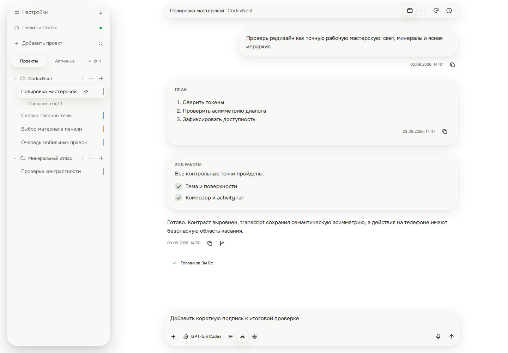</a>
  <a href="assets/floating-bubble-chat-dark.png">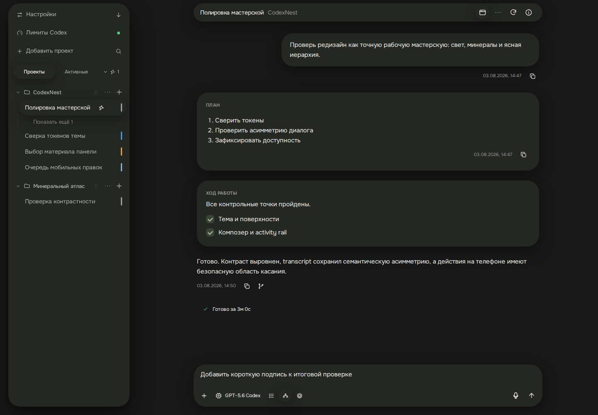</a>
</p>

Настройки: общая поверхность каждой группы, приподнятые поля и выбранный раздел.
Расположение существующих настроек и их назначение сохраняются.

<p>
  <a href="assets/floating-bubble-settings-light.png">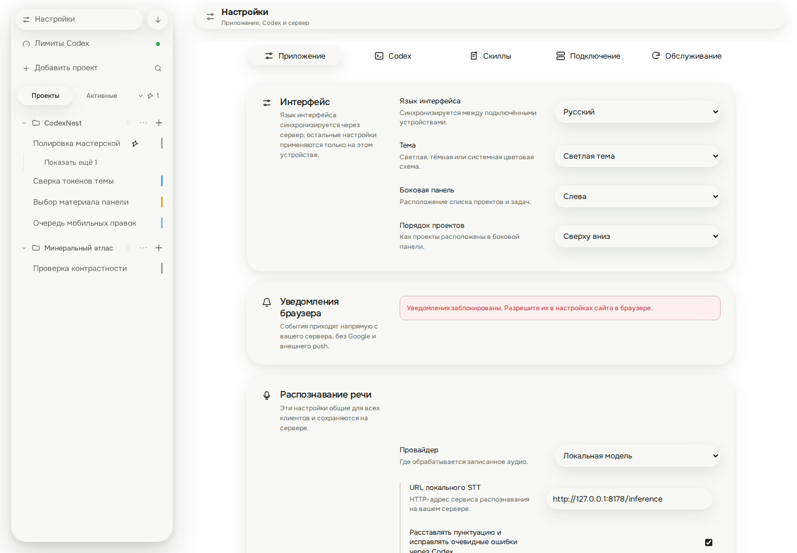</a>
  <a href="assets/floating-bubble-settings-dark.png">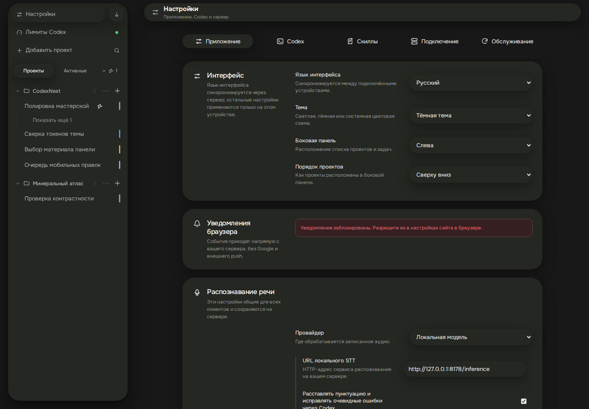</a>
</p>

Мобильный чат сохраняет существующую компоновку, поля и размеры контролов.

<p>
  <a href="assets/floating-bubble-mobile-light.png">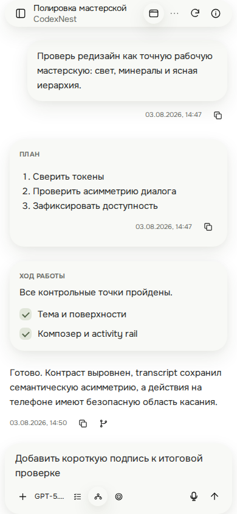</a>
</p>

## Основы UI

### Цвета и поверхности клиента

Нейтральные парящие поверхности используют [единый тон](#утверждённое-направление).
Фон страницы, текст и смысловые цвета ниже сохраняются; переменные определены в [tokens.css][tokens]. Светлая
тема задаётся в `:root`, тёмная — в `:root[data-resolved-theme="dark"]`.
Системный режим разрешается существующей логикой [App.tsx][app]; новой фиче
не нужен собственный механизм определения темы.

| Токен                | Светлая   | Тёмная    | Назначение                             |
| -------------------- | --------- | --------- | -------------------------------------- |
| --color-canvas       | `#ffffff` | `#171817` | Основной фон рабочего пространства     |
| --color-ink          | `#292a29` | `#e9eae7` | Основной текст                         |
| --color-ink-strong   | `#181918` | `#f7f8f5` | Заголовки и важные подписи             |
| --color-muted        | `#6a6c67` | `#92958f` | Описания и метаданные                  |
| --color-muted-strong | `#646660` | `#b1b4ae` | Второстепенные контролы и подписи      |
| --color-lapis        | `#20211f` | `#f1f2ef` | Нейтральный акцент и видимый фокус     |
| --color-line         | `#e5e5e1` | `#323431` | Ненавязчивые разделители               |
| --color-line-strong  | `#d7d8d2` | `#41443f` | Границы там, где необходимы для чтения |
| --color-danger       | `#c53b43` | `#ef6a70` | Ошибки и опасные действия              |
| --color-danger-soft  | `#fff0f0` | `#351f21` | Подложка ошибки                        |
| --color-warning      | `#fff8e8` | `#352e1e` | Подложка предупреждения                |
| --color-warning-text | `#725315` | `#f1cf82` | Текст предупреждения                   |
| --color-success      | `#2ba24c` | `#5ac878` | Успешный результат                     |

`--color-lapis` — историческое имя нейтрального акцента, оно не означает синий
цвет и не задаёт постоянную заливку главной кнопки. `--color-warning` — фон, поэтому его нельзя использовать как цвет текста
предупреждения. Цвет состояния не заменяет понятную подпись или доступное имя.
Читаемость проверяется на фактическом фоне, включая прозрачность и наложения.

В существующем коде используются совместимые псевдонимы: `--text`, `--muted`,
`--surface`, `--surface-muted`, `--line`, `--accent`, `--danger`, `--shadow` и другие.
Их соответствия заданы в [tokens.css][tokens]. При правке существующего блока
переиспользуйте переменные по роли, сверяя их итоговое значение с общим стандартом.
Старые нейтральные заливки не становятся эталоном из-за имени `--color-*`.
Не дублируйте значения HEX в компоненте и не переименовывайте псевдонимы ради
новой фичи. Смысловые и контрастные исключения перечислены отдельно.

### Статусы клиента

Источник цветов — [tokens.css][tokens]; отображение статуса сессии определяют
[thread-status.ts][thread-status] и селекторы `.status-*` в [styles.css][styles].

| Токен                | Светлая   | Тёмная    | Значение                        |
| -------------------- | --------- | --------- | ------------------------------- |
| --status-idle        | `#a0a39d` | `#a0a39d` | Нейтральное состояние           |
| --status-running     | `#4b9ce8` | `#4b9ce8` | Выполнение                      |
| --status-queued      | `#86b7d9` | `#86b7d9` | Очередь                         |
| --status-attention   | `#e5a62b` | `#e5a62b` | Требуется внимание              |
| --status-complete    | `#2ba24c` | `#5ac878` | Завершение, требующее прочтения |
| --status-failed      | `#c53b43` | `#ef6a70` | Ошибка                          |
| --status-interrupted | `#9974db` | `#9974db` | Прерывание                      |

Не вычисляйте маркер только по `thread.state`: учитываются очередь,
прочитанность и факт просмотра. Например, прочитанная ошибка получает нейтральный
маркер, а очередь у прочитанной завершённой сессии — маркер очереди. Используйте
`threadStatusClasses` и `hasAlwaysVisibleThreadStatus` в соответствующих местах.
В навигации маркер — вертикальная полоса `3 × 20px` с отступом `10px` от правого
края строки; базовая точка — `7 × 7px`.
Не распространяйте постоянную пульсацию на все статусы.

### Отступы, размеры и форма

Источник токенов — [tokens.css][tokens]. Размеры указаны в CSS-пикселях.

| Токен                  | Значение | Применение                                       |
| ---------------------- | -------- | ------------------------------------------------ |
| --space-0-5            | `2px`    | Микроинтервал между связанными элементами        |
| --space-1              | `4px`    | Тесная связь подписи и пояснения                 |
| --space-1-5            | `6px`    | Компактный промежуток внутри контрола            |
| --space-2              | `8px`    | Иконка и текст, небольшие группы                 |
| --space-2-5            | `10px`   | Компактный внутренний отступ                     |
| --space-3              | `12px`   | Внутренние отступы и промежутки                  |
| --space-4              | `16px`   | Блоки внутри одного сообщения или диалога        |
| --space-5              | `20px`   | Поля диалога и промежутки между блоками          |
| --space-6              | `24px`   | Поля ленты и разделы на мобильном экране         |
| --space-8              | `32px`   | Разделение ходов разговора и секций desktop      |
| --control-height       | `34px`   | Базовая минимальная высота контрола              |
| --control-touch-height | `32px`   | Текущий компактный мобильный размер              |
| --sidebar-width        | `292px`  | Закреплённая боковая панель desktop              |
| --header-height        | `60px`   | Заголовок desktop; на мобильном переопределяется |

Для новых интервалов сначала выбирайте ближайший токен по назначению. Тонкая
граница обычно `1px`; круглая форма и капсула уместны для круглых действий,
маркеров и коротких статусов. Прямые значения для оптического выравнивания и
специальной геометрии допустимы в существующем паттерне, но не образуют новую шкалу.

Радиусы выбираются из уже существующей геометрии по роли, без новых значений:

| Роль                                                    | Геометрия                                         | Существующий источник                         |
| ------------------------------------------------------- | ------------------------------------------------- | --------------------------------------------- |
| Кнопка, однострочное поле, закрытый select              | Капсула `999px`; икон-кнопка — круг               | Существующие капсулы навигации и композера    |
| Строка сессии                                           | `18px`                                            | `--sidebar-radius-row`                        |
| Вложенная карточка, меню                                | `20px`                                            | `--chat-radius-card`, `--sidebar-radius-menu` |
| Многострочное поле, компактная мобильная поверхность    | `24px`                                            | `--chat-radius-compact`                       |
| Общая панель, группа настроек, крупная карточка, диалог | `28px`                                            | Общий `--chat-radius-surface`                 |
| Композер                                                | `28px` desktop / `24px` mobile                    | Существующая геометрия композера              |
| Шапка чата                                              | Капсула высотой `44px`, фактический радиус `22px` | `--chat-header-height`                        |
| Маркер checkbox                                         | `7px`                                             | `--chat-radius-checkbox`; это не поверхность  |

Однострочный input и textarea внутри общей поверхности редактора не получают
второго пузыря. Узкие контекстные редакторы сохраняют существующий радиус своей
общей поверхности. Вложенные контуры согласуются внутренним полем: например,
верхняя кнопка навигации высотой `38px` с радиусом `19px` и полем `8px` соответствует
общей подложке `28px`. Не вводите новое скругление для исправления такого стыка.

Часть переменных пока локальна для чата и навигации. При реализации перехода
используйте существующие значения по роли; шкала старых примитивов не является
стандартом для новых bubble-поверхностей. [Тест радиусов][style-tests] защищает
от произвольных значений; не отключайте его при расширении области применения.
Сохраняйте плотность, порядок, положение элементов и поведение мобильных sheet.
У парящего диалога все углы скруглены, а ограничение высоты и прокрутка остаются
привязаны к назначению диалога.

Следующая геометрия определяется в [styles.css][styles]. Ширины поверхностей и
сетка настроек заданы локально; отступы используют `--space-*`, а базовая
икон-кнопка — `--control-height`. Таблица показывает итоговые значения,
а не рекомендует копировать числа вместо токенов:

| Элемент / селектор                         | Текущее значение                                                             |
| ------------------------------------------ | ---------------------------------------------------------------------------- |
| Лента `.timeline`                          | Ширина `min(880px, 100%)`, горизонтальные поля `28px` в обычном desktop-чате |
| Композер `.composer`                       | Ширина `min(100%, 880px)`, горизонтальные поля `20px` в обычном desktop-чате |
| Настройки `.settings-stack`                | Ширина `min(880px, 100%)`                                                    |
| Строка `.settings-row`                     | Минимум `62px`, контрол в колонке `220–300px` на desktop                     |
| Диалог `.dialog-surface`                   | Ширина `min(580px, 100%)`, внутренний отступ `20px`                          |
| Небольшой диалог `.dialog-surface.compact` | Ширина `min(450px, 100%)`                                                    |
| Кнопка `.icon-button`                      | `34 × 34px` до локальных переопределений                                     |

Минимальная высота не гарантирует итоговую: содержимое и внутренние отступы
могут увеличить контрол. `32px` — существующий контракт компактности отдельных
мобильных действий, а не универсальное утверждение об удобстве всех целей касания.
Не уменьшайте этот размер ради размещения дополнительной кнопки. Проверяйте
доступность и расстояния между действиями на реальном узком экране.

### Типографика и иконки

Клиент и расширение поставляют локальный variable-шрифт **Onest**, диапазон начертаний
`400–700`, с `font-display: swap`. Семейство задаёт `--font-ui` в [токенах][tokens].
**`--font-mono` сейчас равен `--font-ui`**: пути, код и технические подписи тоже
используют Onest. Не подключайте отдельный моноширинный или заголовочный шрифт
в рамках новой фичи.

Стандартная шкала приложения — **12 / 14 / 15 / 22px**, одинаковая на desktop и mobile.
Это значения по умолчанию: пользователь может изменить каждую роль в настройках.
Выбирайте размер по роли текста, а не отдельно для каждого экрана. Клиентские
значения и псевдонимы `--text-*` заданы в [примитивах][primitives] поверх общих
[токенов][tokens]. Старые значения общего файла сохраняют плотность расширения;
для приложения действует таблица ниже.

| Роль                                                                                     | Токены                           | Размер и параметры                                         |
| ---------------------------------------------------------------------------------------- | -------------------------------- | ---------------------------------------------------------- |
| Время, счётчики, статусы и другие короткие метаданные                                    | `--text-caption`                 | `12px`                                                     |
| Компактные действия и подписи панели композера                                           | `--text-caption`                 | `12px`                                                     |
| Описания, пояснения, вспомогательные подписи                                             | `--text-small`                   | `14px`                                                     |
| Основной UI, названия проектов и сессий, обычные кнопки, меню, вкладки, подписи полей    | `--text-ui`, `--text-label`      | `14px`; базовый интервал `21px`                            |
| Заголовок сессии в верхней панели чата                                                   | `--text-ui`                      | `14px / 20px` на всех ширинах                              |
| Проект в верхней панели чата                                                             | `--text-small`                   | `14px / 20px`; на телефоне `14px / 18px`                   |
| Блоки кода, технические журналы, таблицы                                                 | `--text-code`                    | `14px`; встроенный код наследует размер окружающего текста |
| Сообщения, основной ввод, редакторы очереди и вставленного текста, обычные поля и select | `--text-message`, `--text-input` | `15px / 22.5px`                                            |
| Заголовки экранов, разделов настроек и карточек                                          | `--text-section`                 | `14px`; заголовки экранов и разделов — интервал `24px`     |
| Заголовки диалогов и пустых состояний                                                    | `--text-dialog`                  | `14px`; заголовок диалога — интервал `28px`                |

По умолчанию основной текст `14px` действует во всём клиенте: в навигации и переключателе
«Проекты / Активные», настройках и диалогах, выборе модели, вопросах и вариантах
ответа, результатах поиска, основных значениях инспектора, именах файлов и навыков,
сообщениях об ошибках и пустых состояниях. Пояснения к ним используют `14px`,
а время, счётчики и компактные служебные действия — `12px`. Метаданные не
увеличиваются вместе с основным текстом. Расширение браузера сохраняет свою шкалу.

Мелкие счётчики, индикаторы и обозначения типа файла используют
`--text-micro` / `--text-tiny` (`12px`); заголовок экрана подключения —
`--text-display` (`22px`). По умолчанию обычные подписи не уменьшаются ниже
`12px`. В стилях компонентов используйте ролевые токены; не добавляйте локальные размеры
или отдельную мобильную шкалу. Иерархия заголовков внутри пользовательского Markdown
сохраняется и не подменяется заголовками интерфейса.

Сообщение сохраняет единый размер (по умолчанию `15px / 22.5px`) на всём пути: ввод, очередь,
редактирование, отправка. Обычные поля и select также имеют `15px` на компьютере
и телефоне; компактные переключатели в панели композера остаются `12px`.
Поле может вырасти по высоте, чтобы вместить текст: уменьшать шрифт ради прежней
высоты нельзя. При стандартных размерах пустой композер занимает около `93px` на desktop
и `85px` до `820px`. При увеличении шрифта его высота растёт вместе с текстом.
В настройках до `1279px` включительно заголовки групп и поля выстраиваются в одну
колонку, а вкладки прокручиваются горизонтально внутри своей области.

В **Настройки → Приложение → Шрифты**, сразу после «Интерфейса», доступны девять
независимых размеров: основной интерфейс, сообщения и поля ввода, описания,
технический текст, метаданные, мелкие индикаторы, заголовки разделов, диалогов
и экрана подключения. Каждое числовое поле принимает целые значения **10–32px**
с шагом **1px**; рядом показан живой пример и отдельная кнопка сброса.
При обновлении стандартной шкалы уже сохранённые пользовательские размеры
сохраняются. Новая шкала применяется при первом запуске и по кнопке сброса. Общий сброс
возвращает только размеры шрифтов. Тема и остальные настройки сохраняются.

Пользовательские значения могут выходить за стандартную шкалу, но компоненты
по-прежнему используют ролевые токены. `--text-message` наследует `--text-input`,
`--text-label` — `--text-ui`, `--text-tiny` — `--text-micro`. Технический размер
`--text-code` не зависит от пояснений `--text-small`. Встроенный код сохраняет
размер окружающего текста; Markdown сохраняет относительную иерархию заголовков.

Допустимое изменение применяется сразу. Пустой, дробный или выходящий за диапазон
черновик не меняет интерфейс; уход из поля, Enter или Escape восстанавливают
последнее допустимое значение. Настройка хранится локально в
`codexnest.typography` и применяется до первого рендера, включая экран подключения.
Она не синхронизируется с сервером и не меняет размеры браузерного расширения.
Повреждённые или неизвестные значения не мешают загрузке: каждая роль отдельно
возвращается к своему стандартному размеру.

При пользовательских размерах текстовые контролы растут по высоте. Тесные ряды
вкладок и действий прокручиваются внутри своей области; порядок кнопок сохраняется.
Высота верхней панели чата и отступы ленты используют одни переменные, нижний отступ
следует за фактической высотой композера. Редакторы очереди, комментариев и
подсветка вставок пересчитываются при изменении шрифта без потери текста.
Правила геометрии находятся в [typography.css](../apps/client/src/styles/typography.css),
роли и сохранение — в [typography.ts](../apps/client/src/typography.ts).

<p>
  <a href="assets/font-settings-desktop-light.png">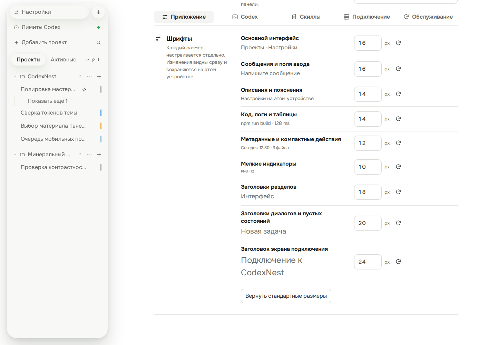</a>
  <a href="assets/font-settings-mobile-dark.png">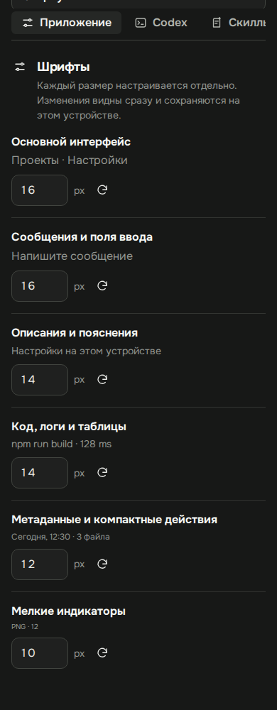</a>
</p>

Общие начертания: `--weight-regular` (`400`), `--weight-medium` (`500`),
`--weight-semibold` (`600`), `--weight-action` (`650`), `--weight-bold` (`700`).
Они сохраняют существующие роли. `--leading-copy` и клиентский `--leading-message`
равны `1.5`; `--leading-tight` — `1.25`. Размеры назначаются через токены, в том
числе в сокращённом свойстве `font`. Это проверяет `src/styles.test.ts`.

Снимки реализованной типографики в чате и настройках. Геометрию и роли текста
проверяют `typography.spec.ts`, `font-settings.spec.ts` и `font-settings-editors.spec.ts`
в Chromium и WebKit, на русском и английском. Проверяются стандартные, минимальные,
максимальные и смешанные значения, сохранение, сброс и редакторы ввода —
в обеих темах и на ширинах `320 / 390 / 820 / 821 / 1440px`:

<p>
  <a href="assets/typography-desktop-chat.png">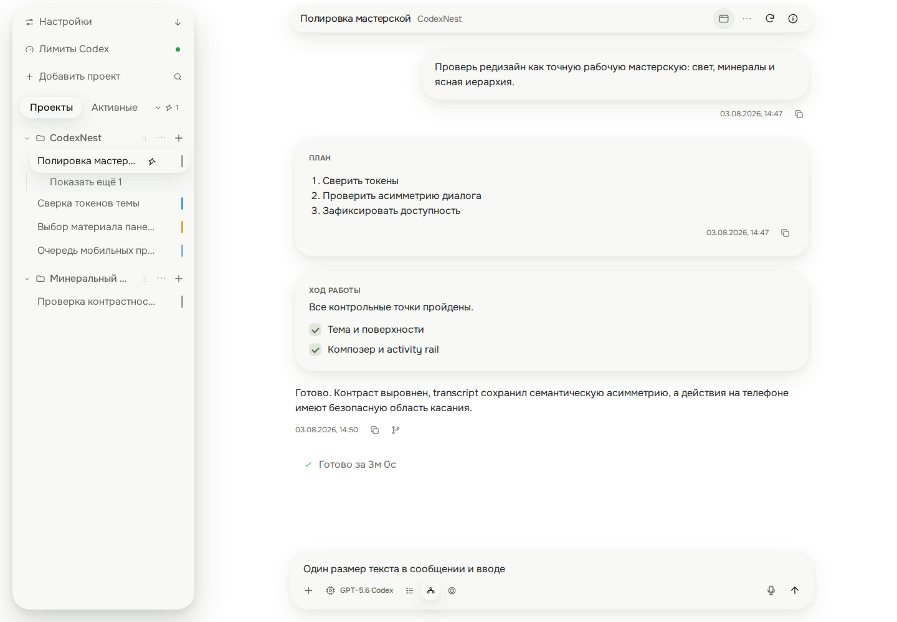</a>
  <a href="assets/typography-desktop-settings.png">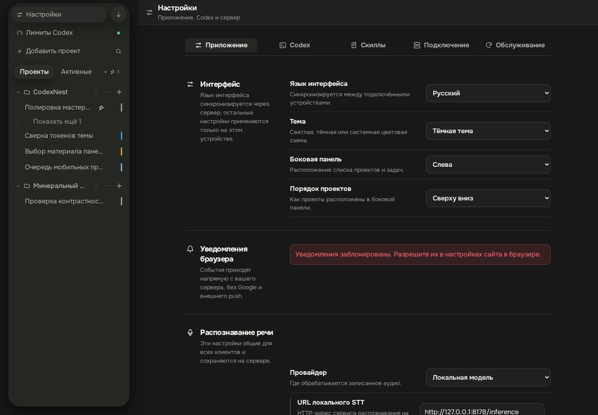</a>
</p>

<p>
  <a href="assets/typography-mobile-chat.png">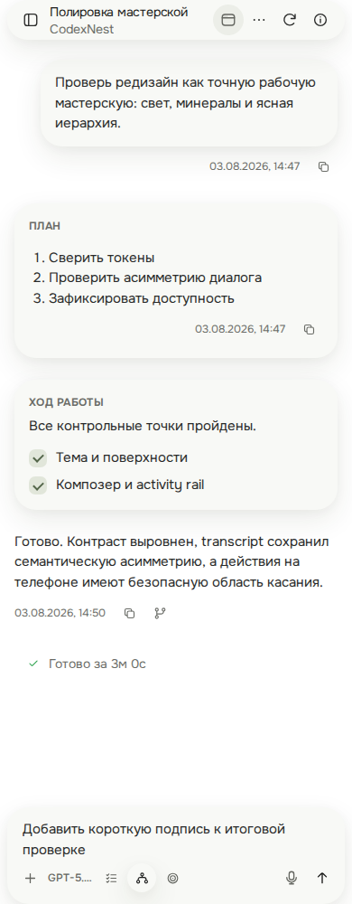</a>
  <a href="assets/typography-mobile-settings.png">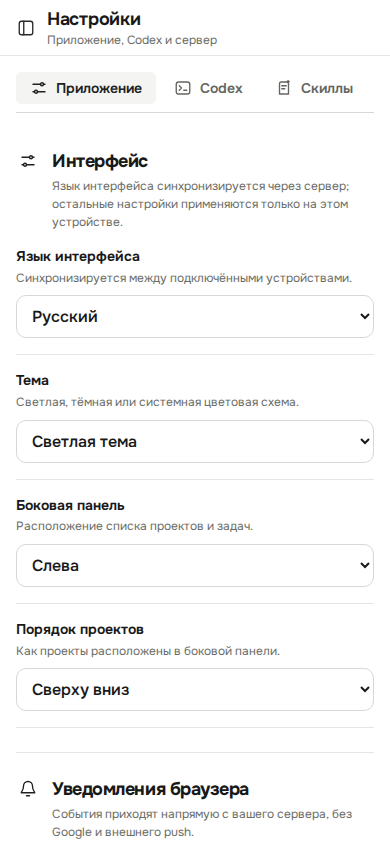</a>
</p>

Короткие заголовки и имена сессий могут сокращаться многоточием. Инструкции,
ошибки и основной текст должны переноситься и оставаться доступными целиком.
Для flex/grid-детей с длинным содержимым сохраняйте `min-width: 0`. Выбранная
сессия выделяется единой поверхностью и тенью: её жирность не меняется при выборе.

Утверждённый набор — **мягкий контурный** (вариант A): плавные контуры,
скруглённые углы, простые детали и согласованный визуальный вес.
[Icons.tsx][icons] задаёт его геометрию: `viewBox="0 0 24 24"`, обычный размер
`18 × 18px`, `strokeWidth="1.8"`, круглые окончания и соединения, `currentColor`.
Общая сетка не означает одинаковые внешние габариты рисунка: шевроны, точки
и предметные символы оптически сбалансированы в одном холсте. Размер на экране
зависит от роли; внутри одного ряда он одинаковый. В отдельных контролах размер
переопределён — ориентируйтесь на соседние иконки того же ряда.
Набор включает 43 иконки клиента и контурный значок открытия приложения
в браузерном расширении. Заливка используется только для простых знаков — точек
и остановки; остальные формы контурные, без собственных теней и цветного фона.
Сначала используйте существующую иконку. Если нужна новая, добавляйте
её в этот набор с теми же параметрами; не вводите другую библиотеку или emoji
вместо пиктограммы. Иконки по умолчанию скрыты от скринридера: доступное название
получает кнопка, например `aria-label={t("Закрыть")}`.

### Логотип и значки приложения

Официальный знак CN для веба и расширения —
[favicon.svg](../apps/client/public/favicon.svg). Сохраняйте геометрию, пропорции,
цвета и внутренние поля исходника; не собирайте буквы текстом или CSS-фигурами.
В заголовке расширения знак имеет размер `24 × 24px`. Рядом с видимой подписью
CodexNest изображение получает пустой `alt`, чтобы название не озвучивалось дважды;
самостоятельная ссылка или кнопка с логотипом должна иметь доступное имя.

Для панели инструментов Chrome используются PNG `16/32px`, для списка расширений
также `48/128px`. Они указаны в [манифесте расширения][extension-manifest] и
механически получены из того же `favicon.svg`, а не нарисованы отдельно.
После согласованного изменения исходника обновите их командой
`npm run icons:generate -w @codexnest/extension` с установленным Chromium для
Playwright. PNG хранятся в репозитории: обычная сборка не требует браузера.
[Браузерный тест][extension-appearance] сверяет размеры и рисунок готовых файлов
с исходным SVG. В обеих темах используется один знак, без отдельного цветного акцента.

У устанавливаемого PWA есть существующий квадратный вариант
[pwa-icon.svg](../apps/client/src/assets/pwa-icon.svg) с тем же знаком на фоне
`#171817`; его ресурсы и правила установки проверяет
[pwa.test.ts](../apps/client/src/pwa.test.ts). Не заменяйте им круглый знак в
заголовке и не меняйте оформление платформенных значков попутно с новой фичей.

### Движение, фокус и перекрытия

Тени поверхностей заданы в [уровнях объёма](#уровни-объёма); motion-токены и порядок
слоёв сохраняются.

| Токен из [tokens.css][tokens] | Значение                     | Назначение                         |
| ----------------------------- | ---------------------------- | ---------------------------------- |
| --motion-fast                 | `120ms`                      | Смена цвета, границы, прозрачности |
| --motion-standard             | `180ms`                      | Появление поверхности              |
| --motion-ease                 | `cubic-bezier(0.2, 0, 0, 1)` | Базовая кривая перехода            |

Анимация объясняет изменение состояния. Не добавляйте декоративное движение
вокруг обычного результата. Поддержка `prefers-reduced-motion` уже предусмотрена
в [примитивах][primitives] и специальных стилях; новые эффекты должны её учитывать.

Базовый `:focus-visible` — обводка `2px` цветом `--color-lapis` с отступом `2px`.
Сохраняйте заметный фокус на кнопках, полях, ссылках и раскрываемых элементах.
У композера есть собственное оформление `:focus-within`; это не образец для
глобального удаления outline.

Нативные checkbox и radio используют нейтральный `accent-color: var(--color-lapis)`.
Семантическое исключение — зелёные маркеры выполнения в `.plan-checklist`.
Не заменяйте нативные контролы декоративными элементами только ради цвета.

У клиента несколько уровней наложения: заголовки и композер, навигация,
инспектор/просмотрщик, затем диалоги. Используйте существующую поверхность и её
backdrop. Не решайте конфликт произвольным `z-index: 9999`.
[Dialog][dialog] создаёт портал и учитывает глубину вложения через `100 + depth`.

## Каталог элементов

Сейчас это сочетание HTML-примитивов с классами и специализированных React-компонентов.
Общего React-компонента `Button`, `Input` или универсального `Card` в клиенте нет.
Каталог описывает существующие реализации; при будущей переработке экрана их
внешний вид сверяется с [утверждённым направлением](#утверждённое-направление),
а поведение и доступность сохраняются.

| Элемент                    | Что использовать                                                                              | Правило                                                                       |
| -------------------------- | --------------------------------------------------------------------------------------------- | ----------------------------------------------------------------------------- |
| Обычная кнопка             | `button`, [primitives.css][primitives]                                                        | Второстепенное действие; `type="button"`, если это не отправка формы          |
| Основное действие          | `button.primary`                                                                              | Одно главное действие в группе; прозрачно в покое, объём при hover/focus      |
| Опасное действие           | `button.danger`                                                                               | Назвать последствие; подтверждение соразмерно действию                        |
| Кнопка с иконкой           | `.icon-button` и [Icons][icons]                                                               | Для компактной панели; доступное имя обязательно                              |
| Поле и выбор               | `input`, `textarea`, `select`                                                                 | Постоянно парящая поверхность; связанная подпись, пояснение и ошибка          |
| Переключатель режима       | `.setting-control` в [SettingsPicker][settings-picker]                                        | `aria-pressed` отражает выбор; недоступность не выглядит выбранным состоянием |
| Переключатель в настройках | `.skill-switch` в [SkillsSettingsCard][skills-settings]                                       | Сохранить настоящий checkbox и связанное имя                                  |
| Действие с ожиданием       | [ActionLabel][action-label] внутри кнопки                                                     | Резервирует место для обеих подписей, доступна только текущая                 |
| Диалог                     | [Dialog][dialog]                                                                              | Название, начальный фокус, Tab, закрытие, возврат фокуса                      |
| Меню действий              | Существующие `details/summary` в [App][app] и [ThreadPage][thread-page]                       | Действия рядом с объектом, доступность без hover, закрытие снаружи            |
| Группа и строка настроек   | [SettingsGroup / SettingsRow][settings-presentation]                                          | Общая парящая подложка группы, существующая сетка и порядок строк             |
| Заголовок рабочего экрана  | [WorkspaceHeader][workspace-header]                                                           | Общий заголовок, мобильная навигация, действия и сведения                     |
| Вопрос в сессии            | [AttentionPanel][attention] / [AsyncQuestionCard][async-question]                             | Выбор и отправка — отдельные шаги; состояние ответа видно                     |
| Сведения и результат       | [SessionInspector][inspector], [ArtifactViewer][artifact-viewer], [ImageViewer][image-viewer] | Использовать существующие панели просмотра                                    |
| Пустое состояние           | `.center-state`, `.center-state.compact`                                                      | Объяснить отсутствие данных и доступный следующий шаг                         |
| Обратная связь             | `.settings-notice`, `.dialog-notice`, контекстная ошибка                                      | Сообщение рядом с действием; подходящая семантическая роль                    |

### Состояния элемента

Для каждого нового элемента проверьте применимые состояния. Если состояние
невозможно по смыслу, его не нужно искусственно добавлять.

| Состояние          | Ожидаемое поведение                                                                                        |
| ------------------ | ---------------------------------------------------------------------------------------------------------- |
| Обычное            | Роль и название действия понятны до взаимодействия                                                         |
| Hover              | Единая поверхность и тень выбранной сессии; без движения соседних элементов                                |
| Клавиатурный фокус | Тот же объём плюс заметный контур; все действия доступны с клавиатуры                                      |
| Выбрано / раскрыто | Постоянный объём выбранного контрола; `aria-pressed`, `aria-selected`, `aria-expanded` согласованы с ролью |
| Недоступно         | Реальный `disabled` или подходящая семантика; причина видна, если она неочевидна                           |
| Выполняется        | Блокируется повторное действие, подпись объясняет процесс, размеры стабильны                               |
| Первичная загрузка | Понятно, что данные ещё не получены; доступные части интерфейса работают                                   |
| Обновление         | Сохраняются введённые данные, выбор, фокус и прочитанный участок                                           |
| Пусто              | Отличается от загрузки и ошибки; предложен уместный следующий шаг                                          |
| Ошибка             | Понятны сбой и возможность исправления/повтора, ввод не теряется                                           |
| Успех              | Подтверждён фактический результат, снята блокировка, контекст сохранён                                     |
| Нет связи          | Показано состояние подключения и судьба действия: сохранено, ожидает или не отправлено                     |

Не используйте `disabled` только для изменения цвета. Базовая непрозрачность
недоступной кнопки клиента — `0.4`; локальные контролы могут иметь переопределения.
Отсутствие данных во время запроса нельзя показывать как «Ничего не найдено».

### Пример: действие без скачка ширины

Фрагмент внутри React-компонента клиента. `t` получен из `useI18n`, `saving` и
`save` — состояние и обработчик этого компонента. Импортируйте [ActionLabel][action-label]
из существующего модуля. Обработчик отвечает за результат и сообщение об ошибке.

```tsx
<button type="button" className="primary" disabled={saving} onClick={save}>
  <ActionLabel idle={t("Сохранить")} busy={t("Сохраняем…")} pending={saving} />
</button>
```

Компонент оставляет обе подписи в расчёте ширины и показывает одну. Не заменяйте
его условием, которое меняет ширину кнопки при каждом запросе. Если фиче нужен
спиннер, его место также не должно сдвигать подпись и соседние действия.

### Пример: строка настроек

Фрагмент использует [SettingsGroup / SettingsRow][settings-presentation] и
[SlidersIcon][icons]. `theme` и `onThemeChange` приходят от владельца настроек,
как в [SettingsPage][settings-page]. Это пример размещения, не отдельная форма
хранения темы. `id` должен быть уникален на странице.

```tsx
<SettingsGroup title={t("Интерфейс")} icon={<SlidersIcon />}>
  <SettingsRow
    label={t("Тема")}
    labelFor="settings-theme"
    description={t("Светлая, тёмная или системная цветовая схема.")}
  >
    <select
      id="settings-theme"
      value={theme}
      onChange={(event) => onThemeChange(event.target.value)}
    >
      <option value="system">{t("Системная тема")}</option>
      <option value="light">{t("Светлая тема")}</option>
      <option value="dark">{t("Тёмная тема")}</option>
    </select>
  </SettingsRow>
</SettingsGroup>
```

`SettingsRow` связывает подпись через `labelFor`. Его `description` отображается
визуально; для программной связи описания/ошибки с полем задавайте явный `id` и
`aria-describedby` в конкретной форме. Не полагайтесь на placeholder как на label.

### Пример: небольшой информационный диалог

Фрагмент монтируется условно, когда диалог открыт. `titleId` создаётся через
React `useId()`, `title` и `content` — локализованный заголовок и содержимое,
`closeButtonRef` — `useRef<HTMLButtonElement>(null)`, `onClose` закрывает диалог.
Используются существующие [Dialog][dialog] и [XIcon][icons].

```tsx
<Dialog
  className="compact"
  titleId={titleId}
  closeOnBackdrop
  closeOnEscape
  initialFocusRef={closeButtonRef}
  onClose={onClose}
>
  <div className="dialog-header">
    <div className="dialog-heading">
      <h2 id={titleId}>{title}</h2>
    </div>
    <button
      ref={closeButtonRef}
      type="button"
      className="icon-button"
      aria-label={t("Закрыть")}
      onClick={onClose}
    >
      <XIcon />
    </button>
  </div>
  <div>{content}</div>
</Dialog>
```

У `Dialog` задаётся либо `titleId`, либо `ariaLabel`. Для формы с несохранёнными
данными политика закрытия должна учитывать потерю ввода: не копируйте поведение
информационного окна автоматически. Сам компонент не подтверждает потерю данных.
Начальный фокус формы обычно получает нужное поле, подтверждения — безопасное
действие. При нестандартном открытии задайте `returnFocusRef`; обычный открыватель
компонент запоминает сам.

### Диалог создания ветки

В [ForkDialog][fork-dialog] метрики находятся под описанием варианта в двух
колонках. Подписи «Объём»/«Время» — `--text-caption` (`12px`), значения —
`--text-small` (`14px`). Текст переносится по словам, а не посреди единицы измерения.
Заголовок и нижние действия сохраняют положение при загрузке и ошибке расчёта.
Высота определяется содержимым. Между прокручиваемым телом и действиями остаётся
`16px`; внутри тела предусмотрены вертикальные отступы `12px`, чтобы тени карточек
не обрезались.
Не резервируйте пустоту фиксированной высотой окна или растягиванием его тела.
Подписи метрик видны и при загрузке; на ширине до `640px` под значение отводится
минимум две строки, чтобы переносы не сдвигали кнопки. На desktop высота ограничена
viewport и safe area, у мобильного sheet — дополнительно `88dvh`.
Если содержимое не помещается, прокручивается только тело, а заголовок и действия
остаются видны.
Недоступность оценки не должна скрывать разрешённое создание ветки.

## UX-паттерны

### Где размещать новую возможность

| Задача пользователя              | Место в интерфейсе              | Правило                                                                     |
| -------------------------------- | ------------------------------- | --------------------------------------------------------------------------- |
| Найти проект, переключить сессию | Боковая навигация               | Сохранять группировку, порядок и выбранную строку                           |
| Выполнить действие над сессией   | Заголовок сессии или её меню    | Частое действие видно; дополнительные действия собраны рядом с объектом     |
| Настроить следующую отправку     | Композер и SettingsPicker       | Не перегружать строку инструментов; сохранять доступ к отправке и остановке |
| Изменить постоянное предпочтение | Соответствующий раздел настроек | Использовать существующие группы и строки; объяснить область действия       |
| Посмотреть детали выполнения     | Раскрываемый журнал активности  | Краткое состояние видно сразу, подробности доступны по запросу              |
| Посмотреть файлы и результат     | Инспектор и просмотрщик         | Сохранять контекст сессии и возможность вернуться к чтению                  |
| Ответить на вопрос               | Блок вопроса в сессии           | Видны варианты, свободный ответ, отправка и состояние доставки              |

Не переносите управление сессией в глобальные настройки только ради свободного
места. Поясняйте область настройки, если она влияет на устройство, все подключения
или только следующие задачи; пример уже есть в разделе «Интерфейс».

### Раскрытие, меню, диалог или отдельный экран

- **Раскрытие на месте** — подробности того же объекта: журнал действий, команда,
  пояснение. Свернутый заголовок должен сохранять полезный смысл.
- **Меню / popover** — небольшой набор действий или короткий выбор рядом с
  инициатором. Сохраняйте доступ без наведения, закрытие снаружи и клавиатурой
  по существующему паттерну; проверьте поведение конкретного меню.
- **Диалог** — ограниченная задача с собственным вводом или подтверждением.
  Используйте общий компонент, явный заголовок и понятный выход.
- **Экран / панель** — длительная работа, большая форма, просмотр документа.
  Переиспользуйте компоновку настроек, инспектора или просмотрщика.

Само наличие `details/summary` не реализует все правила сложного меню. Для новых
действий повторяйте соответствующую логику закрытия и фокуса, а не только HTML.
Не открывайте вложенный диалог, если действие можно завершить в текущем.

### Разговор, очередь и фоновая работа

Источники: [ThreadPage][thread-page], [Composer][composer],
[AsyncQuestionCard][async-question] и [проверки стабильности][layout-tests].

- Сообщение пользователя имеет собственную подложку и выравнивается вправо.
  Ответ ассистента читается в потоке. План, прогресс, вопрос и журнал остаются
  различимыми типами содержимого.
- Сообщение в очереди сохраняет типографику и геометрию при переходе в историю.
  Не меняйте ему размер шрифта или ширину только из-за доставки.
- Различайте запись на устройстве, принятие сервером и доставку. Успех одного
  этапа не означает завершение следующего; подпись должна отражать известный факт.
- При временной недоступности сохраняйте черновик и выбранные ответы. Выбор
  варианта ответа не равен отправке: нужна явная кнопка; основной черновик
  композера при этом не заменяется.
- Отправка сообщения из основного композера пропускает текущую форму уточнений:
  сообщение передаётся как новое указание, без назначения ответом на первый вопрос.
  Форма скрывается после сохранения текста в очередь отправки, а для голосового
  сообщения — с начала загрузки записи. При ошибке или отмене актуальная форма
  возвращается с прежними ответами и текущим вопросом. Диктовка в черновик или
  внутри формы не пропускает вопросы; пропуск привязан к конкретному блоку.
- Форма уточнений отделяется от голосового сообщения и очереди интервалом
  `--space-4` (`16px`); между ходами сохраняется `--space-8` (`32px`). Скрытая форма
  не оставляет собственного отступа. Переключатели вопросов круглые: `34 × 34px`
  на desktop и `32 × 32px` до `820px` включительно, без сжатия. Счётчик и навигация
  располагаются в одной строке с переносом; свободный ответ имеет видимую подпись.
- Фоновые обновления не забирают фокус и не прокручивают читателя к концу, если
  он читает выше. Пользовательская навигация остаётся отзывчивой во время работы.
- Резервируйте место для изображений, загрузки и изменяемых подписей. Отправка,
  остановка, запись голоса и появление очереди не должны перемещать соседние
  контролы под указателем.
- Между правыми действиями композера сохраняйте зазор: `--space-1` (`4px`) на
  desktop и `--space-0-5` (`2px`) до `820px` включительно. Мобильные кнопки остаются
  не меньше `32 × 32px`; при записи и появлении остановки задачи они помещаются
  в одну строку, в том числе на `320px`. Нулевой зазор здесь не является нормой
  компактности. Пульсация записи рисуется внутри кнопки и не закрывает соседние
  действия; при уменьшенном движении остаётся статическая внутренняя обводка.

### Ошибки, обратная связь и подтверждения

Показывайте ошибку рядом с причиной: поле, карточка, композер, просмотрщик.
Проблему общего соединения показывает общий статус. Сохраняйте достаточно
контекста для повтора; не заменяйте всю страницу сообщением из-за локальной ошибки.

Текст сообщает, что не удалось сделать и что доступно дальше. Например:
«Не удалось загрузить фрагмент» с повтором или «В записи не обнаружена речь.
Проверьте микрофон и запишите ещё раз». Не обещайте восстановление или сохранение,
если приложение не располагает подтверждением.

Для ошибки, требующей внимания, подходит `role="alert"`; для ненавязчивого
результата или состояния — `role="status"`. Не озвучивайте каждое фоновое событие.
В [SettingsGroup][settings-presentation] уже есть `aria-busy` и `inert` для загрузки
тела группы; наружный заголовок остаётся. Это не повод размонтировать всю секцию.

Подтверждение требуется там, где пользователь может потерять значимые данные
или прервать работу; его текст называет объект и последствие. Для обычного
безопасного переключения лишний диалог не нужен. Используйте поведение действия
в его текущем контексте: например, завершение сессии в боковом списке имеет
подтверждение повторным нажатием и собственную подпись. Не распространяйте этот
способ на все опасные операции.

## Адаптивность и доступность

### Существующие перестройки клиента

Источник — медиазапросы [styles.css][styles]. Это действующие пороги отдельных
паттернов, не предложение ввести новую общую сетку breakpoint-токенов.

| Ширина viewport          | Что меняется                                                                                     |
| ------------------------ | ------------------------------------------------------------------------------------------------ |
| Более `1279px`           | Боковая навигация закреплена; инспектор и просмотрщик могут соседствовать с лентой               |
| До `1279px` включительно | Инспектор и просмотрщик переходят в накладываемые панели; настройки выстраиваются в одну колонку |
| До `820px` включительно  | Навигация становится drawer шириной `min(310px, 88vw)`; просмотрщик занимает экран               |
| До `760px` включительно  | Отдельное правило ширины сообщений с изображениями                                               |
| До `600px` включительно  | Поиск по диалогам разворачивается на весь экран                                                  |
| До `520px` включительно  | Диалог ветки становится нижней панелью; дополнительно уплотняются отдельные элементы             |

На мобильном шапка чата высотой `44px` плавает над лентой с отступом
`--app-safe-area-top`, без дополнительного зазора до системной области.
Нижний отступ композера равен `--app-safe-area-bottom`; при открытой экранной
клавиатуре он обнуляется. Базовый заголовок других экранов сохраняет
`56px + --app-safe-area-top`. Горизонтальные поля ленты чата — `16px`, композера
и плавающей шапки — `8px`; к ним добавляются боковые safe area. Обе панели
выступают относительно колонки сообщений на `8px` с каждой стороны, в том числе
на экранах шириной до `359px`. Ввод в композере имеет размер `15px`.
Инспектор появляется снизу; не все диалоги автоматически становятся нижними
панелями — это поведение выбирается существующим паттерном.

Лента прокручивается под верхней системной областью. Под часами и нижней
навигацией лежат неподвижные градиенты в цвет `--color-canvas`: сверху — от
`88%` до `78%` непрозрачности с исчезновением в пределах следующих `12px`,
снизу — `78%` с переходом до `16px` выше safe area. Накладки находятся над
лентой, под непрозрачными шапкой и композером, не перехватывают касания и имеют
нулевую высоту при нулевых системных отступах. При открытой клавиатуре нижняя
накладка скрывается. Размытие и обработчики прокрутки для эффекта не нужны.

Безопасные отступы берите из `--app-safe-area-top/right/bottom/left` в
[токенах][tokens]. Используйте текущую компоновку с `100dvh`, прокруткой содержимого
и учётом экранной клавиатуры. Не добавляйте второй фиксированный нижний toolbar,
который перекроет композер или системный отступ.

### Проверки взаимодействия

- Новое действие доступно мышью, клавиатурой и касанием; hover не является
  единственным способом обнаружить или выполнить его.
- Навигация работает с панелью слева и справа. Используйте
  [useDrawerNavigation][drawer] для существующего drawer; новые жесты не должны
  перехватывать ввод, действия и прокрутку таблиц.
- На узком экране названия и ошибки переносятся без перекрытия кнопок. Локальная
  горизонтальная прокрутка допустима у таблицы или списка вкладок, но не у всей
  страницы и не как способ разместить обязательные действия композера.
- Заголовки имеют смысловую иерархию; поля — связанные подписи; группы вариантов —
  `fieldset/legend`, если это соответствует форме. Иконка и цвет не заменяют текст.
- Диалог имеет доступное имя, управляет фокусом, удерживает Tab внутри и возвращает
  фокус после закрытия. Проверяются Escape и клик по фону согласно политике окна.
- Режим уменьшенного движения сохраняет понятность состояния без анимации.
  Автоматический аудит дополняется ручной проверкой клавиатуры и читаемости.

## Тексты интерфейса

Используйте простые глаголы и названия знакомых пользователю объектов: «Создать
ветку», «Подключить вкладку», «Проверить снова». Одинаковое действие называется
одинаково в кнопке, подтверждении и результате. Короткое «Сохранить» уместно
в однозначной форме; среди нескольких операций уточните, что сохраняется.

- Заголовки и кнопки — в обычном регистре, без рекламных формулировок и лишних
  восклицаний. Существующие маленькие рубрики плана/прогресса не задают регистр
  всем заголовкам приложения.
- Label называет поле, описание объясняет смысл, placeholder даёт пример.
  Не поручайте одному тексту все три роли.
- Пустое состояние предлагает следующий шаг: подключить проект, включить Browser
  в сессии или изменить запрос. Оно не обвиняет пользователя.
- Не раскрывайте внутренние имена RPC и хранения там, где достаточно описать
  действие. Технические детали уместны в предназначенном для них журнале.
- В клиенте новые строки проходят через `useI18n().t` и русско-английский словарь
  [i18n.tsx][i18n]. В расширении используется отдельный объект `copy` в
  [popup.ts][extension-popup]. Не создавайте третий механизм перевода.
- Проверяйте обе локали, длинные названия и динамические подписи. Для ожидания
  используйте [ActionLabel][action-label]; формат дат и чисел должен учитывать
  текущий язык, как в соседнем интерфейсе.

## Браузерное расширение

Расширение использует общий [tokens.css][tokens]: обе палитры, Onest, шкалу
радиусов, отступов и базовые размеры текста. Клиентская шкала `12/14/16/18/20px`
на него не распространяется; существующая компактная типографика сохраняется.
[popup.css][extension-styles] импортирует общий файл
напрямую; Vite включает файл шрифта и его OFL-лицензию в сборку и ZIP.
Загрузка шрифта не требует сети или установленного Onest на компьютере.
На `body` явно задан `--font-ui`, чтобы встроенные стили Chrome не подставляли
системный шрифт. Глобальные примитивы и компоновка клиента не импортируются:
popup и side panel сохраняют свои HTML-контролы и структуру.

В заголовке обеих поверхностей используется официальный знак CN из
[favicon.svg](../apps/client/public/favicon.svg), размер `24 × 24px`.
Расширение подключает исходный SVG напрямую; отдельный CSS-знак или копия
геометрии логотипа не допускается. Подпись CodexNest рядом с изображением
озвучивается один раз: у самого изображения пустой `alt`.
Значки в панели Chrome и списке расширений используют PNG из того же исходника,
см. [правила брендинга](#логотип-и-значки-приложения).

### Общие токены и локальная геометрия

`--canvas`, `--recessed`, `--ink` — местные псевдонимы общих цветов.
`--accent-soft` ссылается на `--color-recessed`; `--accent`, `--muted`,
`--line`, `--success` и остальные совместимые имена приходят из общих токенов.
Внешний вид расширения ещё ожидает перехода на единый тон и общие состояния:
главные действия будут прозрачными в покое, поля — постоянно приподнятыми.
Новой независимой палитры и отдельного акцента для расширения нет.

| Параметр                     | Текущее поведение                                                       |
| ---------------------------- | ----------------------------------------------------------------------- |
| Popup                        | Ширина `360px`                                                          |
| Side panel                   | Ширина контейнера, минимальная высота `100vh`                           |
| Верхняя панель               | `--extension-header-height: 52px`, поля `--extension-inset: 17px`       |
| Основные кнопки              | Минимум `--extension-button-height: 35px`, текст `12px`, вес `650`      |
| Поля `.field input/select`   | `--extension-field-height: 37px`, текст `--extension-text-body: 12.5px` |
| Существующие дробные размеры | `--extension-text-caption: 10.5px`, `--extension-text-empty: 11.5px`    |
| Disabled                     | Непрозрачность `0.52` у кнопок и select                                 |
| Focus-visible                | `2px solid var(--color-lapis)`, отступ `2px`                            |

Локальные размеры сохраняют существующую плотность расширения; это не новые
общие ступени для приложения. Цвет соединения дублируется текстом, точкой и
левой полосой `3px`: нейтральный до настройки, `--status-running` при подключении,
`--success` после подключения, `--status-attention` при переподключении,
`--danger` при ошибке.

### Выбор темы

По умолчанию действует системная тема. Внизу popup и side panel, до и после
настройки подключения, доступен выбор «Системная / Светлая / Тёмная».
[popup.ts][extension-popup] хранит режим в `localStorage` расширения под ключом
`codexnest.theme`; неизвестное значение означает `system`. Системный режим
реагирует на `prefers-color-scheme`, а ручной выбор имеет приоритет и сохраняется
при повторном открытии. Событие `storage` синхронизирует открытые поверхности.

Хранилище расширения отдельно от веб-клиента: одинаковый ключ не означает
синхронизацию с темой приложения. Переключение меняет только атрибуты темы и
значение theme-select, не пересоздаёт форму, не сбрасывает выбранную сессию,
фокус или введённые поля и не запрашивает фоновое состояние через RPC.
Это проверяют модульные тесты и [браузерные тесты оформления][extension-appearance].

Основной сценарий: подключение → выбор существующей сессии с включённым Browser →
подключение текущей вкладки → управление подключением. Пустой список объясняет,
где включить Browser. Не добавляйте сюда самостоятельное создание сессии как
побочный способ решить пустое состояние.

Фоновое обновление каталога сохраняет выбранную сессию и не закрывает select
во время взаимодействия. Занятая сессия обозначается текстом и недоступностью,
а side panel следует за активной вкладкой. Это закреплено
[тестами расширения][extension-e2e]. Учитывайте обе поверхности и обе локали.

## Состояние перехода на новый дизайн

| Область             | Реализация                                                                                              |
| ------------------- | ------------------------------------------------------------------------------------------------------- |
| Тон поверхностей T1 | Общий `--color-floating` для навигации, чата, форм, диалогов и расширения; уровни отличаются тенями     |
| Кнопки              | Общие состояния в `controls.css`; специализированные состояния навигации и чата используют те же токены |
| Настройки C         | Вертикальные разделы на desktop, парящие группы и поля, горизонтальная навигация на узком экране        |
| Диалоги P2 / S1     | Компактный выбор папки и поиск с отдельной прокруткой содержимого                                       |
| Расширение          | Общие токены и контролы при сохранении компактных шрифтов, высот и поведения форм                       |

Браузерные эталоны реализации находятся в
[settings-surfaces.spec.ts](../apps/client/e2e/visual/settings-surfaces.spec.ts),
[chat-controls.spec.ts](../apps/client/e2e/visual/chat-controls.spec.ts) и
[appearance.spec.ts](../apps/extension/e2e/appearance.spec.ts).
После изменения соответствующей области обновляйте её браузерные проверки.

## Известные особенности и расхождения

Это перечень границ текущей системы, а не список автоматически разрешённых
стилей для новых элементов. Изменение этих особенностей требует отдельного
обоснования, а не попутного округления всех размеров.

Новое исключение фиксируется здесь вместе с селектором или поверхностью,
причиной, границами применения и способом проверки. Для радиусов также обновляется
явный список в тесте; для остальных значений нужны проверка затронутого сценария
и визуальное ревью. Если исключение повторяется в новой поверхности, сначала
решите, достаточно ли общего токена: повторение само по себе не узаконивает новую шкалу.

| Наблюдение                                                                                                                  | Где                                                 | Как поступать в новой фиче                                                               |
| --------------------------------------------------------------------------------------------------------------------------- | --------------------------------------------------- | ---------------------------------------------------------------------------------------- |
| `--font-mono` совпадает с UI-шрифтом                                                                                        | [tokens.css][tokens]                                | Сохранить текущую типографику, несмотря на название токена                               |
| Оптические радиусы: маркер сессии и край артефакта `2px`, фокус ссылки родителя `3px`                                       | [Тест радиусов][style-tests]                        | Это не поверхности и не дополнительные ступени шкалы; не переносить на кнопки и меню     |
| Компактный touch-токен `32px`, отдельные проектные действия имеют `26px`, кнопки `.fork-operation-actions` — минимум `24px` | [tokens.css][tokens], [styles.css][styles]          | Не брать самые маленькие значения как стандарт; отдельно проверить область касания       |
| Не все переходы используют motion-токены: drawer задаёт `180ms ease` напрямую                                               | [styles.css][styles]                                | Новую общую анимацию строить на токенах; не менять старые жесты попутно                  |
| У расширения сохранены высоты контролов `35/37px`, поля `17px` и дробные размеры текста                                     | [popup.css][extension-styles]                       | Переиспользовать локальные токены, не менять плотность без отдельной задачи              |
| Унаследованные оптические начертания между ступенями общей шкалы и локальные размеры текста                                 | [styles.css][styles], [popup.css][extension-styles] | Не округлять попутно: изменятся переносы; не копировать в новые элементы без обоснования |
| Браузерные проверки запускаются локально; CI выполняет модульные тесты и сборку                                             | [CI][ci], [настройки Playwright][playwright-config] | UI проверять в браузере, жесты, клавиатуру и safe area — на целевых устройствах          |

## Примеры соблюдения правил

| Соответствует дизайн-коду                                                       | Нарушает правило                                                           |
| ------------------------------------------------------------------------------- | -------------------------------------------------------------------------- |
| Цвет текста и подложки берётся из токенов своей поверхности                     | В новой карточке зашиты белый фон и чёрный текст для обеих тем             |
| Новая настройка использует SettingsGroup и SettingsRow                          | Каждая строка получает отдельную карточку и произвольную сетку             |
| Все нейтральные парящие элементы используют тон левой панели                    | Вложенной карточке назначен другой нейтральный оттенок ради высоты         |
| Главное действие прозрачно до hover/focus, выбранный раздел постоянно приподнят | Главное действие постоянно залито, а выбор обозначен только сменой оттенка |
| Используется Dialog с названием и возвратом фокуса                              | Нарисован похожий `div` поверх экрана без управления клавиатурой           |
| ActionLabel резервирует ширину обычной и занятой подписи                        | «Сохранить» заменяется на длинную подпись, сдвигая соседнюю кнопку         |
| Новое действие учитывает существующую строку композера на `320px`               | Ради дополнительной иконки уменьшаются цели касания и размер текста        |
| Ошибка сохраняет введённый текст и предлагает повтор                            | Неудачная отправка очищает поле и сообщает только «Ошибка»                 |
| Статус сессии вычисляется существующим helper                                   | Любая завершённая сессия всегда окрашивается зелёным без учёта прочтения   |
| Фоновое событие сохраняет положение читателя                                    | Каждое обновление прокручивает историю вниз                                |
| Иконка взята из Icons и у кнопки есть доступное имя                             | Добавлен похожий символ из другого набора или безымянная кнопка            |

## Проверка новой фичи

### Короткий порядок проверки

1. **Место и паттерн:** задача размещена в подходящем разделе, выбран существующий
   элемент; новый общий паттерн, если он нужен, описан вместе с реализацией.
2. **Визуальная сверка:** все нейтральные парящие поверхности имеют единый тон
   левой панели в обеих темах; уровни различаются тенями. Соблюдены типографика,
   плотность, радиусы и внутренние поля; проверены соответствующие поверхности расширения.
3. **Состояния:** обычные и главные действия прозрачны в покое, hover/focus и выбор
   имеют согласованный объём, нажатие сохраняет отклик. Проверены disabled,
   ожидание, пустота, ошибка и успех; нет потери ввода или скачков геометрии.
4. **Размер и ввод:** проверены desktop, узкий экран, длинное содержимое,
   экранная клавиатура, касание и полностью клавиатурное прохождение сценария.
5. **Язык и обратная связь:** русский и английский помещаются, действия имеют
   понятные названия, ошибки и состояния доступны вспомогательным технологиям.
6. **Регрессии:** выполнены подходящие существующие проверки; изменения снимков
   просмотрены, а изменения общего правила отражены в этом документе.

Для клиентской визуальной сверки используйте имеющиеся fixture-размеры
`1440 × 1000` и `390 × 844`. При изменении композера дополнительно проверяйте
ширины `320`, `360`, `390`, `412px` с уменьшенной высотой viewport. При изменении
адаптивного правила проверьте обе стороны именно затронутого порога, например
`820` и `821px`; при изменении drawer — оба положения боковой панели. Верх панели
совпадает с шапкой чата, низ — с композером; safe area учитывается один раз.
Проверьте внутренние поля индикаторов, отсутствие обрезанных теней и прокрутку
длинных названий сессий при наведении с учётом reduced motion.

### Существующие проверки

Команды ниже запускаются из корня репозитория с установленными зависимостями.
Для Playwright нужны браузеры, указанные в его конфигурации. Это команды для
проверки будущих UI-изменений, не заявление, что каждый сценарий покрыт автоматикой.
Если локальное окружение задаёт `NODE_ENV=production`, запускайте тесты с явным
`NODE_ENV=test`: production-сборка React не содержит необходимых модульным тестам
функций. Менять код компонента ради такого сбоя не нужно.

[CI][ci] выполняет быстрые проверки в задании `verify`: форматирование, lint,
модульные тесты, сборку и отдельную проверку типов сервера. Модульный тест радиусов и типографики
входит в `verify`. Визуальный набор клиента и браузерные тесты расширения сохранены
для локального запуска и больше не блокируют rolling-релиз. Публикация зависит
от `verify` и использует готовые сборки клиента и расширения из этого задания.
В GitHub обязательной проверкой для слияния PR остаётся `verify`.

Локальный запуск визуального набора в Chromium:

```bash
npm run build -w @codexnest/protocol
npm exec -w @codexnest/client -- playwright install chromium
NODE_ENV=test npm run test:visual -w @codexnest/client -- --project=chromium --update-snapshots=none
```

| Что изменено                                                 | Проверка                                                                         |
| ------------------------------------------------------------ | -------------------------------------------------------------------------------- |
| Основные экраны, темы, диалоги                               | `npm run test:visual -w @codexnest/client -- redesign.visual.spec.ts`            |
| Компактный композер, рост, fallback и состояния              | `npm run test:visual -w @codexnest/client -- composer-bubble.spec.ts`            |
| Композер, очередь, загрузка, фоновое обновление              | `npm run test:visual -w @codexnest/client -- layout-stability.spec.ts`           |
| Навигация, состояния, выравнивание и мобильные жесты         | `npm run test:visual -w @codexnest/client -- sidebar-actions.spec.ts`            |
| Радиусы и токены размеров шрифта                             | `npm run test -w @codexnest/client -- src/styles.test.ts`                        |
| Типографика, формы, темы и языки на ширинах 320–1440px       | `npm run test:visual -w @codexnest/client -- typography.spec.ts`                 |
| Метрики ветки, темы и нейтральные контролы                   | `npm run test:visual -w @codexnest/client -- design-contract.spec.ts`            |
| Поведение общего диалога                                     | `npm run test -w @codexnest/client -- src/components/Dialog.test.tsx`            |
| Асинхронные вопросы                                          | `npm run test -w @codexnest/client -- src/components/AsyncQuestionCard.test.tsx` |
| Отображение и выбор в расширении                             | `npm run test -w @codexnest/extension -- src/popup.test.ts`                      |
| Popup, side panel, обновление каталога и подключение вкладки | `npm run test:e2e -w @codexnest/extension`                                       |
| Только этот документ                                         | `npm exec -- prettier --check docs/design-kit.md` и проверка ссылок/значений     |

[Визуальный набор клиента][visual-tests] включает снимки, проверки геометрии,
типографики и отдельные аудиты axe. [Набор стабильности][layout-tests] проверяет
размеры при доставке, загрузке, записи голоса, длинных английских подписях и
сохранение позиции чтения. Сценарии `recording paint bounds` отдельно включают
обычную анимацию, проверяют её фазы, включая максимум, зазоры и размеры кнопок
на ширинах `320/360/390/412/820/821px` в обеих темах, без задачи и с выполняющейся
задачей, а затем режим уменьшенного движения. Прямоугольник элемента не учитывает
внешнюю тень: одной проверки геометрии без проверки анимации недостаточно.
[Dialog.test.tsx][dialog-tests] проверяет начальный
фокус, Tab, Escape, фон, возврат фокуса и вложенность.

Клиентский [Playwright][playwright-config] настроен на Chromium и WebKit,
уменьшенное движение и стабильные fixture-данные; часть специализированных
проверок выполняется только в Chromium. Добавляйте проверку нового поведения,
если существующие сценарии его не покрывают. Не обновляйте эталонные снимки
автоматически только ради прохождения теста — сначала объясните визуальную разницу.

Изменение одной документации не требует запуска сборки, полного UI-набора или
пересоздания скриншотов. Достаточно сверить источники, примеры, ссылки и формат.
Правила помогают обнаруживать отклонения при разработке и ревью. Документ сам
по себе не блокирует изменения; тест радиусов дополнительно запрещает новые
произвольные скругления во всех CSS-файлах внутри `apps/client/src` и
`apps/extension/src`, включая новые файлы. Это не проверка inline-стилей,
семантического выбора радиуса или всех интервалов и размеров текста:
эти решения дополнительно проверяются по токенам, сценарию и снимкам.

[tokens]: ../apps/client/src/styles/tokens.css
[primitives]: ../apps/client/src/styles/primitives.css
[styles]: ../apps/client/src/styles.css
[main]: ../apps/client/src/main.tsx
[app]: ../apps/client/src/App.tsx
[icons]: ../apps/client/src/components/Icons.tsx
[dialog]: ../apps/client/src/components/Dialog.tsx
[fork-dialog]: ../apps/client/src/components/ForkDialog.tsx
[style-tests]: ../apps/client/src/styles.test.ts
[settings-presentation]: ../apps/client/src/components/SettingsPresentation.tsx
[settings-picker]: ../apps/client/src/components/SettingsPicker.tsx
[settings-page]: ../apps/client/src/components/SettingsPage.tsx
[skills-settings]: ../apps/client/src/components/SkillsSettingsCard.tsx
[action-label]: ../apps/client/src/components/ActionLabel.tsx
[workspace-header]: ../apps/client/src/components/WorkspaceHeader.tsx
[thread-status]: ../apps/client/src/thread-status.ts
[thread-page]: ../apps/client/src/components/ThreadPage.tsx
[composer]: ../apps/client/src/components/Composer.tsx
[attention]: ../apps/client/src/components/AttentionPanel.tsx
[async-question]: ../apps/client/src/components/AsyncQuestionCard.tsx
[inspector]: ../apps/client/src/components/SessionInspector.tsx
[artifact-viewer]: ../apps/client/src/components/ArtifactViewer.tsx
[image-viewer]: ../apps/client/src/components/ImageViewer.tsx
[drawer]: ../apps/client/src/useDrawerNavigation.ts
[i18n]: ../apps/client/src/i18n.tsx
[extension-styles]: ../apps/extension/src/popup.css
[extension-popup]: ../apps/extension/src/popup.ts
[extension-manifest]: ../apps/extension/public/chrome/manifest.json
[extension-e2e]: ../apps/extension/e2e/popup.spec.ts
[extension-appearance]: ../apps/extension/e2e/appearance.spec.ts
[visual-tests]: ../apps/client/e2e/visual/redesign.visual.spec.ts
[layout-tests]: ../apps/client/e2e/visual/layout-stability.spec.ts
[dialog-tests]: ../apps/client/src/components/Dialog.test.tsx
[playwright-config]: ../apps/client/playwright.config.ts
[ci]: ../.github/workflows/ci.yml
[chat-styles]: ../apps/client/src/styles/chat.css
[pasted-text-styles]: ../apps/client/src/styles/pasted-text.css
[thread-search]: ../apps/client/src/components/ThreadSearchDialog.tsx
